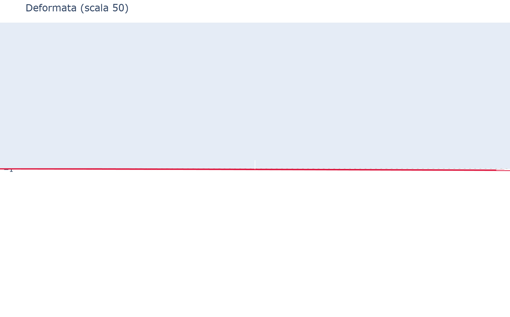

# 06 - Timoshenko and End Releases

## Timoshenko element (shear deformability)

For stocky beams (low L/h ratio) the shear contribution is not negligible. The Timoshenko element includes shear parameters `Φ_y` and `Φ_z`:

```python
sec = Section(A=0.18, Iy=5e-3, Iz=2e-3, J=3e-3,
              Asy=5/6*0.18, Asz=5/6*0.18)  # effective shear areas
m.add_beam(id, ni, nj, mat, sec, shear=True)
```

**For a rectangular section**: `Asy = Asz = 5/6 · A` (shear factor).

For slender beams (large L/h), `shear=False` (default) and Timoshenko → Euler-Bernoulli.

## End releases (hinges)

Releases remove stiffness for specific DOFs at the element end via **static condensation**. They are ideal for modeling hinges and joints.

```python
# Flexural hinge (Mz=0) at end j
m.add_beam(id, ni, nj, mat, sec, releases_j=["rz"])

# Hinge at both ends
m.add_beam(id, ni, nj, mat, sec, releases_i=["rz"], releases_j=["rz"])

# Multiple releases (e.g. spherical joint with free translation)
m.add_beam(id, ni, nj, mat, sec, releases_i=["uy", "uz"])
```

**Allowed DOFs**: `ux`, `uy`, `uz`, `rx`, `ry`, `rz` (local coordinates).

**Warning**: a released DOF must have stiffness from at least one other element connected to the node, otherwise the global matrix becomes singular.

### Example: continuous beam with hinge at central node

```python
# Element 1: hinge at j-end (central node)
m.add_beam(1, 1, 2, mat, sec, releases_j=["rz"])
# Element 2: continuous (no release)
m.add_beam(2, 2, 3, mat, sec)
```

### Illustrated example: stocky Timoshenko cantilever (L/h = 2)

Deformed shape with shear contribution (deflection ~20% larger than EB):



The Mz diagram will show M=0 at end j of element 1 (node 2 from the left side), which is exactly the effect of the hinge.
