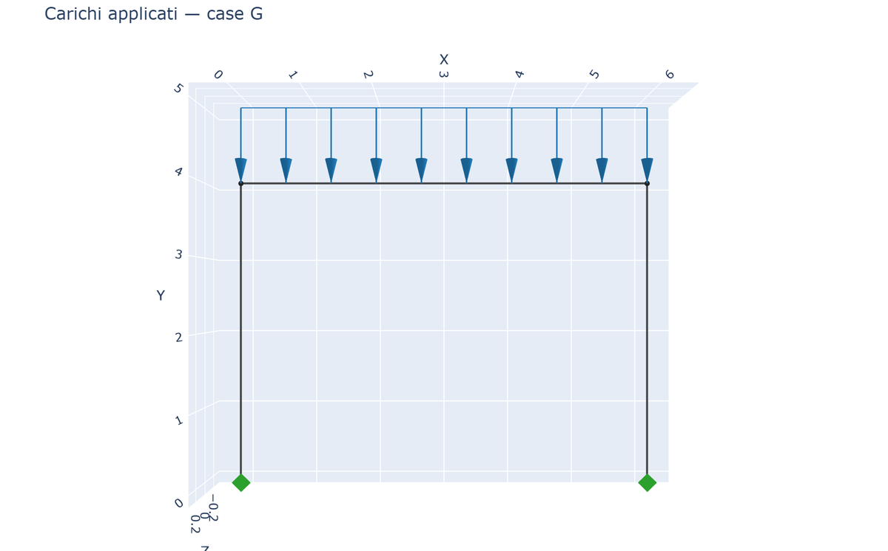
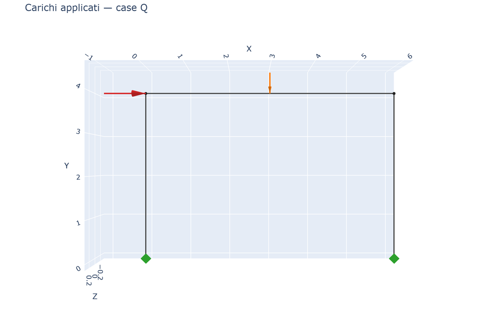
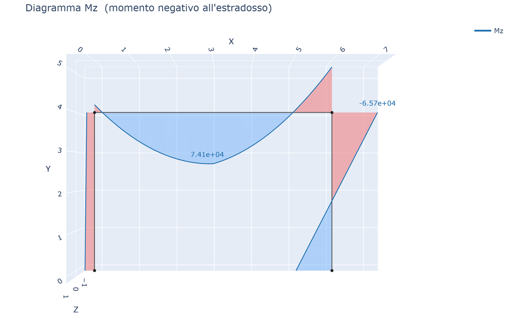
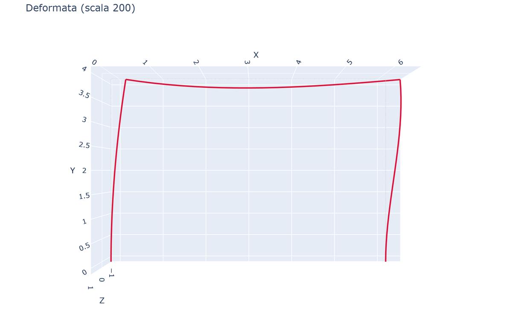
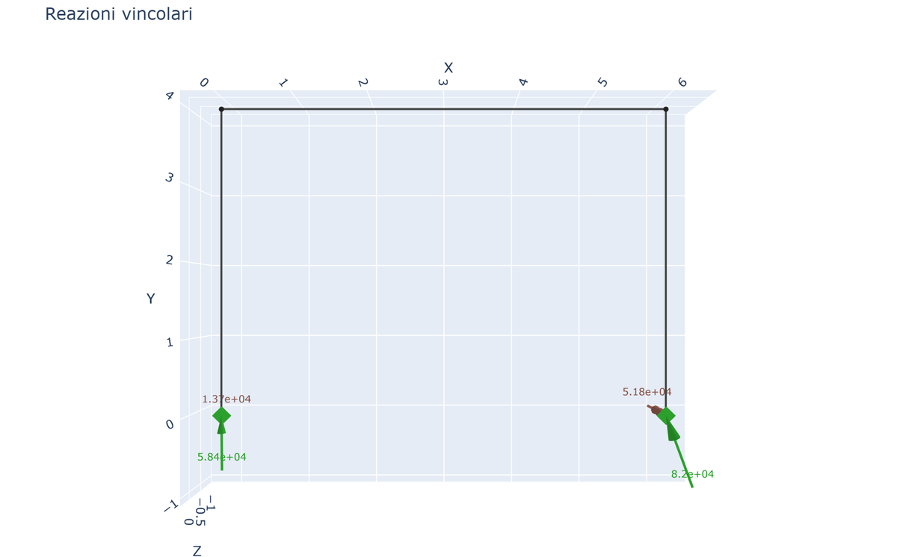

# 10 - Plotly Charts

beamfeapy provides 6 interactive visualization functions based on Plotly.

## Installation

```bash
pip install beamfeapy[plot]
```

## Available functions

### plot_model(m)

Model structure (nodes, elements, supports):

```python
from beamfeapy.plotting import plot_model
fig = plot_model(m)
fig.show()
```

### plot_loads(m, case=None)

Structure + applied loads. Filterable by load case:

```python
from beamfeapy.plotting import plot_loads
plot_loads(m, case="G").show()    # only case G loads
plot_loads(m, case="Q").show()    # only case Q
plot_loads(m).show()              # all loads
```

| Case G (distributed) | Case Q (wind + concentrated) |
|---|---|
|  |  |

### plot_diagram(result, component)

Internal force diagram along the structure:

```python
from beamfeapy.plotting import plot_diagram
for comp in ["N", "Vy", "Vz", "T", "My", "Mz"]:
    plot_diagram(res, comp).show()
```

The diagram is drawn as a **bicolor filled area by sign** (with transparency): for bending, **positive** is light blue, **negative** is light red; other components use dedicated color pairs. Each action is plotted on its **usage axis** (N shares the axis of My).

**European convention**: negative moment at the extrados.



### plot_deformed(result, scale=1.0)

Deformed configuration with scale factor:

```python
from beamfeapy.plotting import plot_deformed
plot_deformed(res, scale=200).show()
```



### plot_reactions(result)

Support reactions (forces and moments) at constraints:

```python
from beamfeapy.plotting import plot_reactions
plot_reactions(res).show()
```



### plot_internal_forces(result, elem_id)

The 6 diagrams (N, Vy, Vz, T, My, Mz) for a single element:

```python
from beamfeapy.plotting import plot_internal_forces
plot_internal_forces(res, elem_id=1).show()
```

## Saving

```python
fig = plot_diagram(res, "Mz")
fig.write_html("diagram_Mz.html", include_plotlyjs="cdn")
fig.write_image("diagram_Mz.png", width=1200, height=600)  # requires kaleido
```

## Complete portal frame example

```python
from beamfeapy import Material, Model, Section
from beamfeapy.plotting import plot_loads, plot_diagram, plot_deformed, plot_reactions

mat = Material(210e9, 0.3)
col = Section(A=0.16, Iy=2.13e-3, Iz=2.13e-3, J=3.6e-3)
bm = Section(A=0.18, Iy=1.35e-3, Iz=5.4e-3, J=2.0e-3)

m = Model()
m.add_node(1, 0, 0, 0); m.add_node(2, 0, 0, 4)
m.add_node(3, 6, 0, 4); m.add_node(4, 6, 0, 0)
m.add_beam(1, 1, 2, mat, col)
m.add_beam(2, 2, 3, mat, bm, ref_vector=(0, 0, 1))
m.add_beam(3, 3, 4, mat, col)
m.fix(1); m.fix(4)
m.add_distributed_load(2, "fy", -20e3, case="G")
m.add_nodal_load(2, Fx=30e3, case="Q")

res = m.solve(cases=["G", "Q"])

plot_loads(m, case="G").show()
plot_diagram(res, "Mz").show()
plot_deformed(res, scale=200).show()
plot_reactions(res).show()
```
