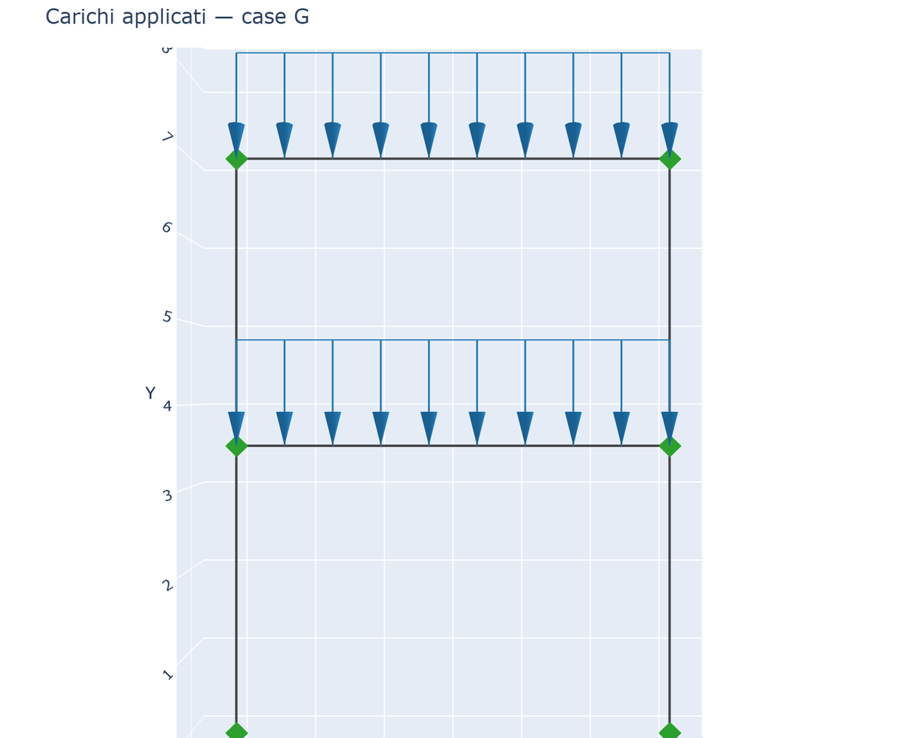
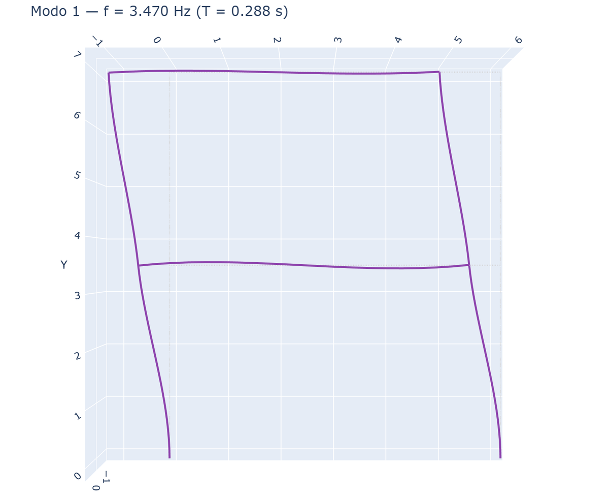
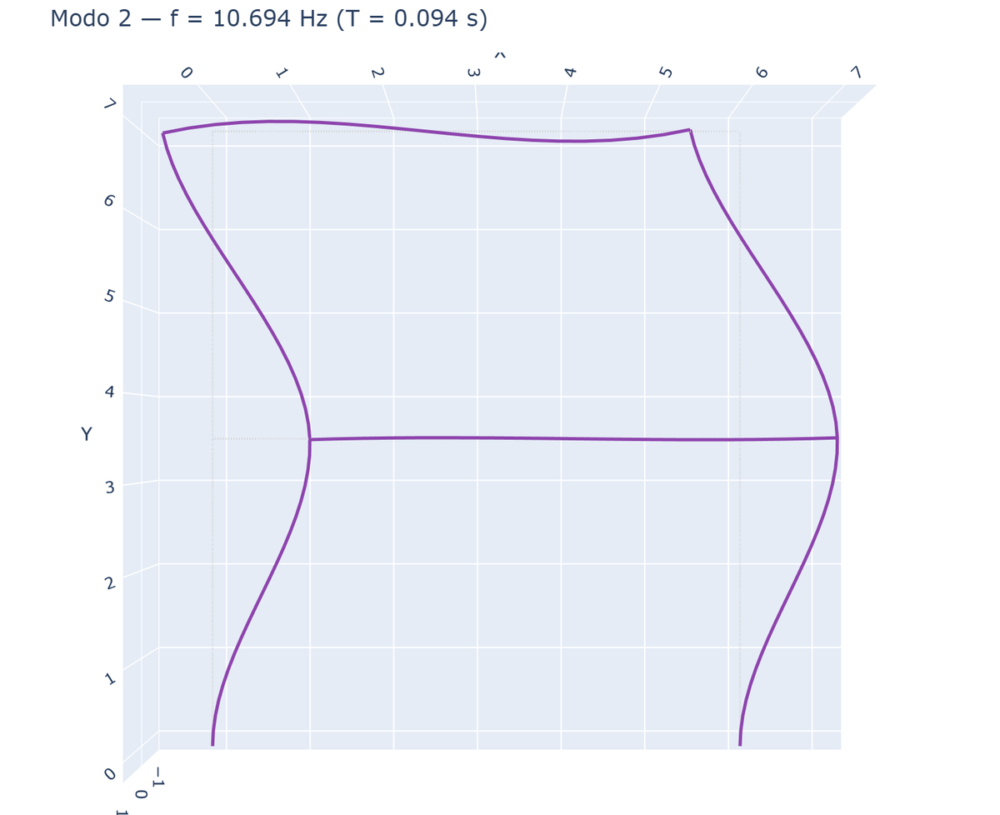
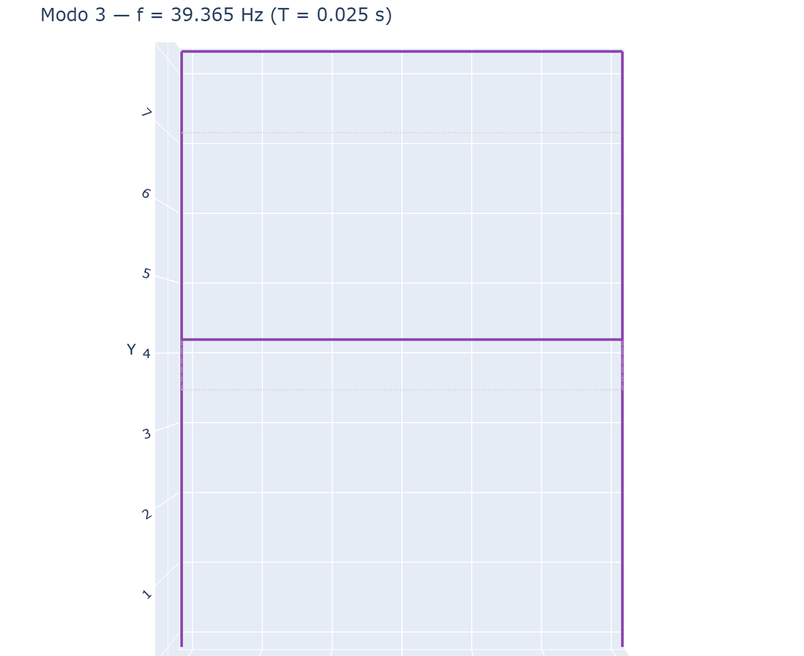

# 19 - Modal Analysis and Combinations with Coefficients

## Combinations with multiplicative coefficients

`Model.solve` accepts a **dictionary `{case: coefficient}`** as `cases` to
combine load patterns with factors (e.g. ULS per NTC/Eurocode):

```python
res = m.solve(cases={"G": 1.35, "Q": 1.5})        # 1.35·G + 1.5·Q
res = m.solve(cases={"G": 1.0, "Q": 0.3, "N": 1.0})  # any combination
```

Displacements, reactions and **internal forces** respect the coefficients
(linearity verified). `cases` remains usable as string or list (coeff 1).

## Masses from loads

The user decides **which load cases to convert to mass** and with what
coefficient, via a *mass source* `{case: coefficient}`. Mass is derived from
forces: `mass = coeff · |force| / g`, assigned to the 3 translational DOFs of
each node (lumped mass). Both **distributed loads** (distributed to nodes via
equivalent nodal forces) and **concentrated loads** (nodal and in-span) are
converted to mass. Include gravitational load cases in the source.

```python
M = m.assemble_mass({"G": 1.0, "Q": 0.3})   # mass vector (diagonal)
```

## Modal analysis

```python
mr = m.modal(n_modes=6, mass_source={"G": 1.0, "Q": 0.3}, g=9.81)

for i in range(len(mr.freq)):
    print(mr.freq[i], "Hz", mr.period[i], "s")
mp = mr.mass_participation()     # participating mass ratios (n_modes x 3: X,Y,Z)
```

`modal()` solves `K φ = ω² M φ` on free DOFs; free DOFs **without mass**
(rotational and unloaded translational) are eliminated by **static
condensation**, avoiding spurious modes. The result is a `ModalResult` with
`omega`, `freq` [Hz], `period` [s], `phi` (mass-normalized mode shapes),
`eff_mass` and `mass_participation()` per direction.

> Cross-validation: frequencies match **OpenSees** (`ops.eigen`) to machine
> precision (see `validation/validate_modal_opensees.py`).

### Illustrated example (2-storey plane frame)

Masses from gravitational loads on beams; first three modes (out-of-plane DOFs
restrained for 2D analysis):

| Loads (mass source) | Mode 1 — sway | 
|---|---|
|  |  |

| Mode 2 | Mode 3 |
|---|---|
|  |  |

Visualizing mode shapes:

```python
from beamfeapy.plotting import plot_mode
plot_mode(mr, 0).show()     # 1st mode (index 0); amplitude auto-scaled
```
