# 26 - Advanced Case Studies

This page presents three complex real-world examples that demonstrate the full
capabilities of **beamfeapy**: a multi-storey building, a 3D beam grillage, and
a skyscraper with performance benchmarking.

---

## Example 26 — 9-Storey Residential Building (2×3 bays)

A 9-storey reinforced concrete building with:
- **2 bays in X** (6 m each) × **3 bays in Y** (5 m each)
- **12 columns per floor** (3×4 grid), 3.0 m storey height
- Beams in both X and Y directions at each floor
- **120 nodes**, **261 elements**

### Loads

| Case | Type | Description |
|------|------|-------------|
| G | Distributed | 25 kN/m on all beams (permanent) |
| Q | Distributed | 8 kN/m on all beams (live load) |
| W | Nodal | 15 kN horizontal at each floor (wind, X direction) |

### Analyses

- **Static ULS**: combination `{G: 1.35, Q: 1.5}`
- **Modal**: masses from `{G: 1.0, Q: 0.3}`

### Results

```
Static analysis (ULS: 1.35G + 1.5Q): 0.221 s
  Max horizontal displacement at top floor: 9.20e-05 m (0.09 mm)

Modal analysis: 0.284 s
  Mode    f [Hz]    T [s]     mpX     mpY
     1     0.537    1.863   0.813   0.000
     2     0.587    1.704   0.000   0.817
     3     0.622    1.609   0.000   0.000
     4     1.605    0.623   0.000   0.000
     5     1.638    0.610   0.099   0.000
     6     1.777    0.563   0.000   0.099
```

### Script

<details markdown="block">
<summary>Show full script</summary>

```python
"""Example 26 - 9-storey residential building (2x3 bays)."""

import _common  # noqa: F401
import time
from beamfeapy import Material, Model, Section
from beamfeapy.plotting import (
    plot_deformed, plot_diagram, plot_loads, plot_model, plot_mode, plot_reactions,
)

def main():
    n_storeys = 9
    bays_x, bays_y = 2, 3
    Lx, Ly = 6.0, 5.0
    H = 3.0

    mat = Material(E=30e9, nu=0.2, alpha=1.0e-5)
    col_sec = Section(A=0.16, Iy=2.13e-3, Iz=2.13e-3, J=3.6e-3)
    bm_x_sec = Section(A=0.15, Iy=1.125e-3, Iz=2.8125e-3, J=1.5e-3)
    bm_y_sec = Section(A=0.15, Iy=1.125e-3, Iz=2.8125e-3, J=1.5e-3)

    m = Model()
    node_id = 1
    node_grid = {}
    for iz in range(n_storeys + 1):
        for iy in range(bays_y + 1):
            for ix in range(bays_x + 1):
                x, y, z = ix * Lx, iy * Ly, iz * H
                m.add_node(node_id, x, y, z)
                node_grid[(ix, iy, iz)] = node_id
                node_id += 1

    elem_id = 1
    for iz in range(n_storeys):
        for iy in range(bays_y + 1):
            for ix in range(bays_x + 1):
                ni = node_grid[(ix, iy, iz)]
                nj = node_grid[(ix, iy, iz + 1)]
                m.add_beam(elem_id, ni, nj, mat, col_sec)
                elem_id += 1

    for iz in range(1, n_storeys + 1):
        for iy in range(bays_y + 1):
            for ix in range(bays_x):
                ni = node_grid[(ix, iy, iz)]
                nj = node_grid[(ix + 1, iy, iz)]
                m.add_beam(elem_id, ni, nj, mat, bm_x_sec, ref_vector=(0, 0, 1))
                elem_id += 1

    for iz in range(1, n_storeys + 1):
        for iy in range(bays_y):
            for ix in range(bays_x + 1):
                ni = node_grid[(ix, iy, iz)]
                nj = node_grid[(ix, iy + 1, iz)]
                m.add_beam(elem_id, ni, nj, mat, bm_y_sec, ref_vector=(0, 0, 1))
                elem_id += 1

    for iy in range(bays_y + 1):
        for ix in range(bays_x + 1):
            m.fix(node_grid[(ix, iy, 0)])

    beam_elem_ids = []
    for e in m.elements.values():
        ni, nj = e.node_i.id, e.node_j.id
        zi = m.nodes[ni].z
        zj = m.nodes[nj].z
        if abs(zi - zj) < 0.01:
            beam_elem_ids.append(e.id)

    for e_id in beam_elem_ids:
        m.add_distributed_load(e_id, "fy", -25e3, case="G")
        m.add_distributed_load(e_id, "fy", -8e3, case="Q")

    for iz in range(1, n_storeys + 1):
        for iy in range(bays_y + 1):
            for ix in range(bays_x + 1):
                m.add_nodal_load(node_grid[(ix, iy, iz)],
                    Fx=15e3 / ((bays_x + 1) * (bays_y + 1)), case="W")

    res = m.solve(cases={"G": 1.35, "Q": 1.5})
    mr = m.modal(n_modes=10, mass_source={"G": 1.0, "Q": 0.3}, g=9.81)

    _common.save(plot_model(m), "ex26_palazzina_model.html")
    _common.save(plot_loads(m, case="G"), "ex26_palazzina_loads_G.html")
    _common.save(plot_deformed(res, scale=100), "ex26_palazzina_deformed.html")
    _common.save(plot_diagram(res, "Mz"), "ex26_palazzina_Mz.html")
    _common.save(plot_diagram(res, "N"), "ex26_palazzina_N.html")
    for i in range(3):
        _common.save(plot_mode(mr, i, scale=5.0), f"ex26_palazzina_mode{i+1}.html")
```

</details>

### Gallery

| Model | Loads G | Loads W |
|---|---|---|
| 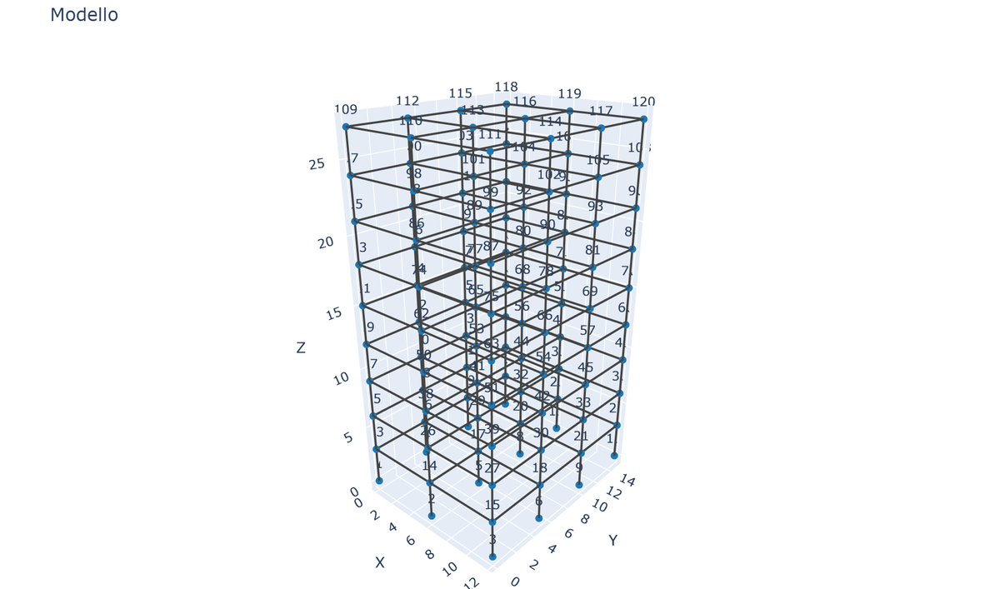 | 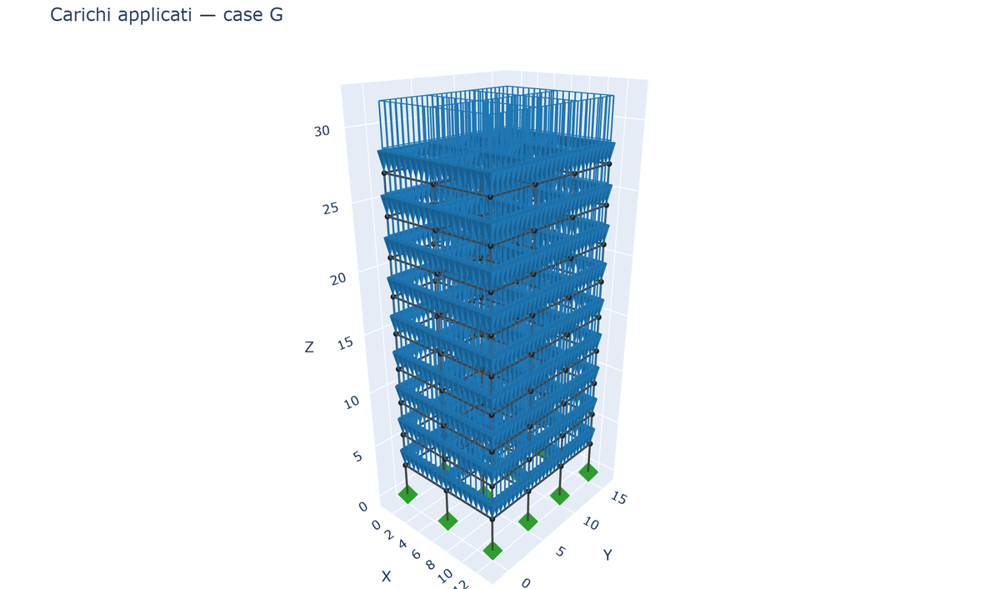 | 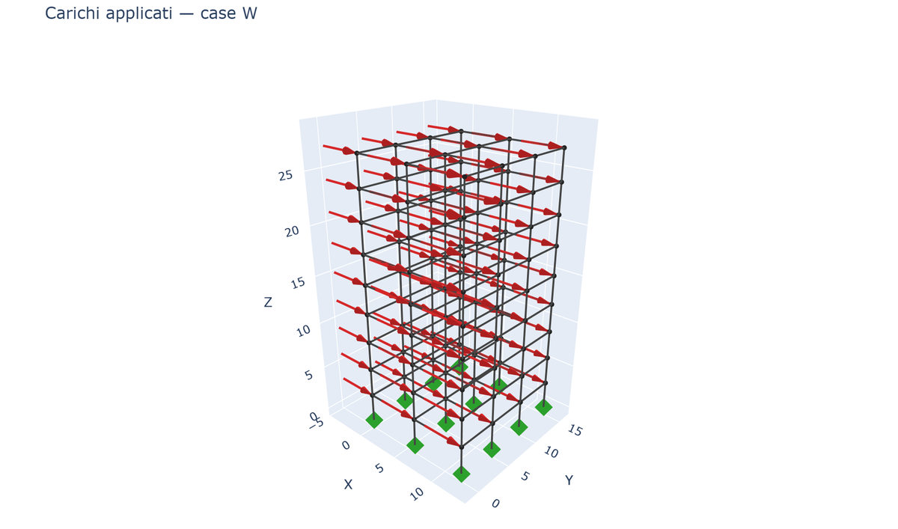 |

| Deformed shape | Moment Mz | Axial N |
|---|---|---|
| 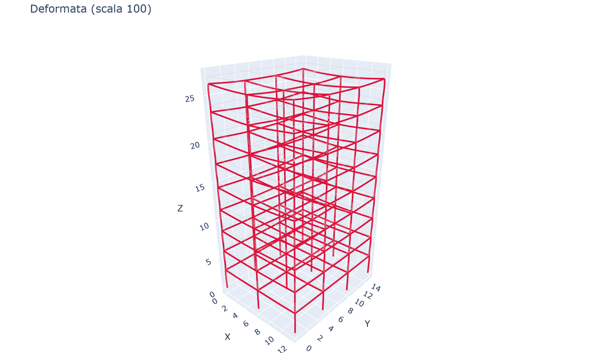 | 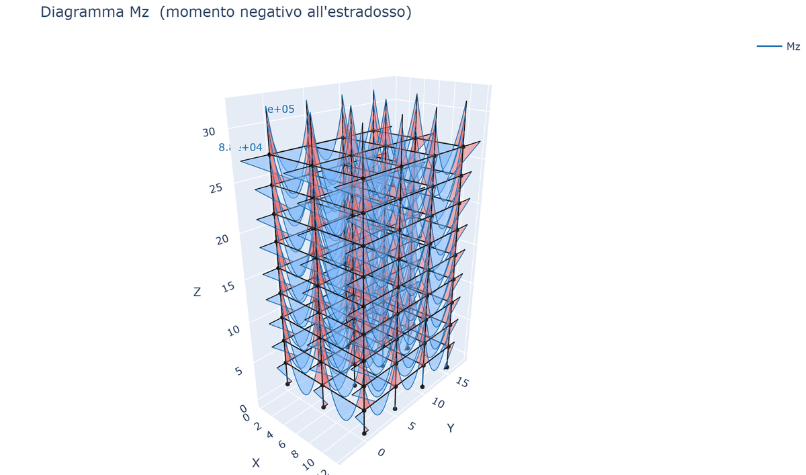 | 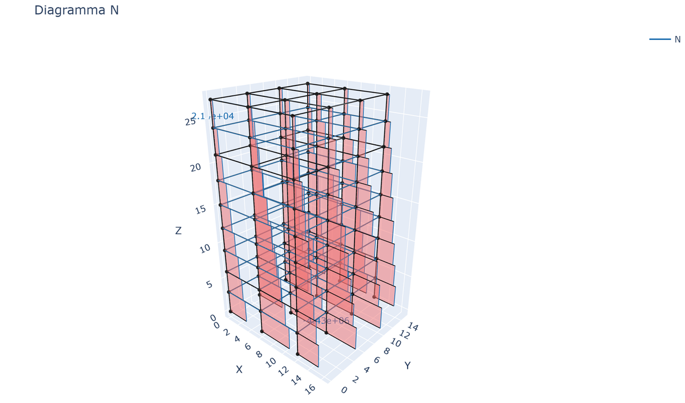 |

| Reactions | Mode 1 (T=1.86s) | Mode 2 (T=1.70s) |
|---|---|---|
| 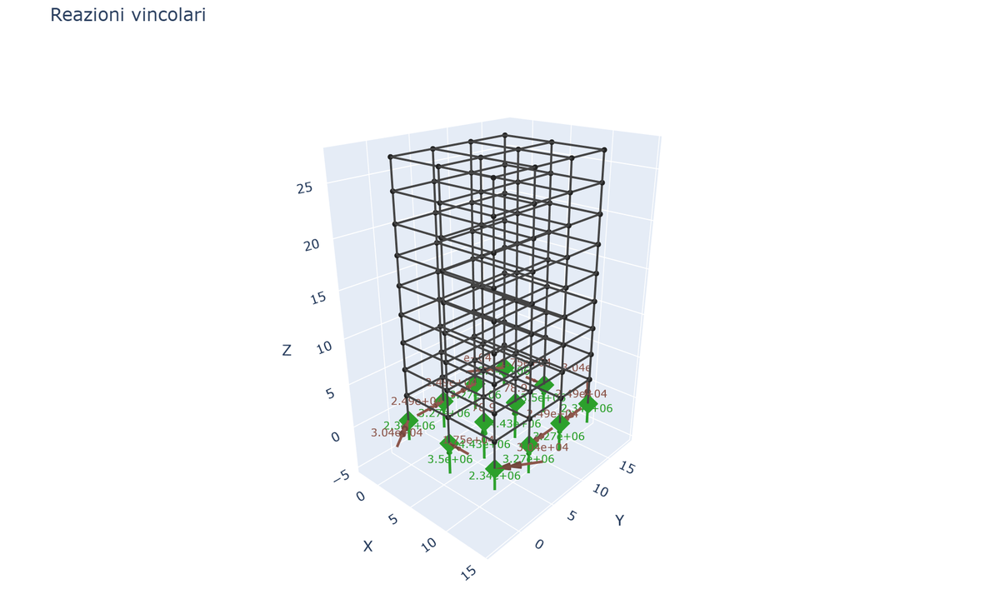 | 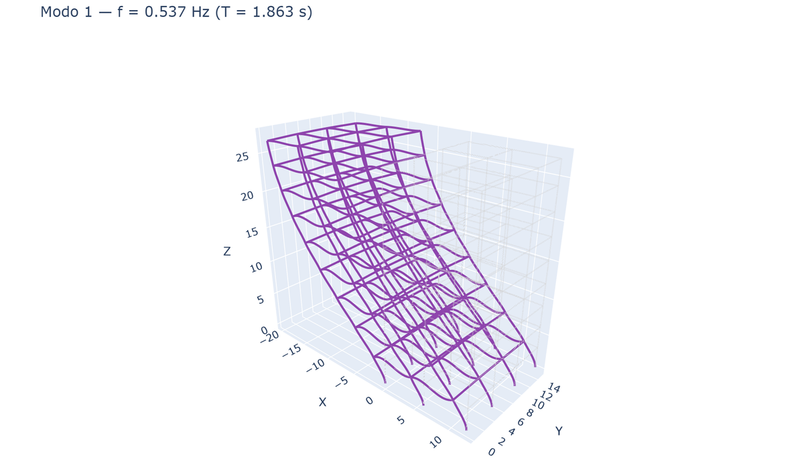 | 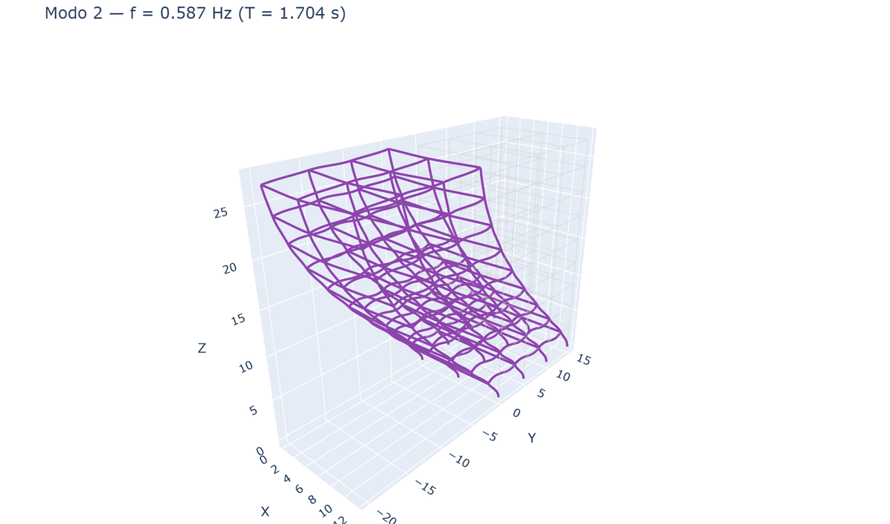 |

| Mode 3 (T=1.61s) |
|---|
| 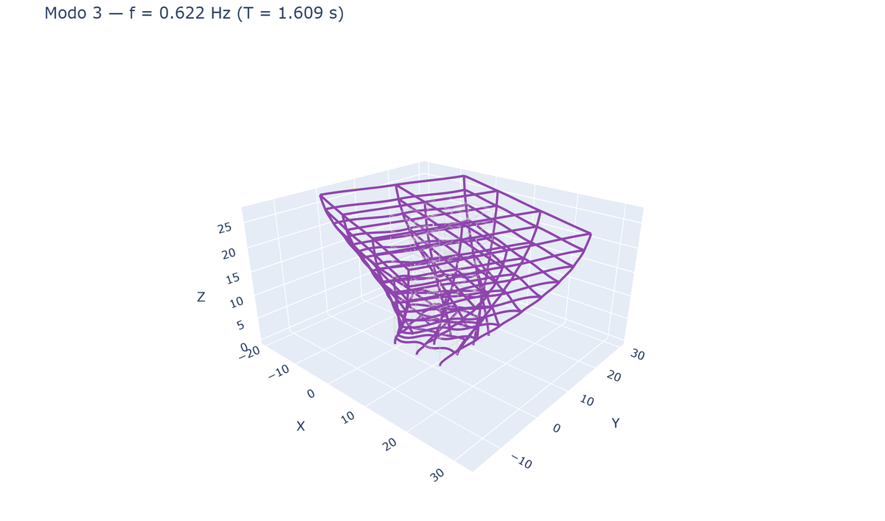 |

### Word Report Generated with Matplotlib

The example also produces a technical Word report with Matplotlib PNG figures
generated in memory and inserted through `python-docx`.

[Download the residential building Word report](assets/ex26_palazzina_report.docx)

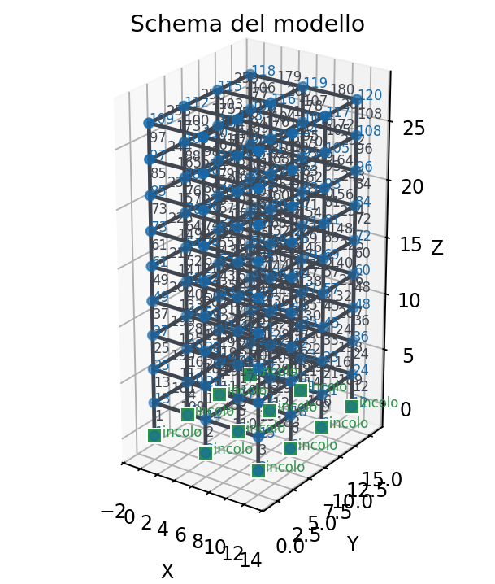

To regenerate the document:

```bash
python scripts/generate_palazzina_word_report.py
```

The core workflow is:

```python
from beamfeapy.reporting import create_word_report

m = build_palazzina_model()
combinations = {
    "Gravity ULS - 1.35G + 1.5Q": {"G": 1.35, "Q": 1.5},
    "Wind ULS - 1.35G + 1.5Q + 1.5W": {"G": 1.35, "Q": 1.5, "W": 1.5},
}
results = {name: m.solve(cases=cases) for name, cases in combinations.items()}
report = create_word_report(
    m,
    results,
    options={
        "title": "9-storey residential building - FEM report",
        "image_width_cm": 15.8,
        "load_cases": ["G", "Q", "W"],
        "combinations": combinations,
        "force_components": ["Mz", "Vy", "N"],
    },
)

with open("docs/assets/ex26_palazzina_report.docx", "wb") as f:
    f.write(report.getvalue())
```

---

## Example 27 — 3D Beam Grillage (Grigliato di travi)

A 3D beam grillage with:
- **4×4 grid** of intersecting beams in the X-Y plane
- Simply supported at the 4 corners
- 5 m bay length, total plan: **20 m × 20 m**
- **25 nodes**, **40 elements**

### Loads

| Case | Type | Description |
|------|------|-------------|
| G | Distributed | 12 kN/m on all beams (vertical, global Z) |
| Q | Nodal | 100 kN concentrated at center node |

### Analyses

- **Static**: combination G + Q
- **Modal**: masses from `{G: 1.0, Q: 0.3}`
- **Full post-processing**: all 6 internal force components

### Results

```
Static analysis (G + Q): 0.035 s
  Vertical displacement at center: -6.09 mm
  Total vertical reaction: 100000 N

Modal analysis: 0.158 s
  Mode    f [Hz]    T [s]     mpX     mpY     mpZ
     1     1.987    0.503   0.762   0.000   0.000
     2     2.053    0.487   0.000   0.000   0.938
     3     3.305    0.303   0.000   0.000   0.000
     4     3.305    0.303   0.000   0.000   0.000
     5     4.421    0.226   0.000   0.695   0.000
     6     4.742    0.211   0.000   0.000   0.000
```

### Script

<details markdown="block">
<summary>Show full script</summary>

```python
"""Example 27 - 3D beam grillage (grigliato di travi)."""

import _common  # noqa: F401
import time
from beamfeapy import Material, Model, Section
from beamfeapy.plotting import (
    plot_deformed, plot_diagram, plot_internal_forces, plot_loads, plot_model,
    plot_mode, plot_reactions,
)

def main():
    nx, ny = 4, 4
    L = 5.0
    mat = Material(E=210e9, nu=0.3, alpha=1.2e-5)
    sec = Section(A=0.18, Iy=1.35e-3, Iz=5.4e-3, J=2.0e-3)

    m = Model()
    node_id = 1
    node_grid = {}
    for iy in range(ny + 1):
        for ix in range(nx + 1):
            x, y = ix * L, iy * L
            m.add_node(node_id, x, y, 0.0)
            node_grid[(ix, iy)] = node_id
            node_id += 1

    elem_id = 1
    for iy in range(ny + 1):
        for ix in range(nx):
            ni = node_grid[(ix, iy)]
            nj = node_grid[(ix + 1, iy)]
            m.add_beam(elem_id, ni, nj, mat, sec, ref_vector=(0, 0, 1))
            elem_id += 1

    for iy in range(ny):
        for ix in range(nx + 1):
            ni = node_grid[(ix, iy)]
            nj = node_grid[(ix, iy + 1)]
            m.add_beam(elem_id, ni, nj, mat, sec, ref_vector=(0, 0, 1))
            elem_id += 1

    m.support(node_grid[(0, 0)], ux=True, uy=True, uz=True)
    m.support(node_grid[(nx, 0)], uy=True, uz=True)
    m.support(node_grid[(0, ny)], uz=True)
    m.support(node_grid[(nx, ny)], uz=True)

    for e in m.elements.values():
        m.add_distributed_load(e.id, "fz", -12e3, case="G")

    center_ix, center_iy = nx // 2, ny // 2
    center_node = node_grid[(center_ix, center_iy)]
    m.add_nodal_load(center_node, Fz=-100e3, case="Q")

    res = m.solve(cases=["G", "Q"])
    mr = m.modal(n_modes=10, mass_source={"G": 1.0, "Q": 0.3}, g=9.81)

    _common.save(plot_model(m), "ex27_grigliato_model.html")
    _common.save(plot_loads(m, case="G"), "ex27_grigliato_loads_G.html")
    _common.save(plot_deformed(res, scale=50), "ex27_grigliato_deformed.html")
    _common.save(plot_diagram(res, "Mz"), "ex27_grigliato_Mz.html")
    _common.save(plot_diagram(res, "My"), "ex27_grigliato_My.html")
    _common.save(plot_diagram(res, "Vz"), "ex27_grigliato_Vz.html")
    _common.save(plot_diagram(res, "T"), "ex27_grigliato_T.html")
    _common.save(plot_reactions(res), "ex27_grigliato_reactions.html")

    for e in m.elements.values():
        if e.node_i.id == node_grid[(center_ix-1, center_iy)] and \
           e.node_j.id == node_grid[(center_ix, center_iy)]:
            _common.save(plot_internal_forces(res, e.id),
                         "ex27_grigliato_internal_forces.html")
            break

    for i in range(4):
        _common.save(plot_mode(mr, i, scale=3.0), f"ex27_grigliato_mode{i+1}.html")
```

</details>

### Gallery

| Model | Loads G | Loads Q |
|---|---|---|
| 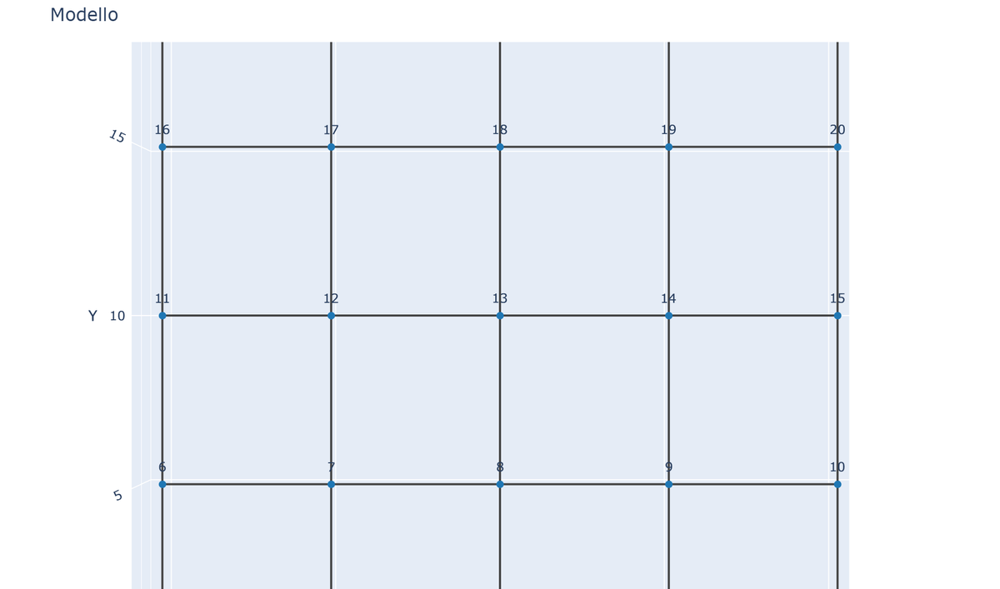 | 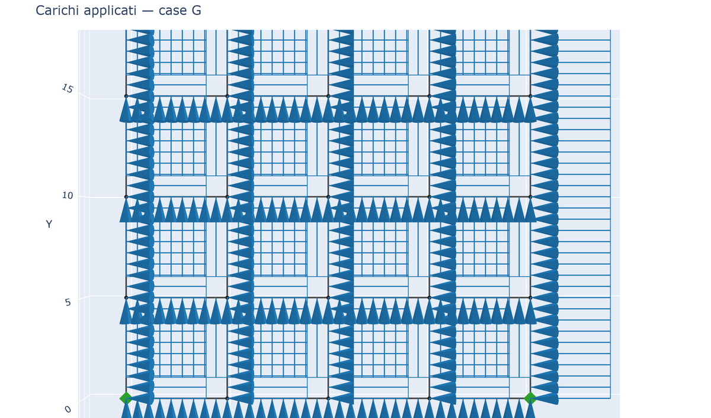 | 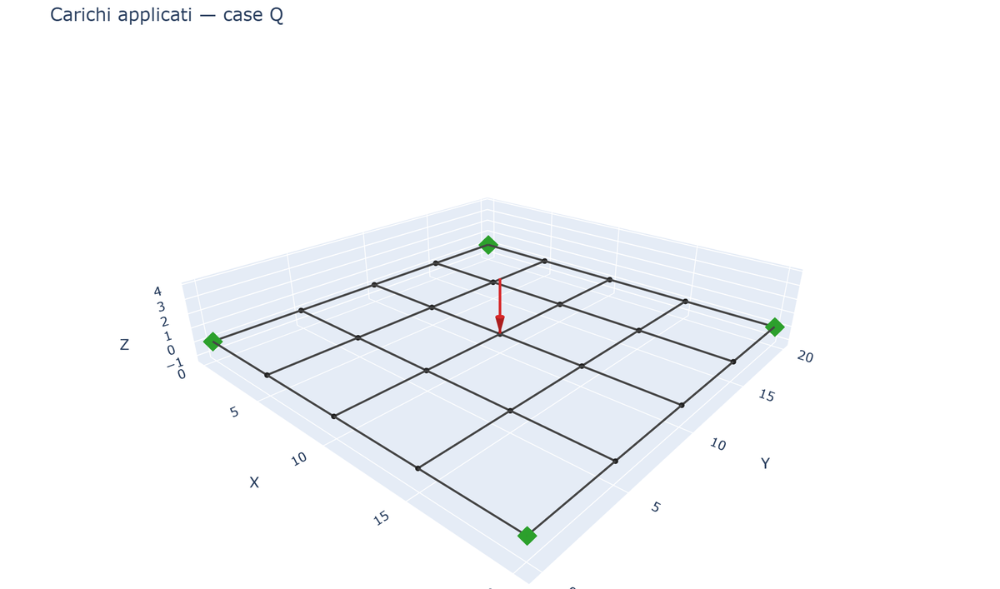 |

| Deformed shape | Moment Mz | Moment My |
|---|---|---|
| 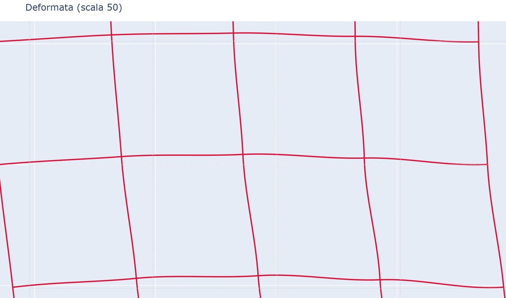 | 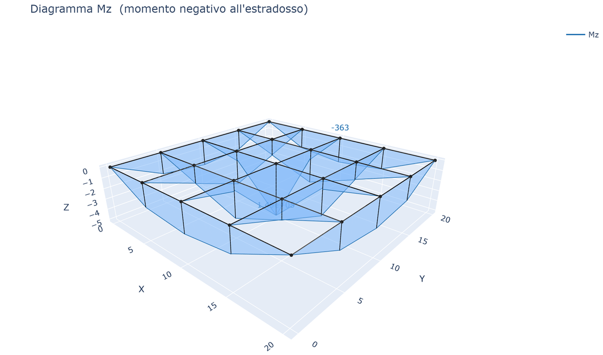 | 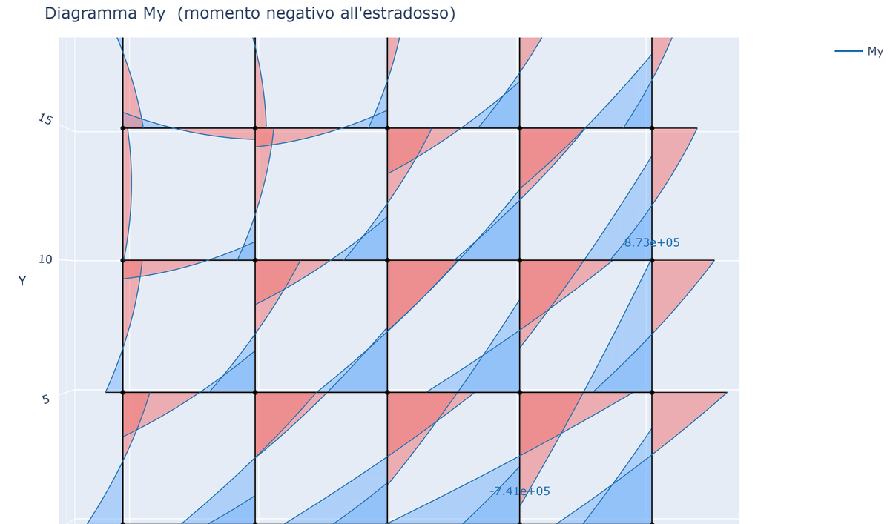 |

| Shear Vy | Shear Vz | Torsion T | Axial N |
|---|---|---|---|
| 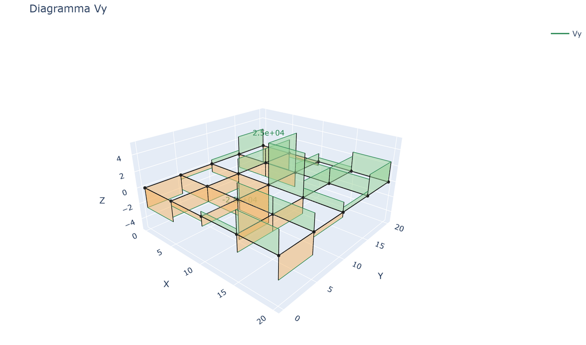 | 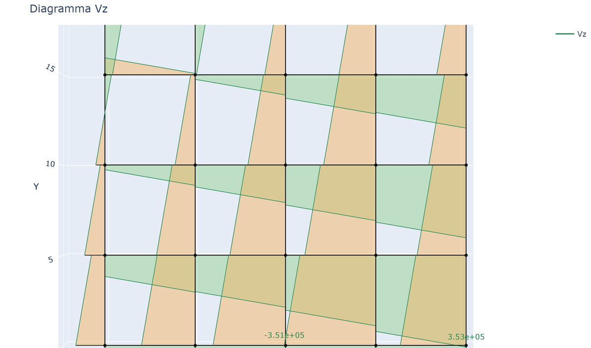 | 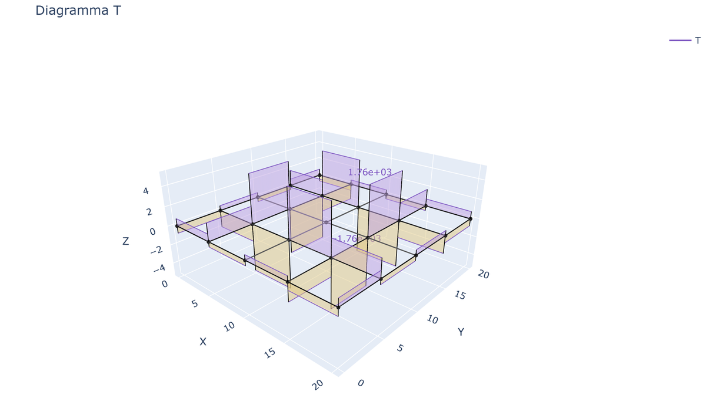 | 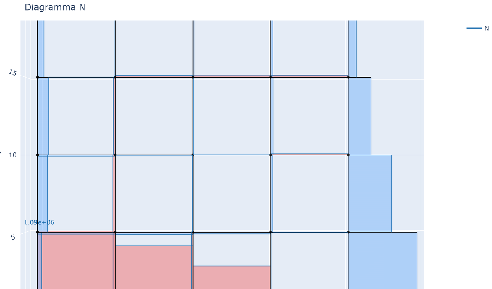 |

| Reactions | Internal forces (center beam) |
|---|---|
| 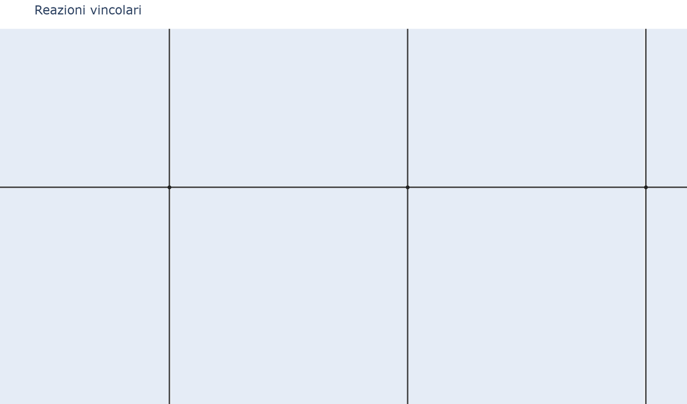 | 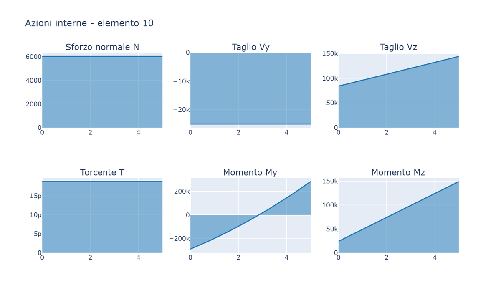 |

| Mode 1 (T=0.50s) | Mode 2 (T=0.49s) | Mode 3 (T=0.30s) | Mode 4 (T=0.30s) |
|---|---|---|---|
| 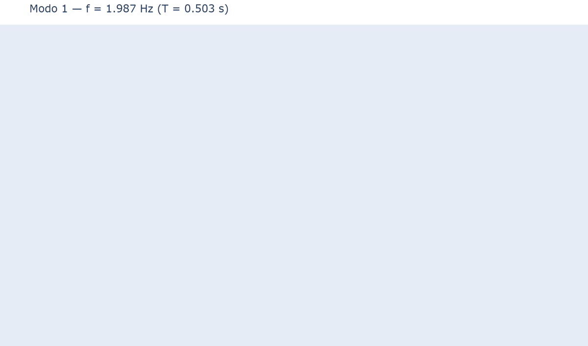 | 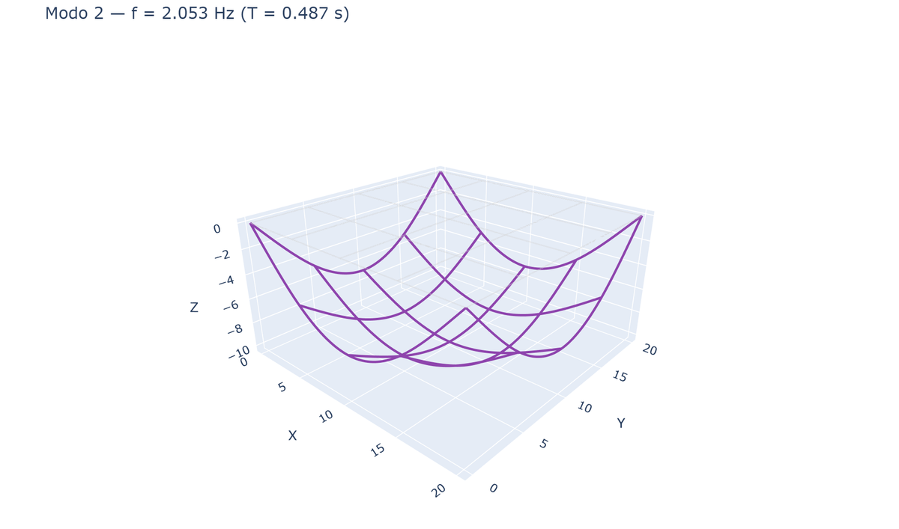 | 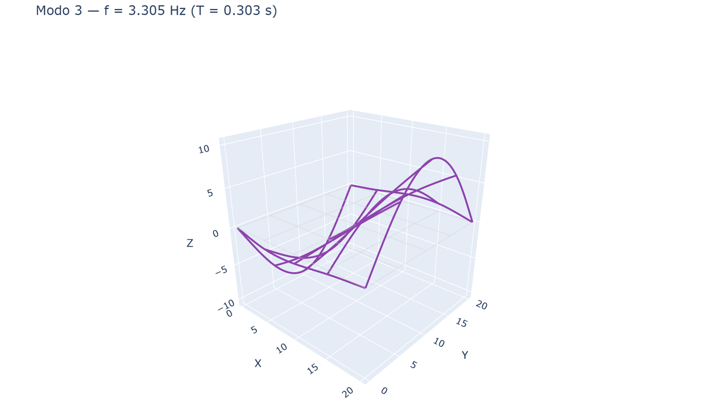 | 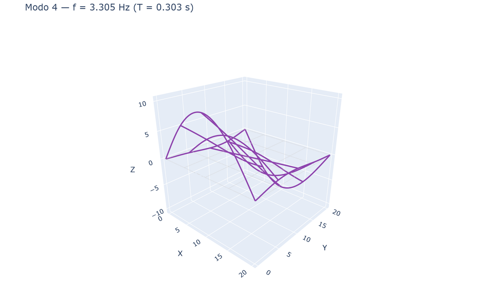 |

---

## Example 28 — Skyscraper (50 storeys) with Performance Benchmark

A 50-storey skyscraper with:
- **3×3 bays** (4×4 columns per floor)
- 4.0 m bay length, 3.5 m storey height
- **Total height: 175 m**
- Tapered columns: 0.8×0.8 m at base → 0.4×0.4 m at top
- **816 nodes**, **2000 elements**

### Loads

| Case | Type | Description |
|------|------|-------------|
| G | Distributed | 30 kN/m on all beams (permanent) |
| Q | Distributed | 10 kN/m on all beams (live load) |
| W | Nodal | 50 kN horizontal at each floor (wind, X direction) |

### Analyses

- **Static ULS**: combination `{G: 1.35, Q: 1.5, W: 1.5}`
- **Modal**: masses from `{G: 1.0, Q: 0.3}`
- **Performance benchmark**: dense vs sparse solver

### Performance Benchmark

```
Dense solver:  3.427 s
Sparse solver: 2.934 s
Speedup:       1.17x
Max difference (dense vs sparse): 3.32e-12
```

### Results

```
Max horizontal displacement at top: 668.96 mm
Drift ratio: 0.382%

Modal analysis: 3.567 s
  Mode    f [Hz]    T [s]     mpX     mpY
     1     0.114    8.801   0.470   0.181
     2     0.114    8.801   0.181   0.470
     3     0.204    4.894   0.000   0.000
     4     0.373    2.683   0.000   0.194
     5     0.373    2.683   0.194   0.000
     6     0.518    1.929   0.000   0.000
     7     0.725    1.379   0.000   0.059
     8     0.725    1.379   0.059   0.000
```

### Script

<details markdown="block">
<summary>Show full script</summary>

```python
"""Example 28 - Skyscraper (grattacielo) with performance benchmark."""

import _common  # noqa: F401
import time
import numpy as np
from beamfeapy import Material, Model, Section
from beamfeapy.plotting import (
    plot_deformed, plot_diagram, plot_loads, plot_model, plot_mode, plot_reactions,
)

def main():
    n_storeys = 50
    bays_x, bays_y = 3, 3
    Lx, Ly = 4.0, 4.0
    H = 3.5

    mat = Material(E=35e9, nu=0.2, alpha=1.0e-5)
    col_sec_base = Section(A=0.64, Iy=3.41e-2, Iz=3.41e-2, J=5.8e-2)
    col_sec_mid = Section(A=0.36, Iy=1.08e-2, Iz=1.08e-2, J=1.8e-2)
    col_sec_top = Section(A=0.16, Iy=2.13e-3, Iz=2.13e-3, J=3.6e-3)
    bm_sec = Section(A=0.18, Iy=1.35e-3, Iz=5.4e-3, J=2.0e-3)

    m = Model()
    node_id = 1
    node_grid = {}
    for iz in range(n_storeys + 1):
        for iy in range(bays_y + 1):
            for ix in range(bays_x + 1):
                x, y, z = ix * Lx, iy * Ly, iz * H
                m.add_node(node_id, x, y, z)
                node_grid[(ix, iy, iz)] = node_id
                node_id += 1

    elem_id = 1
    for iz in range(n_storeys):
        if iz < n_storeys // 3:
            col_sec = col_sec_base
        elif iz < 2 * n_storeys // 3:
            col_sec = col_sec_mid
        else:
            col_sec = col_sec_top
        for iy in range(bays_y + 1):
            for ix in range(bays_x + 1):
                ni = node_grid[(ix, iy, iz)]
                nj = node_grid[(ix, iy, iz + 1)]
                m.add_beam(elem_id, ni, nj, mat, col_sec)
                elem_id += 1

    for iz in range(1, n_storeys + 1):
        for iy in range(bays_y + 1):
            for ix in range(bays_x):
                ni = node_grid[(ix, iy, iz)]
                nj = node_grid[(ix + 1, iy, iz)]
                m.add_beam(elem_id, ni, nj, mat, bm_sec, ref_vector=(0, 0, 1))
                elem_id += 1
        for iy in range(bays_y):
            for ix in range(bays_x + 1):
                ni = node_grid[(ix, iy, iz)]
                nj = node_grid[(ix, iy + 1, iz)]
                m.add_beam(elem_id, ni, nj, mat, bm_sec, ref_vector=(0, 0, 1))
                elem_id += 1

    for iy in range(bays_y + 1):
        for ix in range(bays_x + 1):
            m.fix(node_grid[(ix, iy, 0)])

    beam_elem_ids = []
    for e in m.elements.values():
        ni, nj = e.node_i.id, e.node_j.id
        zi = m.nodes[ni].z
        zj = m.nodes[nj].z
        if abs(zi - zj) < 0.01:
            beam_elem_ids.append(e.id)

    for e_id in beam_elem_ids:
        m.add_distributed_load(e_id, "fy", -30e3, case="G")
        m.add_distributed_load(e_id, "fy", -10e3, case="Q")

    for iz in range(1, n_storeys + 1):
        for iy in range(bays_y + 1):
            for ix in range(bays_x + 1):
                m.add_nodal_load(node_grid[(ix, iy, iz)],
                    Fx=50e3 / ((bays_x + 1) * (bays_y + 1)), case="W")

    # Benchmark
    t0 = time.time()
    res_dense = m.solve(cases={"G": 1.35, "Q": 1.5, "W": 1.5})
    t_dense = time.time() - t0

    t0 = time.time()
    res_sparse = m.solve(sparse=True, cases={"G": 1.35, "Q": 1.5, "W": 1.5})
    t_sparse = time.time() - t0

    mr = m.modal(n_modes=15, mass_source={"G": 1.0, "Q": 0.3}, g=9.81)

    res = res_sparse
    _common.save(plot_model(m), "ex28_grattacielo_model.html")
    _common.save(plot_loads(m, case="G"), "ex28_grattacielo_loads_G.html")
    _common.save(plot_loads(m, case="W"), "ex28_grattacielo_loads_W.html")
    _common.save(plot_deformed(res, scale=50), "ex28_grattacielo_deformed.html")
    _common.save(plot_diagram(res, "Mz"), "ex28_grattacielo_Mz.html")
    _common.save(plot_diagram(res, "N"), "ex28_grattacielo_N.html")
    _common.save(plot_reactions(res), "ex28_grattacielo_reactions.html")
    for i in range(4):
        _common.save(plot_mode(mr, i, scale=3.0), f"ex28_grattacielo_mode{i+1}.html")
```

</details>

### Gallery

| Model | Loads G | Loads W |
|---|---|---|
| 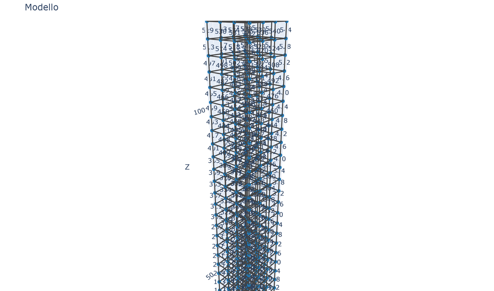 | 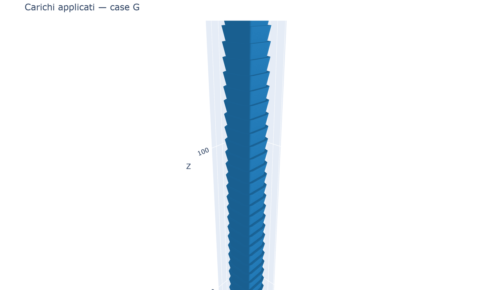 | 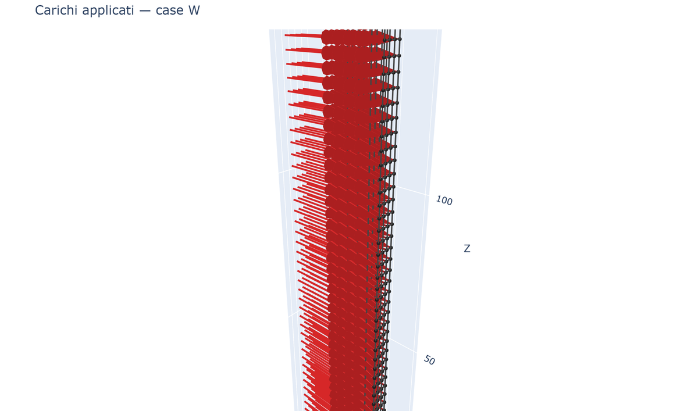 |

| Deformed shape | Moment Mz | Axial N |
|---|---|---|
| 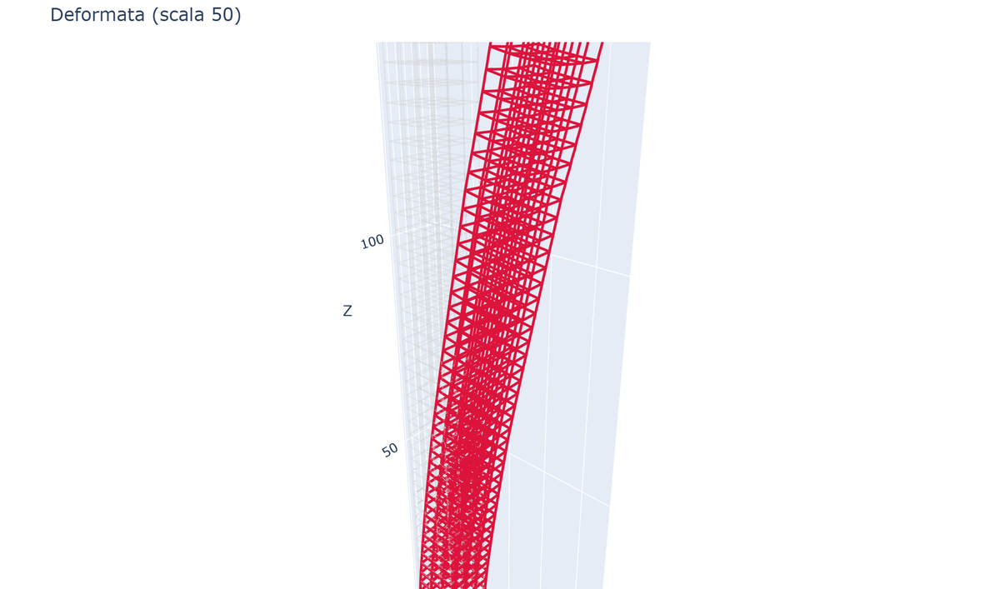 | 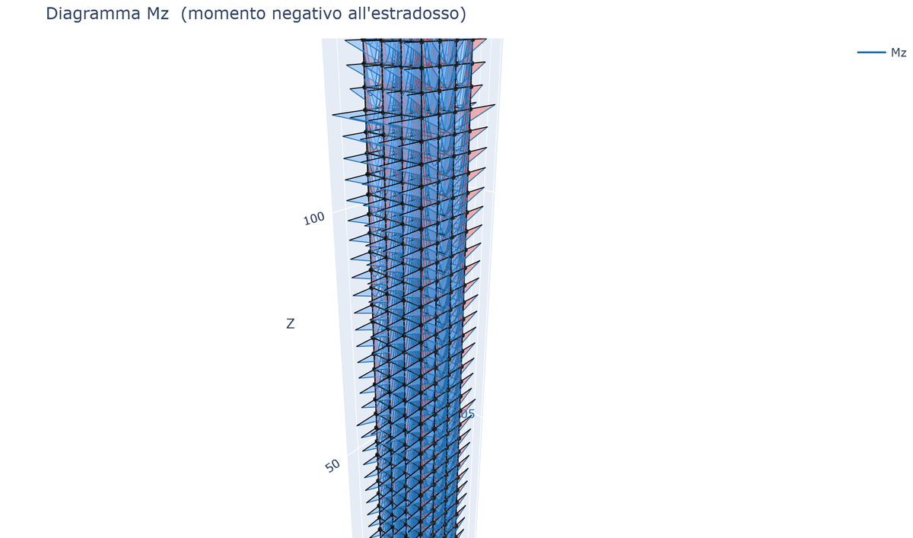 | 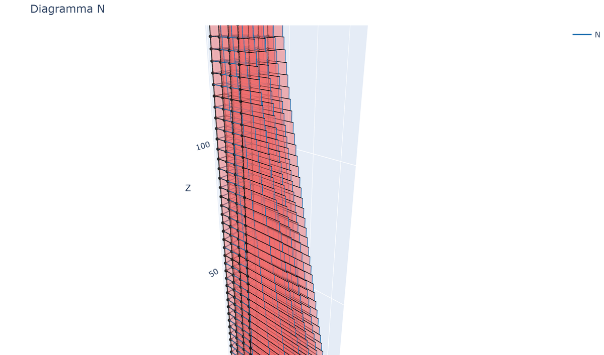 |

| Reactions | Mode 1 (T=8.80s) | Mode 2 (T=8.80s) |
|---|---|---|
| 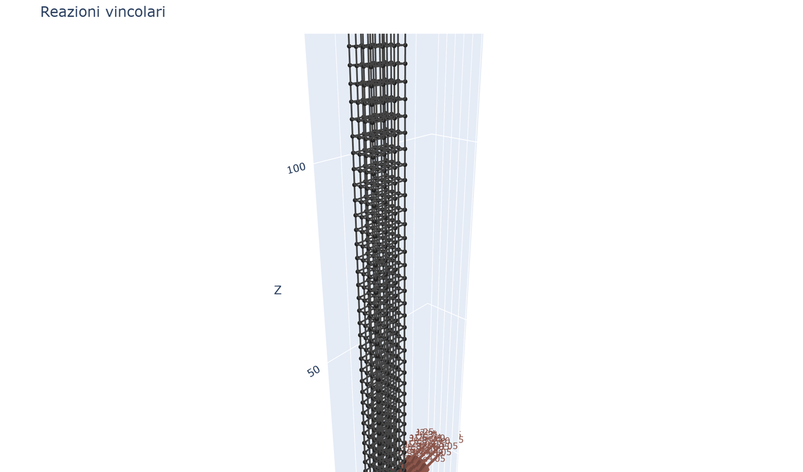 | 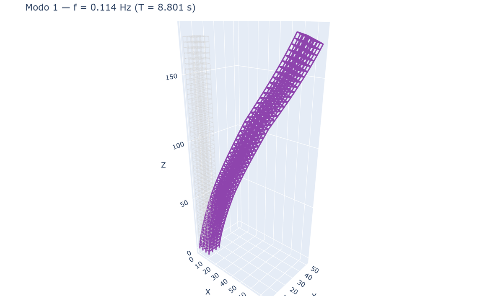 | 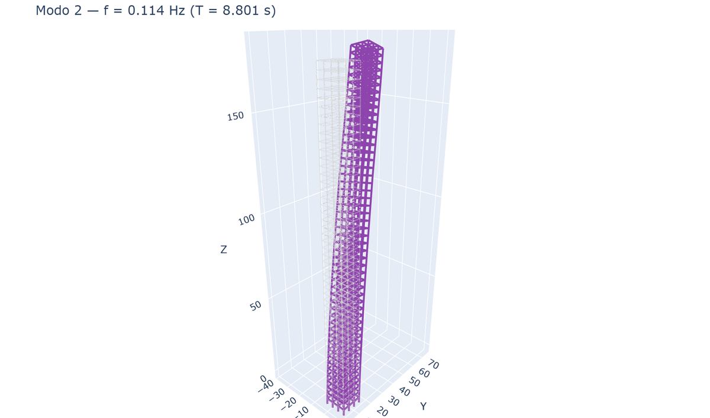 |

| Mode 3 (T=4.89s) | Mode 4 (T=2.68s) |
|---|---|
| 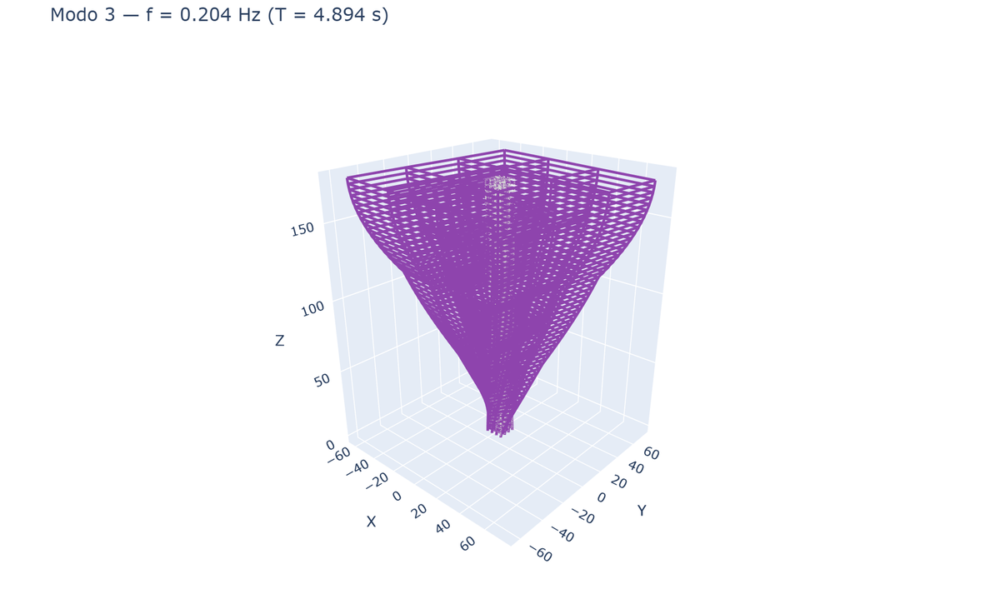 | 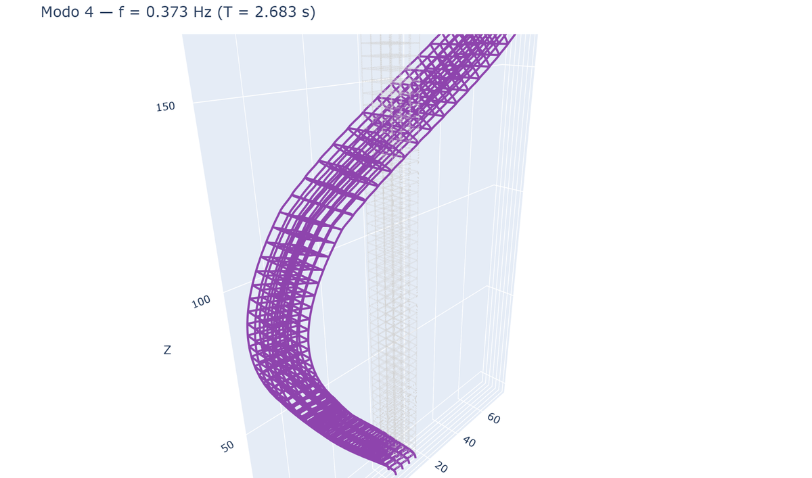 |
