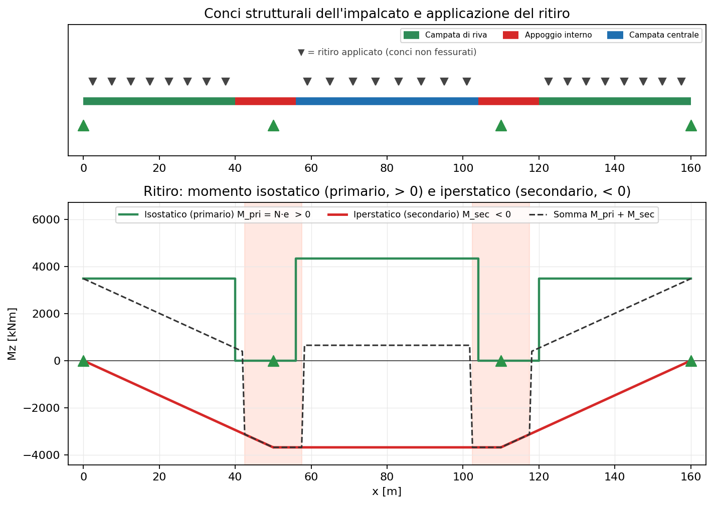

# 31 - Shrinkage in steel-concrete composite sections

Concrete shrinkage is an imposed strain that, in composite sections, produces
**stress states even without external loads**. Standard theory *splits* the
shrinkage effect into two distinct contributions — a **primary (isostatic)**
part and a **secondary (hyperstatic)** part — that must be treated separately.
This page explains the theory and shows how to model it in beamfeapy through
imposed strains (thermal analogy).

> References: EN 1992-1-1 §3.1.4 (shrinkage and creep), EN 1994-2 §5.4.2.2
> (effective modulus and shrinkage), §5.4.2.3 (effects of cracking).

---

## 1. Why shrinkage produces internal forces

The concrete slab "wants" to shorten by the free shrinkage strain
$\varepsilon_{cs}$, but it is connected by the shear studs to the steel girder,
which restrains it. This **mutual restraint** produces:

- a **residual tension** in the concrete (prevented from fully shrinking),
- an induced **compression and bending** in the steel,
- in a **statically indeterminate** structure, also **extra reactions and
  moments**.

The key point is that the slab is **eccentric** with respect to the composite
centroid: the shrinkage restraint force, applied at the slab centroid, is
equivalent to an axial force **plus** a moment $N \cdot e$.

---

## 2. Free shrinkage and effective modulus (creep)

Shrinkage is a slow phenomenon acting together with creep, so an **effective
modulus** of concrete is used:

$$
E_{c,\text{eff}} = \frac{E_{cm}}{1 + \psi_L \, \varphi(t,t_0)}
$$

with $\psi_L = 0.55$ for shrinkage (EN 1994-2 §5.4.2.2). The long-term modular
ratio is $n_L = E_a / E_{c,\text{eff}}$.

With $E_{cm} = 33$ GPa, $\varphi = 2.0$, $\psi_L = 0.55$:

$$
E_{c,\text{eff}} = \frac{33}{1 + 0.55 \cdot 2.0} = 15.7 \ \text{GPa},
\qquad n_L = \frac{210}{15.7} \approx 13.4
$$

---

## 3. Primary (isostatic) effect: $N$ and $N\cdot e$

The **restrain-and-release** method is used:

1. **Restrain.** Prevent the slab from shrinking by applying a tensile force to
   the concrete alone, at its centroid:

   $$
   N_{cs} = \varepsilon_{cs} \, E_{c,\text{eff}} \, A_c
   $$

2. **Release.** This force does not really exist: release it by applying
   $-N_{cs}$ at the slab centroid on the **composite** section. Since the slab
   centroid is eccentric by $e$ from the composite centroid, this is equivalent
   to:

   $$
   N = N_{cs}, \qquad M_{\text{pri}} = N_{cs}\cdot e
   $$

The sum restrain + release is a **self-equilibrated** sectional stress state:
the beam resultants $N$ and $M$ are **zero** under isostatic conditions. In a
**simply supported** structure this state produces no reactions: the beam
merely shortens and curves, with free deformations

$$
\varepsilon_0 = \frac{N_{cs}}{(EA)_{\text{comp}}}, \qquad
\kappa_0 = \frac{M_{\text{pri}}}{(EI)_{\text{comp}}}
$$

evaluated with the **homogenised composite** stiffnesses ($n_L$).

> In short: the primary part is what you obtain by treating the deck as
> **simply supported everywhere** and applying shrinkage (thermal analogy). The
> beam resultants vanish; what remains is the self-equilibrated sectional state
> $N_{cs}$ and $N_{cs}\cdot e$.

---

## 4. Secondary (hyperstatic) effect

In a **continuous** beam the curvature $\kappa_0$ is **not free**: the
intermediate supports prevent the deflection and **secondary moments**
$M_{\text{sec}}$ (hyperstatic) and reactions arise. They are obtained by
applying the imposed deformation $(\varepsilon_0,\kappa_0)$ to the
indeterminate structure and solving for the redundants.

For two equal spans with a uniform imposed curvature $\kappa_0$ the classic
result holds:

$$
M_{\text{sec}} = \tfrac{3}{2}\, (EI)_{\text{comp}}\, \kappa_0 = \tfrac{3}{2}\, M_{\text{pri}}
$$

(hogging moment over the internal support). The total design action is the
**superposition**:

$$
\sigma = \underbrace{\sigma(N_{cs}, M_{\text{pri}})}_{\text{primary, sectional}}
       + \underbrace{\sigma(M_{\text{sec}})}_{\text{secondary, resultant}}
$$

---

## 5. Cracked vs uncracked regions

Over internal supports the slab is in tension (hogging) and **cracks**. In the
cracked regions (EN 1994-2 §5.4.2.3):

- tensile concrete is neglected → the **cracked section** is used
  (steel + reinforcement), with reduced $(EI)$;
- since the concrete contribution disappears, the **primary shrinkage action**
  ($N_{cs}$, $M_{\text{pri}}$) is **not applied** in those segments.

In global analysis practice, therefore, shrinkage as an imposed strain is
applied **only to the uncracked segments** (the spans), leaving the hogging
regions over internal supports out. This reduces the secondary moment compared
with applying it over the whole beam.

---

## 6. Modelling in beamfeapy

beamfeapy has no explicit "composite" material: the composite beam is
represented by an element with the $EA$ and $EI$ of the **homogenised section**
(using $n_L$ for shrinkage/creep). Shrinkage is introduced as an **imposed
initial strain** through [`add_thermal_load`](en-04-loads.html), via the thermal
analogy: the element generates the strain

$$
\boldsymbol{\varepsilon}_0 = \big[\alpha\,\Delta T_{ax}, \ \cdot, \ \alpha\,\Delta T_{grad,y}/h_y, \ 0\big]
$$

Setting $\alpha = 1$ (a fictitious coefficient) gives directly:

| To impose | Thermal parameter |
|-----------|-------------------|
| shortening $\varepsilon_0$ | `dT_axial = -eps0` |
| curvature $\kappa_0$ | `dT_grad_y = kappa0 * h_y`, with `h_y = h` |

The equivalent thermal loads are applied **only to the uncracked elements**.
The practical decomposition is:

- **Primary (isostatic):** compute $N_{cs}$ and $M_{\text{pri}} = N_{cs}\cdot e$
  analytically (or solve a simply supported model: the beam resultants come out
  zero, confirming self-equilibrium).
- **Secondary (hyperstatic):** solve the **continuous** model with the same
  imposed strains; the resulting moment $M_{\text{sec}}$ and reactions are the
  secondary effect.

> Axis convention. With `ref_vector=(0,1,0)` the local $y$ axis coincides with
> global $Y$: the gradient `dT_grad_y` bends in the $X$-$Y$ plane (`uy`
> displacement, `Mz` moment). With `ref_vector=(0,0,1)` the local $y$ axis
> becomes global $Z$ and bending occurs in the vertical plane: choose the
> `ref_vector` consistent with the plane in which the shrinkage curvature
> should develop.

---

## 7. Worked example: three-span twin-girder bridge

The script
[`scripts/shrinkage_composite_decomposition.py`](https://github.com/DomenicoGaudioso/beamfeapy/blob/main/scripts/shrinkage_composite_decomposition.py)
models the longitudinal girder of the
[three-span twin-girder bridge](en-32-twin-girder-bridge.html) (50 + 60 + 50 m).
The deck is made of **different structural segments**, the sections defined in
[`scripts/_bridge_sections.py`](https://github.com/DomenicoGaudioso/beamfeapy/blob/main/scripts/_bridge_sections.py):

| Segment | Section | $I_{\text{vert}}$ [m⁴] | $e$ [m] | $M_{\text{pri}}$ [kNm] | State |
|---------|---------|------------------------|---------|------------------------|-------|
| End span | composite | 0.141 | 0.699 | 3483 | uncracked |
| Central span | composite | 0.201 | 0.871 | 4337 | uncracked |
| Internal support | steel + rebar | 0.208 | 1.057 | 5261 | **cracked** |

Each segment has its own $\varepsilon_0$ and $\kappa_0$ (they depend on $e$ and
the stiffnesses): shrinkage is not uniform but **piecewise**.

### Load application

Shrinkage is applied as an imposed strain **only to the uncracked segments**
(the spans); over the internal supports the slab is cracked and the primary
action is not applied. In the top panel of the figure the ▼ markers show where
shrinkage is applied and the colours mark the segments that make up the deck.

### Separate results: primary and secondary

The **isostatic (primary) moment is positive**, the **hyperstatic (secondary)
moment is negative**: the two effects have opposite signs and partly cancel.

```text
ISOSTATIC (primary) moment M_pri = N*e  ->  POSITIVE:
  end span = +3483 kNm   central span = +4337 kNm   (cracked support = 0)
HYPERSTATIC (secondary) moment M_sec  ->  NEGATIVE:
  support x=50 m : M_sec = -3686 kNm
  support x=110 m: M_sec = -3686 kNm
  mid central span x=80 m : M_sec = -3686 kNm
Total moment M_pri + M_sec at mid central span = +652 kNm
```

- **isostatic** (primary effect): it is the moment $M_{\text{pri}} = N_{cs}\cdot e$,
  **positive** (sagging), specific to each segment (a step diagram: $+3483$ kNm
  in the end spans, $+4337$ kNm in the central one, $0$ in the cracked segments).
  It is a **self-equilibrated sectional state**: in the isostatic FE model the
  *beam resultant* comes out $\approx 0$ ($\int\sigma\,dA = 0$), yet the design
  primary moment stays $N_{cs}\cdot e$ and produces stresses;
- **hyperstatic** (secondary effect): it is the moment $M_{\text{sec}}$,
  **negative** (hogging), linear between supports (no transverse load), zero at
  the ends and constant ($-3686$ kNm) in the central span; it is the *beam
  resultant* of the continuous model.

In the figure: green is the primary (positive, stepped), red the secondary
(negative), dashed their moment sum. The sum drops where the section is cracked
(the primary vanishes).



### Summing the stresses

Verification is done by **summing fibre by fibre** the primary stress
(self-equilibrated, sectional) and the secondary stress (from $M_{\text{sec}}$).
Below, the **shrinkage-only** values [MPa] at two key sections (to be added to
the other load effects).

**Mid central span** (uncracked segment, $M_{\text{sec}} = -3686$ kNm):

| Fibre | Primary | Secondary | Total |
|-------|--------:|----------:|------:|
| slab top | 0.92 | 1.42 | 2.34 |
| slab bottom | 1.44 | 0.97 | 2.41 |
| steel top flange | −43.73 | 13.00 | −30.73 |
| steel bottom flange | 8.43 | −31.32 | −22.89 |

**Internal support** (cracked segment, $M_{\text{sec}} = -3686$ kNm):

| Fibre | Primary | Secondary | Total |
|-------|--------:|----------:|------:|
| slab top | 0.00 | 0.00 | 0.00 |
| slab bottom | 0.00 | 0.00 | 0.00 |
| steel top flange | 0.00 | 22.08 | 22.08 |
| steel bottom flange | 0.00 | −20.95 | −20.95 |

Note that:

- in the **span** the primary part dominates the steel fibres (e.g. $-43.7$ MPa
  on the top flange) and is self-equilibrated: $\int \sigma\,dA \approx 0$ and
  $\int \sigma\,z\,dA \approx 0$ over the section;
- over the **cracked support** the primary part is zero (the tensile slab is
  cracked) and only the secondary part remains, a true resultant acting on the
  cracked section (steel + reinforcement).

### Core workflow

```python
from beamfeapy import Material, Model, Section, postprocess
from scripts._bridge_sections import SEC_END, SEC_MID, SEC_SUPPORT

steel = Material(E=210e9, nu=0.30, alpha=1.0)   # alpha=1 -> dT = strain

m = Model()
# ... for each segment: Section(A, Iy, Iz, J) of the active cross-section ...
for eid, cs in segments.items():
    if cs.cracked:
        continue                                # no shrinkage on cracked segments
    m.add_thermal_load(eid, dT_axial=-cs.eps0,
                       dT_grad_y=cs.kappa0 * cs.H, h_y=cs.H, case="SHR")

res = m.solve(cases="SHR")                       # -> SECONDARY M and reactions
# summing the stresses at a section (shrinkage):
sigma = cs.primary_stress(z, in_slab) + cs.secondary_stress(z, M_sec, in_slab)
```

---

## 8. Implications for the bridge examples

Examples [30 - grillage bridge](en-30-composite-grillage-bridge.html) and
[32 - twin-girder bridge](en-32-twin-girder-bridge.html) apply this shrinkage
modelling; to be complete it must

1. use the **effective modulus** $E_{c,\text{eff}}$ (creep) for the composite
   properties;
2. apply **both** the axial shortening ($\varepsilon_0$) **and** the equivalent
   curvature ($\kappa_0$, i.e. the $N\cdot e$ term);
3. limit the primary action to the **uncracked segments** and use cracked
   properties over the internal supports;
4. keep the **primary** (sectional) and **secondary** (resultant) effects
   separate, combining them only at the verification stage.
