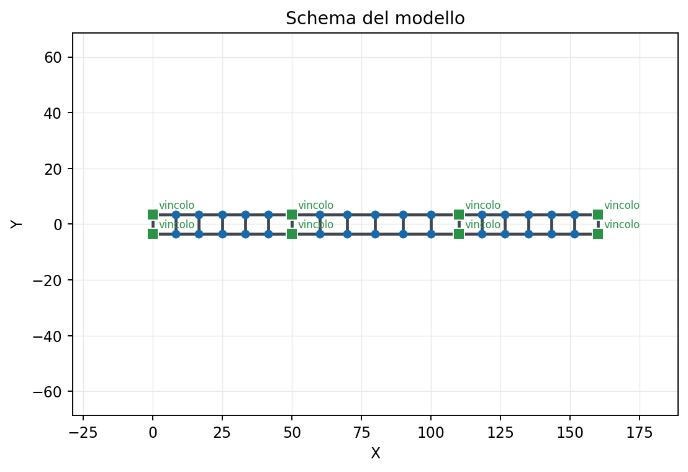
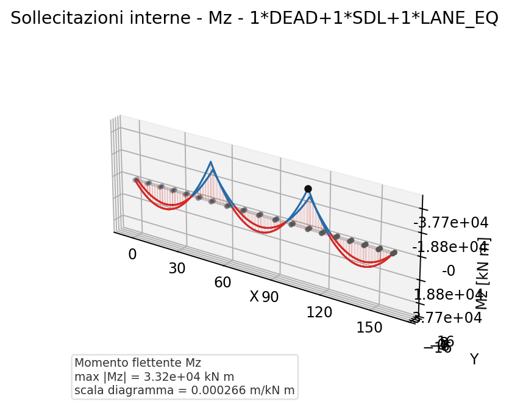

# 32 - Three-span twin-girder composite bridge

This example develops a **continuous three-span road bridge** (50 + 60 + 50 m)
with a grillage deck on **two** main steel girders and a composite concrete
slab. It is the companion of the
[example 30 - grillage bridge](en-30-composite-grillage-bridge.html), here with
only two girders and with **variable structural segments** along the deck.

## Model layout

- continuous three-span bridge: 50 + 60 + 50 m
- grillage deck: 2 main girders (7.0 m spacing) + cross beams
- composite concrete slab (steel-concrete section)
- vertical supports on both girders at each support line; one fixed bearing
  (longitudinal + lateral) at a single corner, the others free to expand



## Structural segments (sections making up the deck)

The deck does not have a constant section: as in real bridges several segments
are distinguished, defined in
[`scripts/_bridge_sections.py`](https://github.com/DomenicoGaudioso/beamfeapy/blob/main/scripts/_bridge_sections.py)
and computed by homogenisation (effective concrete modulus, $n_L$):

| Segment | Location | $A$ [m²] | $I_{\text{vert}}$ [m⁴] | State |
|---------|----------|---------:|-----------------------:|-------|
| End span | side spans | 0.153 | 0.141 | uncracked |
| Central span | central span | 0.175 | 0.201 | uncracked |
| Internal support | over internal supports | 0.177 | 0.208 | **cracked** |

The segments over the internal supports are treated as **cracked** (tensile
concrete neglected, steel + reinforcement section), with thicker flanges.

## Load cases

| Case | Description |
|------|-------------|
| DEAD | Nominal self-weight (steel + slab) |
| SDL | Superimposed dead loads (pavement, barriers) |
| LANE_EQ | Static equivalent lane load, eccentric on one girder |
| THERM | Uniform temperature change + vertical gradient |
| SHR | Shrinkage as an imposed strain, only on the uncracked segments |

> Shrinkage follows the rigorous treatment of
> [31 - Shrinkage in composite sections](en-31-shrinkage-composite-sections.html):
> primary isostatic effect ($N$, $N\cdot e$) and secondary hyperstatic effect,
> applied only to the uncracked segments, with stress summation at the
> verification stage.

## Analysed combinations

- Permanent loads: `DEAD + SDL`
- Service: `DEAD + SDL + LANE_EQ`
- Thermal and shrinkage: `THERM + SHR`
- Rare: all cases

Internal forces are in engineering units (moments in kN·m, shear/axial in kN)
and the deflection in mm; in the 3D diagrams the out-of-plane axis reports the
internal-force value.



## Word report

[Download the twin-girder bridge Word report](assets/ex32_ponte_bitrave_report.docx)

To regenerate the document:

```bash
python scripts/generate_twin_girder_bridge_word_report.py
```

Core workflow:

```python
from scripts.generate_twin_girder_bridge_word_report import (
    build_twin_girder_model,
    solve_cases,
)
from beamfeapy.reporting import create_word_report

model, groups = build_twin_girder_model()
results, combinations = solve_cases(model)

report = create_word_report(
    model,
    results,
    options={
        "title": "Three-span twin-girder composite bridge - FEM report",
        "load_cases": ["DEAD", "SDL", "LANE_EQ", "THERM", "SHR"],
        "combinations": combinations,
        "force_components": ["Mz", "Vy", "N"],
    },
)
```
