# 36 - Strait of Messina Bridge (global model)

Reconstruction of a **global FEM model** of the Strait of Messina Bridge — the
future longest single-span suspension bridge in the world (3,300 m) — from the
**public data of the 2011 Final Design** (Eurolink/COWI). We compute the
self-weight equilibrium, the response under static service loads and the natural
modes of vibration, comparing them with the official **IBDAS** model results
reported in the PS0005 validation report.

The model uses [cable elements](en-33-cables-cable-stayed-suspension.html): two
main-cable planes, **hangers** in tension only (in the main span *and* in the
suspended side spans), a **three-box** deck, **inward-leaning** towers and a
nonlinear (Newton-Raphson) solution.

> **Study model.** As-built inertias are not public, so we use representative
> values of the **real IBDAS model sections** (Appendix D-1 of PS0002). The
> **masses** come entirely from the **real permanent loads** (PG0022): *no*
> fictitious tuning mass was introduced.

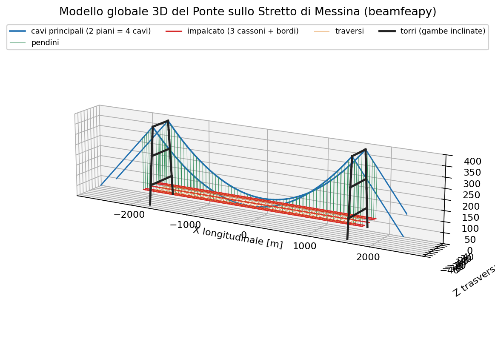

## 1. Design geometry

A 3,300 m main suspended span between two ~383 m towers, with two 183 m suspended
side spans. Four main cables on two vertical planes (52 m apart) drop from the
saddles at the top (382.6 m) to mid-span (81.1 m): sag **f = 301.5 m**
(f/L ≈ 1/10.9).

| Quantity | Value |
|----------|------:|
| Main span *L* | 3,300 m |
| Suspended side spans | 183 m (×2) |
| Total suspended length | 3,666 m |
| Tower height (cable saddle) | 382.6 m |
| Deck elevation (mid-span) | 74.34 m |
| Cable elevation at mid-span | 81.1 m |
| Cable sag *f* | 301.5 m (f/L ≈ 1/10.9) |
| Deck width | 60.4 m |
| Cable-plane spacing | 52 m (z = ±26 m) |
| Main cables | 4 (2 planes × 2 cables) |
| Metallic area per cable | 1.015 m² |
| Cable diameter (incl. wrapping) | 1.263 m |

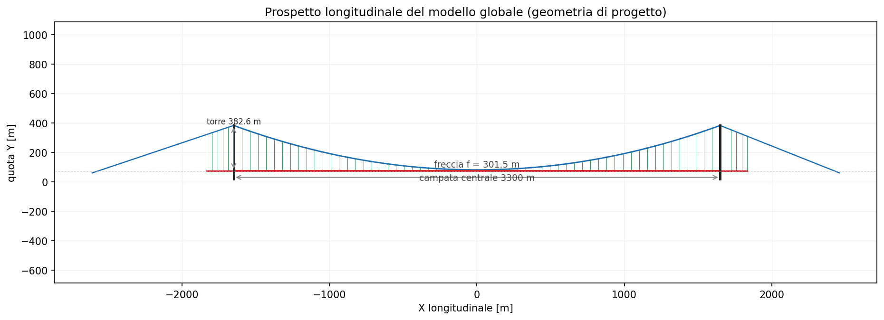

The deck has **three boxes**: two roadway boxes (z = ±18.72 m) and a central
railway box (z = 0). The cross-girders extend out to z = ±26 m, where the hangers
connect to the cable planes.

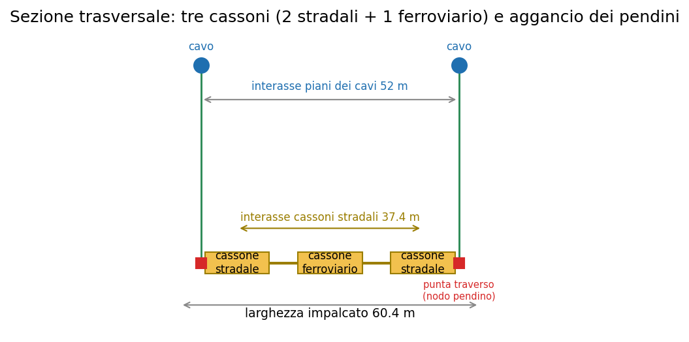

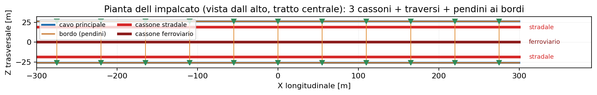

## 2. Permanent loads (PG0022, model 3.3f)

Permanent loads per unit length come from document PG0022. They drive both the
cable statics and the modal mass.

| Contribution | kN/m |
|--------------|-----:|
| Roadway girders — PP (×2) | 97.8 |
| Railway girder — PP | 31.6 |
| Cross-girders — PP (T1, every 30 m) | 53.8 |
| Welds + paint + clamps — PP | 7.8 |
| Road surfacing — PN | 20.0 |
| Roadway equipment — PN (×2) | 36.2 |
| Railway equipment — PN | 18.1 |
| **Total suspended deck  g₁+g₂** | **265.3** |
| Main cables — PP+PN (4 cables) | 324.3 |
| **Total vertical load  w** | **589.6** |

Total vertical load on the suspension system: **w = 589.6 kN/m**, i.e. a mass of
about 60.1 t/m.

## 3. Structural idealisation

A 3D "fish-bone" (grillage) model. Axes: X longitudinal, Y vertical, Z transverse.

- **Main cables**: two planes (z = ±26 m), each equivalent to the 2 real cables
  (area 2.03 m²), discretised into large-displacement cable elements.
- **Hangers**: vertical tension-only cables, in the **main span** (from the main
  cable) *and* in the **side spans** (from the back-stay cable — see §4).
- **Three-box deck**: two roadway boxes (z = ±18.72 m) and one railway box
  (z = 0), modelled as longitudinal beams connected by cross-girders extending to
  z = ±26 m. The box spacing provides the global torsional and lateral stiffness.
- **Towers**: two **inward-leaning** legs (from z = ±39.23 m at the base, elev.
  18 m, to z = ±26 m at the saddle, elev. 382.6 m), with portal cross-beams;
  fixed bases.
- **Side spans and anchorages**: back-stay cable from the saddle to the anchor
  blocks; side-span deck suspended from hangers and supported on the terminal
  structures.

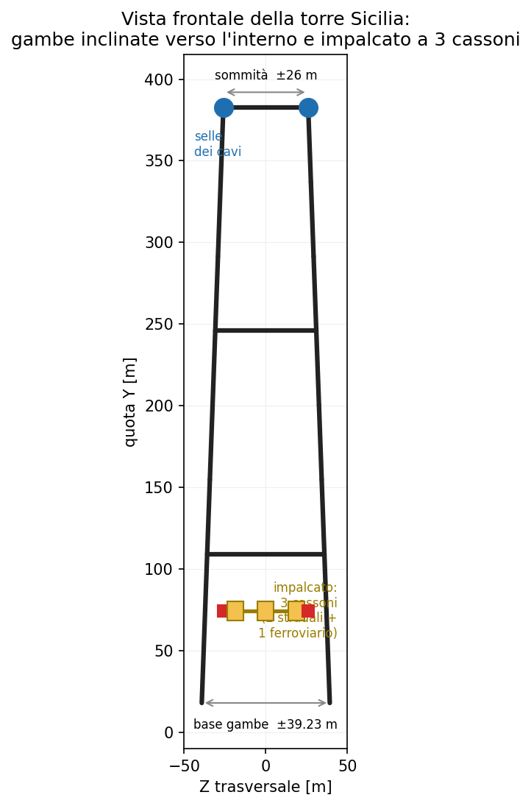

### Real IBDAS model sections (PS0002, App. D-1)

Representative values (robust medians, E = 210 GPa, OCR outliers filtered). *Iy*
= lateral bending (horizontal plane), *Iz* = vertical bending. The roadway box is
**very stiff laterally (Iy = 9 m⁴) and flexible vertically (Iz = 0.44 m⁴)**: an
aerodynamic deck.

| Element | A [m²] | Iy [m⁴] | Iz [m⁴] | J [m⁴] | E [GPa] |
|---------|------:|------:|------:|------:|------:|
| Roadway box (×2) | 0.576 | 9.00 | 0.44 | 1.02 | 210 |
| Railway box | 0.332 | 0.68 | 0.60 | 1.08 | 210 |
| Deck cross-girders | 0.50 | 1.38 | 1.67 | 2.85 | 210 |
| Tower legs | 7.21 | 327.7 | 108.2 | 164 | 210 |
| Tower cross-beams | 2.39 | 63.9 | 27.4 | 50 | 210 |
| Main cable (per plane) | 2.03 | — | — | — | 200 |
| Hangers | 0.018 | — | — | — | 200 |

## 4. Restraints and structural scheme

Defining the restraints correctly is the trickiest part:

- **Saddles**: the cable end node coincides with the saddle and is restrained in
  translation (rigid saddle). The tower carries the vertical reaction; the
  horizontal component is balanced by the back-stay cable.
- **Tower bases**: fixed (foundation flexibility from PB0030/PB0031 is neglected).
- **Anchorages**: back-stay cables fixed in the anchor blocks.
- **Suspended deck**: hung from hangers along the full length (−1,833 ÷ +1,833 m),
  supported vertically and transversely at the towers and at the **terminal
  structures**, with a single longitudinal restraint at mid-span ("floating"
  deck). The side spans are **not** cantilevered: they are **suspended from the
  back-stay cable** (hangers cover the entire suspended length, confirmed by the
  PS0005 charts) and supported on the terminals — with **no** intermediate piers.

> **Note on the typical mistake.** An earlier attempt gave wrong frequencies
> because the deck was clamped at both ends with all rotations locked (artificial
> stiffening) and, to bring the frequencies back down, a fictitious mass of
> 450,000 kN/m (~50× the real load) had been added. Here both artifices are
> removed: physical restraints and real mass.

## 5. Static analysis

### 5.1 Self-weight (end-of-construction configuration)

Nonlinear solution (Newton-Raphson): converges in 5 iterations. The cable keeps
its design parabolic shape and the deck sags only 0.44 m at mid-span. Validation
relies on the classic parabolic-cable theory: **H = w·L²/(8·f)**.

| Quantity | FEM | Theory / note |
|----------|----:|:--------------|
| Cable sag (deformed) | 301.9 m | 301.5 m (geometric) |
| H — horizontal component (per plane) | 1,334 MN | 1,331 MN = w L²/8f |
| Max cable force, per plane (at saddle) | 1,416 MN | — |
| Max force in a single real cable | 708 MN | — |
| Max cable stress | 698 MPa | allowable ~700–840 MPa |
| Hanger force | 4.0 – 7.4 MN | — |
| Deck sag at mid-span | −0.44 m | — |

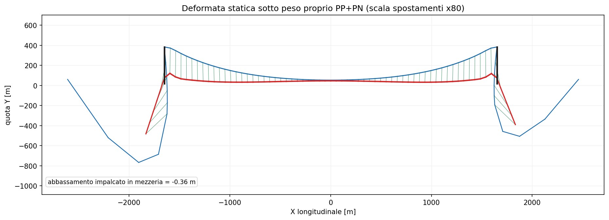

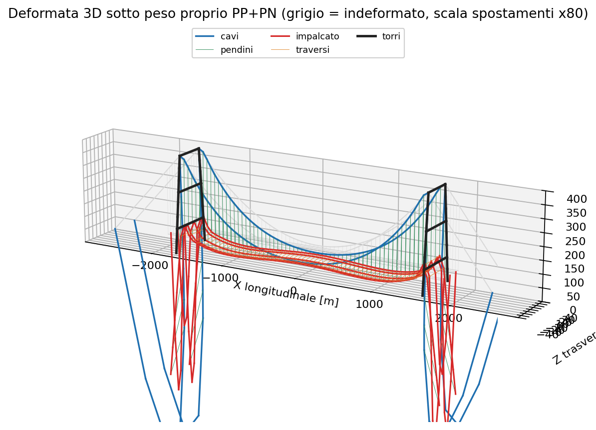

**Comparison with IBDAS (PS0005, end of construction).** The model forces are of
the same order but ~12–14% higher:

| Quantity (per cable plane) | beamfeapy | IBDAS | error |
|----------------------------|----------:|------:|-----:|
| Cable force at mid-span | 1,334 MN | 1,170 MN | +14% |
| Cable force at saddle | 1,416 MN | ≈1,260 MN | +12% |
| Total permanent load *w* | 590 kN/m | ≈515 kN/m | +15% |

The gap is explained by the permanent load: the value deduced from PG0022 is
slightly conservative. For the same load the mechanics is exact (H = wL²/8f within
0.2%).

The official cable-force chart (ADINA/IBDAS model, PS0005) shows **N ≈ 1,170 MN at
mid-span** rising to **~1,260 MN at the towers**, with the characteristic peak at
the saddle: the same trend as the beamfeapy model (1,334 ÷ 1,416 MN), shifted up by
the higher permanent load.

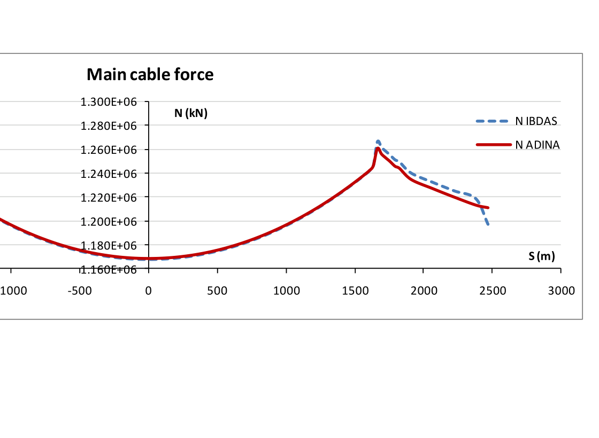

### 5.2 Service loads (traffic and wind)

Besides self-weight, two reference static load cases are analysed:
- **QV** — vertical traffic: 24 kN/m per roadway box + 48 kN/m on the railway box
  (96 kN/m total) over the whole deck;
- **QT** — transverse wind-type action: ~15 kN/m total on the deck.

| Case | Result |
|------|-------:|
| G — mid-span sag | −0.44 m |
| G+QV — mid-span sag | −4.10 m (traffic increment −3.66 m ≈ L/900) |
| G+QV — max bending moment in roadway boxes | 253 MNm |
| G+QV — max cable force | 1,628 MN/plane (+211 MN) |
| G+QT — max transverse deck displacement | 8.3 m |

The deck is very stiff vertically thanks to the cables (only L/900 extra sag under
traffic), whereas the **transverse** response is the most sensitive: laterally the
deck is not supported by the cables and behaves as a beam over a 3,300 m span,
with displacements of a few metres.

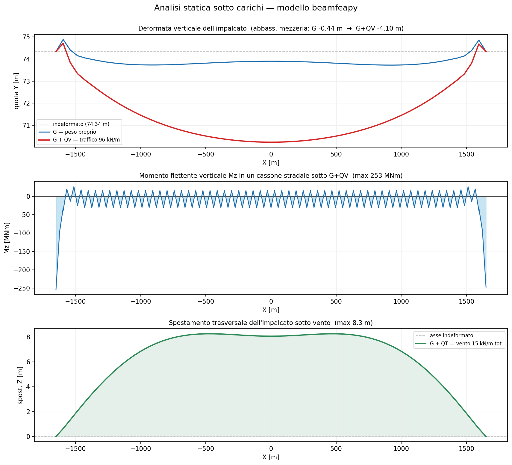

## 6. Modal analysis

The cables are linearised about the self-weight equilibrium (the cable geometric
stiffness, proportional to the tension, provides the transverse stiffness). The
mass comes from the real permanent loads. The first four global modes are
compared with the IBDAS/ADINA modal parameters from PS0005 (§7.2).

| # | Mode type | IBDAS | ADINA | beamfeapy | T [s] | error |
|---|-----------|------:|------:|----------:|------:|-----:|
| 1 | transverse (lateral) | 0.0309 | 0.0313 | 0.0322 | 31.0 | +4% |
| 2 | vertical antisymmetric | 0.0569 | 0.0585 | 0.0598 | 16.7 | +5% |
| 3 | longitudinal | 0.0593 | 0.0593 | 0.0662 | 15.1 | +12% |
| 4 | vertical symmetric | 0.0809 | 0.0809 | 0.0877 | 11.4 | +8% |

*Frequencies in Hz; error relative to IBDAS.*

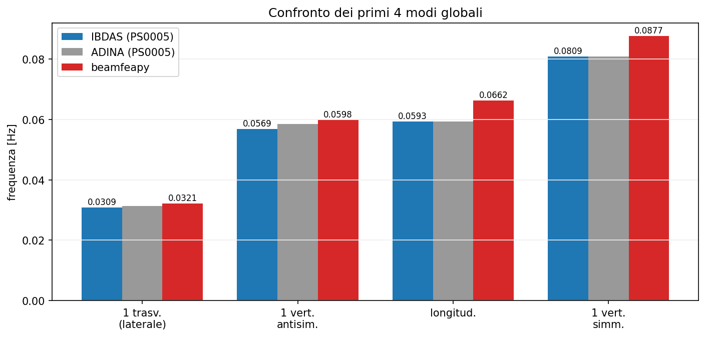

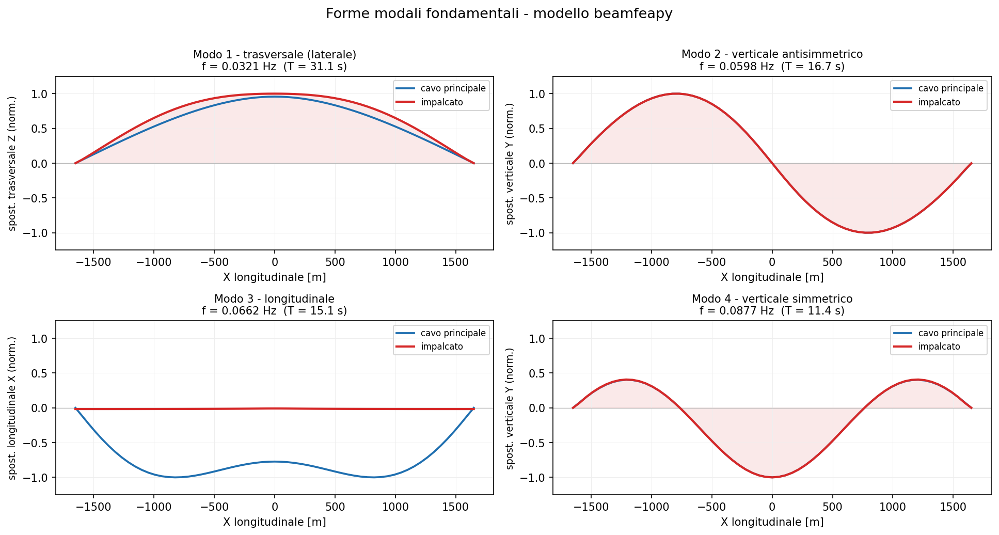

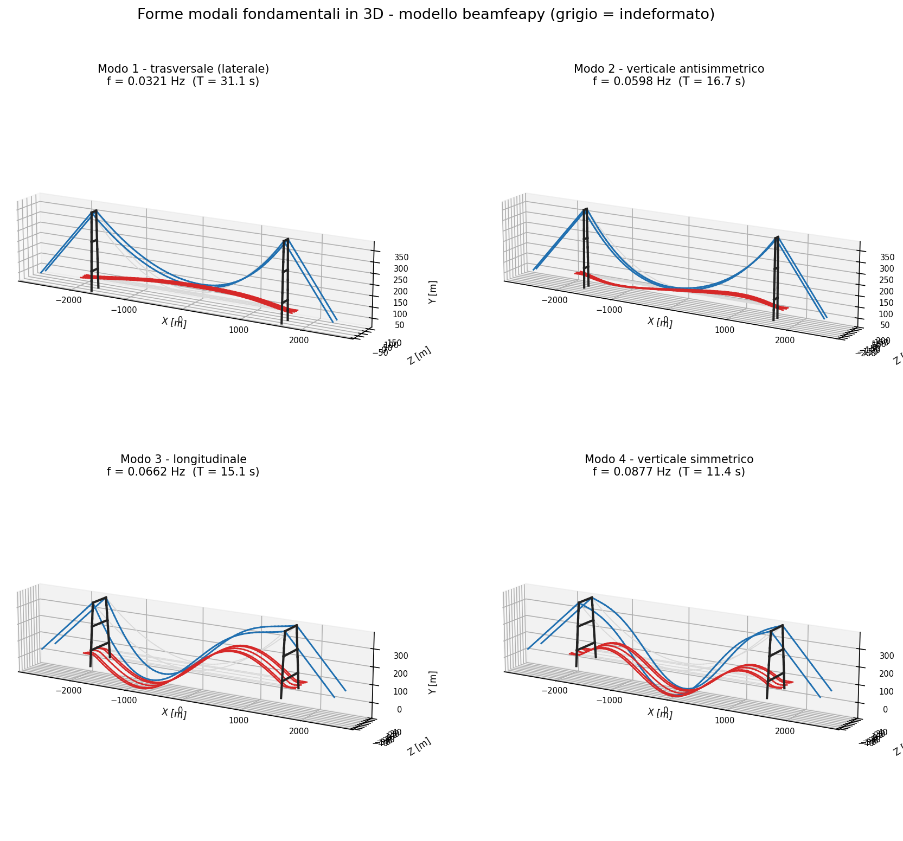

The same four mode shapes in the **official ADINA/IBDAS model** (screenshots taken
from the PS0005 validation report) confirm the **type, hierarchy and shape** of each
mode: the lateral half-wave in plan (mode 1), the antisymmetric vertical with a node
at mid-span (mode 2), the longitudinal mode (mode 3) and the symmetric vertical hump
(mode 4).

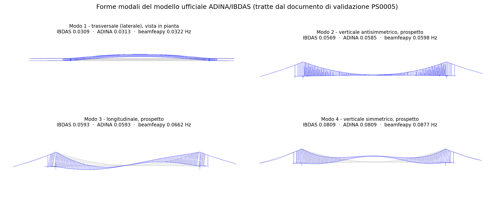

**Theoretical check.** The first vertical antisymmetric mode of a parabolic cable
has frequency f ≈ √(g/8f) = 0.0638 Hz, **independent of the mass**: it depends only
on the sag. The model (0.0598 Hz) reproduces this relation and is consistent with
IBDAS (0.0569 Hz).

## 7. Discussion and limitations

- The fundamental (transverse) mode agrees excellently (+4%); the other modes are
  within +5÷8%.
- The residual upward bias mainly comes from clamping the saddles rigidly and
  fixing the tower bases: neglecting tower and foundation flexibility makes the
  model stiffer than reality. A suspension bridge vertical frequency depends on the
  sag and **not** on the mass, so the bias is not due to the mass.
- Consistently, the static cable forces are ~13% higher than IBDAS: the PG0022
  permanent load is slightly conservative. Mass (slightly high) and stiffness
  (slightly high from the rigid restraints) act in opposite directions on the
  frequencies, leaving a small net error.
- The deck vertical alignment, the restraint devices (tower buffers) and
  aerodynamic/seismic effects remain simplified.

**Key point:** the ~4÷12% agreement on the modes and the exactness of the cable
mechanics (H = wL²/8f within 0.2%) are obtained with the **real IBDAS sections**
and **no mass calibration**, using public data only.

## 8. References

- **PG0022** — Summary of permanent loads for the Global Model (Final Design,
  rev. F0, 2011).
- **PS0002** — IBDAS global model, description (Appendix D-1, beam sections).
- **PS0005** — Validation of the global finite-element model (IBDAS/ADINA modal
  and static results).
- **PB0030 / PB0031** — Equivalent soil-foundation stiffness and damping matrices.
- H.M. Irvine, *Cable Structures*, MIT Press, 1981.
- A.G. Pugsley, *The Theory of Suspension Bridges*, 2nd ed., Edward Arnold, 1968.

## 9. How to reproduce

```bash
python scripts/messina_global_model.py   # build model + static and modal analysis
python scripts/messina_figures.py        # all figures on this page
```

See also the [Vincent Thomas suspension bridge](en-35-suspension-vincent-thomas.html)
and the [cable-element theory](en-33-cables-cable-stayed-suspension.html).
