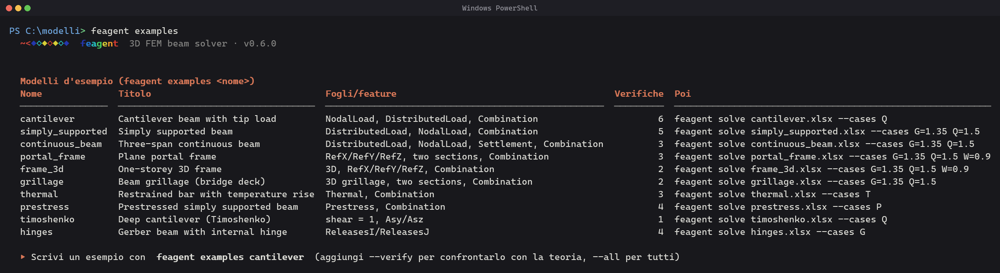
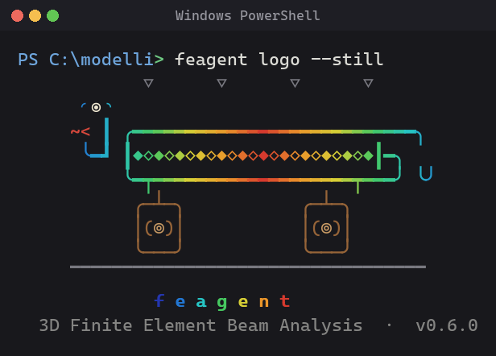

# 37 - Command-Line Interface (CLI)

Installing the package registers a **command-line interface** that lets you
build, validate, analyze, visualize and export models straight from the
terminal, **without writing Python code**. The model lives in an Excel
workbook (see [11 - Excel I/O](en-11-excel-io.html)); the CLI reads it, runs the
analysis and writes results, figures and reports next to it.

Three equivalent ways to invoke it:

```bash
feagent <command> ...          # the installed command
fg <command> ...               # short alias
python -m feagent <command>    # always works, even when Scripts/ is not on the PATH
```

<div align="center">
  
</div>

{: .note }
New to the CLI? Follow the step-by-step [41 - CLI tutorial](en-41-cli-excel-tutorial.html):
it goes from installation to a solved model, sheet by sheet. This page is the
**reference** of every command and option.

## Commands at a glance

| Group | Command | What it does |
|---|---|---|
| Setup | `doctor` | check Python, optional packages, PATH and terminal; solver self-test |
| | `completion` | print a shell-completion script (bash, zsh, PowerShell) |
| | `version`, `logo` | version string; animated logo |
| Model creation | `examples` | catalog of ready-made Excel models with analytical checks |
| | `template` | write an editable Excel template (with README and Combination sheets) |
| | `new` | build a small model with an interactive wizard |
| | `convert` | translate SAP2000 / MIDAS / Robot table exports into a feagent workbook |
| Validation | `check` | validate the workbook (references, supports, loads, combinations), optional trial analysis |
| | `info` | summary of the model: geometry, materials, sections, loads per case, combinations |
| Analysis | `solve` | static analysis of one combination, or of all the combinations of the `Combination` sheet, with envelopes |
| | `modal` | natural frequencies, periods and participating masses |
| | `buckling` | linear buckling multipliers |
| Results | `results` | print a results file (`.xlsx` or `.h5`): displacements, reactions, end forces, modes |
| | `plot` | interactive HTML (Plotly) or PNG (Matplotlib) figures of model, loads, deformed shape, diagrams, reactions |
| | `report` | Word calculation report (`.docx`) |
| | `export` | export to OpenSees, SAP2000, MIDAS, Robot, Straus7 |
| Integration | `mcp` | MCP server for AI agents, see [38 - MCP Server](en-38-mcp-server.html) |

```bash
feagent                 # logo + command list
feagent --help          # full help
feagent solve --help    # help of one command
```

## Global options, environment and exit codes

| Option | Effect |
|---|---|
| `-q`, `--quiet` | print only the essential output (no header, no progress lines); accepted before **or after** the command |
| `--json` | available on most commands: print **only JSON** on stdout (messages go to stderr), for scripts and agents |
| `--color {auto,always,never}` | force or disable ANSI colours (default: auto-detect) |
| `--no-banner` | hide the header line |
| `-V`, `--version` | print the version and exit |

| Environment variable | Effect |
|---|---|
| `NO_COLOR=1` | disable colours (same as `--color never`) |
| `FORCE_COLOR=1` | force colours even when stdout is not a terminal |
| `FEAGENT_DEBUG=1` | show the full Python traceback on errors |

| Exit code | Meaning |
|---|---|
| `0` | success |
| `1` | generic error (invalid combination name, singular matrix, ...) |
| `2` | wrong usage or input file not found |
| `3` | a required optional dependency is missing (the message tells which `pip install "feagent[...]"` fixes it) |
| `4` | validation failed (`check`) or an analytical verification failed (`examples --verify`) |
| `130` | interrupted with Ctrl-C |

## Load combinations: `--cases` versus `--combo`

Every analysis command accepts a **single combination** with `--cases`:

| Form | Meaning |
|---|---|
| *(omitted)* | all loads, coefficient 1 |
| `--cases G` | a single load case |
| `--cases G Q` | combination, coefficient 1 each |
| `--cases G=1.35 Q=1.5` | combination with multiplicative coefficients |

`solve` and `report` also work on **named combinations**, stored in the
`Combination` sheet of the workbook (one row per combination/case pair:
`Name`, `Case`, `Coef`) or given inline:

| Form | Meaning |
|---|---|
| `--combos` | all the combinations of the `Combination` sheet |
| `--combo SLU` | the combination named `SLU` in the sheet (or the load case `SLU` alone) |
| `--combo SLU=G:1.35,Q:1.5` | inline definition (`CASE:COEF` pairs, `CASE=COEF` also accepted, no coefficient = 1); repeatable |
| `--envelope` | with several combinations: also write the min/max envelope workbook |

## `doctor` - environment check

```bash
feagent doctor            # human-readable report
feagent doctor --json     # same data for scripts
```

Prints the feagent and Python versions and locations, a table of every
package with the extra that installs it (`feagent[excel]`, `feagent[plot]`,
...), the `pip install` line for what is missing, whether the `feagent` / `fg`
commands are found on the PATH (with the `python -m feagent` fallback
otherwise), the terminal capabilities (ANSI colours, Unicode, encoding) and a
solver self-test (cantilever `P L^3 / 3 E I`). Exit code `1` if a mandatory
package is missing or the self-test fails.

<div align="center">
  
</div>

## `examples` - ready-made Excel models

```bash
feagent examples                            # catalog
feagent examples cantilever                 # writes cantilever.xlsx in the current folder
feagent examples cantilever -o mensola.xlsx --lang it
feagent examples simply_supported --verify  # writes, solves and compares with closed-form formulas
feagent examples --all -o esempi/           # every model in a folder
feagent examples --json                     # catalog as JSON
```

Each example is a complete workbook (with the `Combination` sheet where it
makes sense) and carries **closed-form checks**: `--verify` reads the file
back, solves it and prints expected vs computed values with the relative
error; exit code `4` if any check fails.

| Key | Model | Excel features shown | Checks |
|---|---|---|---|
| `cantilever` | cantilever, tip load (Q) + permanent load (G) | NodalLoad, DistributedLoad, Combination | `P L^3/3EI`, `P L^2/2EI`, `q L^4/8EI`, reactions, `M` at the fixed end (SLU) |
| `simply_supported` | 6 m beam, 6 elements, uniform load + midspan force | pin/roller supports, load cases | `5 q L^4/384EI`, `P L^3/48EI`, `q L/2`, `q L^2/8`, `P L/4` |
| `continuous_beam` | three spans 6 + 6 + 8 m, settlement of an internal support | Settlement sheet | sum of reactions per case, imposed displacement |
| `portal_frame` | plane portal, HEB300 columns + IPE400 beam, wind | `RefX/RefY/RefZ`, two sections, three combinations | global equilibrium per case and combination |
| `frame_3d` | one-storey spatial frame 6 x 4 m | 3D geometry, `RefX` on columns | global equilibrium |
| `grillage` | two girders + seven cross beams (deck) | horizontal X-Z grillage, wheel load | global equilibrium |
| `thermal` | bar fixed at both ends, +30 K | Thermal sheet | `N = E A alpha dT`, zero displacement |
| `prestress` | 20 m beam with a parabolic tendon, element by element | Prestress sheet (`e_i`, `e_j`, `sag`) | camber `5 w L^4/384EI` with `w = 8 P s/L^2`, `M = P s`, `N = P`, zero reactions |
| `timoshenko` | deep concrete cantilever | `shear = 1`, `Asy`/`Asz` | `P L^3/3EI + P L/G As` |
| `hinges` | Gerber beam with an internal hinge | `ReleasesJ = rz` | reactions, `M` at the fixed end, `M = 0` at the hinge |

<div align="center">
  
</div>

<div align="center">
  
</div>

## `template` - Excel template

```bash
feagent template model.xlsx              # 2-element cantilever with one load of every type
feagent template model.xlsx --blank      # column headers only, no example rows
feagent template model.xlsx --no-readme --no-combos
```

The workbook contains one sheet per data type (`Node`, `Material`, `Section`,
`Element`, `Support`, `NodalLoad`, `DistributedLoad`, `ConcentratedLoad`,
`Thermal`, `Settlement`, `Prestress`), a `Combination` sheet with SLU/SLE
examples and a `README` sheet describing every column, unit and convention
(in English and Italian). `README` is ignored when the model is read. The
format is documented in [11 - Excel I/O](en-11-excel-io.html).

## `new` - guided wizard

`feagent new model.xlsx` asks for nodes, material, section, elements,
supports and nodal loads and writes the workbook (press <kbd>Enter</kbd> to
accept a default, leave a line empty to close a list). Supports are entered
as `node dofs` with six 0/1 digits (`1 111111` = fixed), loads as
`node Fx Fy Fz Mx My Mz [Case]`.

## `convert` - import external tables

```bash
feagent convert sap_tables.xlsx model.xlsx --A 1e-2 --Iy 2e-5 --Iz 3e-5 --J 1e-5
```

Recognizes the usual sheet and column names exported by SAP2000
(`Joint Coordinates`, `Connectivity - Frame`, `Joint Restraint Assignments`,
`Joint Loads - Force`, ...), MIDAS (`NODE`, `ELEMENT`, `CONSTRAINT`, `CONLOAD`)
and Robot (`Nodes`, `Bars`, `Supports`) and writes a feagent workbook. Where
the external file has no numeric material/section data, the defaults `--E`,
`--nu`, `--A`, `--Iy`, `--Iz`, `--J` (and the names `--material`, `--section`)
are used: review them, then `check` and `solve`.

## `check` - validate the workbook

```bash
feagent check model.xlsx                 # structural checks
feagent check model.xlsx --solve         # + trial analysis (conditioning, equilibrium)
feagent check "models/*.xlsx" --strict   # batch; warnings count as errors
feagent check model.xlsx --json
```

Checks the workbook **before** building the model and reports every finding
with a stable code, the sheet and the **Excel row** (header = row 1):

| Group | Codes | What is caught |
|---|---|---|
| Sheets and columns | `E01`-`E02`, `E07`-`E08`, `E11`-`E13`, `E16`-`E18` | missing `Node` sheet, missing `Material`/`Section`/`Element` sheets or their mandatory columns |
| Ids and references | `E03`-`E04`, `E09`, `E14`, `E19`-`E22`, `E25` | non-integer or duplicated ids, elements pointing to undefined nodes, materials (warning `W03`) or sections |
| Geometry | `E23`-`E24`, `E37` | coincident end nodes, zero-length elements, nodes not connected to any element and not fully restrained |
| Element data | `E26`-`E27` | `shear = 1` on a section without `Asy`/`Asz`; invalid release names |
| Supports | `E29`-`E36`, `W04` | restraint on an undefined node, no restrained degree of freedom at all (unstable), all-zero rows |
| Loads | `E38`-`E56`, `W05` | loads on undefined nodes/elements, invalid `Component`, `a`/`b`/`xi` outside `[0, 1]`, thermal gradient without `h_y`/`h_z`, invalid `Dof`, `plane` or `frame` |
| Combinations | `E57`-`E59` | missing columns, non-numeric coefficient, combination citing a load case that no load uses |
| Model build | `E60` | any error raised while building the model |
| Trial analysis (`--solve`) | `E61`-`E63`, `W07` | singular / near-singular stiffness (mechanism), analysis failure, global equilibrium residual, displacements much larger than the model |
| Information | `I01`-`I03`, `W01`-`W02`, `W06` | unknown sheets (ignored), missing coordinate columns, no loads |

Exit code `4` when errors are present (or warnings with `--strict`), so the
command can gate a batch or a CI job.

<div align="center">
  
</div>

<div align="center">
  
</div>

## `info` - model summary

```bash
feagent info model.xlsx
feagent info model.xlsx --json
```

Nodes, elements (Timoshenko and released ones counted apart), springs, shells,
cables; bounding box and total beam length; tables of materials and sections;
loads by type and **by load case**; the combinations of the `Combination`
sheet.

<div align="center">
  
</div>

## `solve` - static analysis

```bash
feagent solve model.xlsx                                  # all loads, coefficient 1 -> model_results.xlsx
feagent solve model.xlsx --cases G=1.35 Q=1.5 -o slu.xlsx
feagent solve model.xlsx --cases G Q --print --top 5      # tables of displacements and reactions
feagent solve model.xlsx --cases Q --nodes 3 7            # displacements of chosen nodes
feagent solve model.xlsx --combos --envelope              # every combination of the sheet + envelope
feagent solve model.xlsx --combo SLU --combo X=G:1,Q:2 -o out/
feagent solve "models/*.xlsx" --outdir results/           # batch
feagent solve model.xlsx --format hdf5 --n-diagram 21     # HDF5 with internal-force diagrams
feagent solve model.xlsx --client                         # extended client workbook
feagent solve model.xlsx --cases Q --json
```

| Option | Meaning |
|---|---|
| `input` | one or more workbooks; patterns such as `*.xlsx` are expanded by the CLI (useful on Windows) |
| `-o`, `--output` | output file for a single run; with several combinations it is the output **folder** |
| `--outdir` | destination folder (created if needed); required with several input files |
| `--format {excel,hdf5}` | output format when `-o` is not given (`<name>_results.xlsx` or `.h5`) |
| `--cases`, `--combos`, `--combo`, `--envelope` | see [load combinations](#load-combinations---cases-versus---combo) |
| `--print`, `--nodes N ...`, `--top N` | print displacement and reaction tables (the `N` most displaced nodes, or the chosen ones) |
| `--sparse` / `--dense` | force the solver; by default sparse above 3000 degrees of freedom |
| `--client` | extended client workbook (model, loads, results and diagrams in one file, Excel only) |
| `--n-diagram N` | stations per element for the `InternalForces` sheet (0 = none; 21 in the envelope) |
| `--json` | summary (max displacement, most displaced nodes, total reactions, output files) as JSON |

The results workbook has the sheets `Displacements`, `Reactions`,
`ElementEndForces` and, with `--n-diagram`, `InternalForces`
(see [22 - Saving Results](en-22-saving-results.html)). With several
combinations one file per combination is written
(`model_SLU.xlsx`, `model_SLE_rara.xlsx`, ...) and the console shows a
comparison table; `--envelope` adds `model_envelope.xlsx` with the sheets
`Summary`, `Displacements` and `Reactions` (min/max per node and DOF with the
governing combination) and `InternalForces` (min/max of `N`, `Vy`, `Vz`, `T`,
`My`, `Mz` along each element, with combination and position).

<div align="center">
  
</div>

<div align="center">
  
</div>

## `results` - read a results file

```bash
feagent results model_SLU.xlsx --top 5
feagent results model_SLU.xlsx --node 3 7 --element 2
feagent results modal.h5                    # modes / critical multipliers if present
feagent results model_results.xlsx --json
```

Prints the most displaced nodes (or the chosen ones), the nodes with non-zero
reactions with their sum, the end forces of the chosen elements (local axes)
and, for HDF5 files, the modal and buckling tables.

<div align="center">
  
</div>

## `modal` - natural frequencies

```bash
feagent modal model.xlsx -n 12 --mass-cases G=1.0 Q=0.3 -o modal.h5
feagent modal model.xlsx -n 5 --mass-cases G --json
```

Masses are derived from the chosen load cases (`--mass-cases` is mandatory);
the table gives frequency, period and participating masses per mode. `-o`
writes the modes to HDF5 (readable with `results`).

<div align="center">
  
</div>

## `buckling` - linear buckling

```bash
feagent buckling model.xlsx -n 4 --cases G Q
feagent buckling model.xlsx --cases G --json
```

Critical multipliers of the reference combination, which must produce axial
force in at least one element (a cantilever loaded only transversally has no
buckling mode: the command explains it and exits with code `1`).

## `plot` - figures

```bash
feagent plot model.xlsx --what model --open                          # interactive HTML in the browser
feagent plot model.xlsx --what deformed --cases G=1.35 Q=1.5 --scale 200
feagent plot model.xlsx --what forces --component Mz --png           # static PNG
feagent plot model.xlsx --what all --cases G Q -o figs/              # every figure
```

| `--what` | Figure |
|---|---|
| `model` | geometry, node numbers, supports |
| `loads` | loads of the combination |
| `deformed` | deflected shape (auto-scaled, or `--scale`) |
| `forces` | internal-force diagram of `--component` (`N`, `Vy`, `Vz`, `T`, `My`, `Mz`; default `Mz`) |
| `reactions` | support reactions |
| `all` | every figure in a folder (`<name>_figs/` by default) |

By default the figures are interactive Plotly HTML files (a clickable
`file://` link is printed; `--open` launches the browser); `--png` writes a
static Matplotlib image instead.

<div align="center">
  
</div>

<div align="center">
  
  
  
</div>

## `report` - Word calculation report

```bash
feagent report model.xlsx -o report.docx --cases G=1.35 Q=1.5
feagent report model.xlsx -o report.docx --combos --title "Portal frame" --subtitle "Preliminary design"
feagent report model.xlsx --no-solve      # model description only
```

Model description, one figure per load case, results and diagrams of the
requested combination(s) (with `--combos` / `--combo`, one chapter per named
combination). Requires `python-docx` and `matplotlib` (`feagent[report]`).

## `export` - external solvers

```bash
feagent export model.xlsx model.tcl                # format from the extension
feagent export model.xlsx model.s2k --format sap2000
```

| Format | `--format` | Extension |
|---|---|---|
| OpenSees (Tcl) | `opensees` | `.tcl` |
| OpenSeesPy | `openseespy` | `.py` |
| SAP2000 | `sap2000` | `.s2k` |
| MIDAS Civil / Gen | `midas` | `.mct` |
| Robot | `robot` | `.str` |
| Straus7 | `straus7` | `.txt` |

See [24 - External Export](en-24-external-export.html) for the mapping of local
axes, releases and loads.

## `completion` - shell completion

```bash
feagent completion bash >> ~/.bashrc
feagent completion zsh  >> ~/.zshrc
feagent completion powershell >> $PROFILE       # Windows PowerShell / pwsh
```

Generates a script that completes command names and options for `feagent`
and `fg` (bash and zsh through `compgen`; PowerShell through
`Register-ArgumentCompleter`). Reload the shell afterwards.

## `logo`, `version`, `mcp`

`feagent logo` plays the animated logo (`--still` static frame, `--loop`
until Ctrl-C, `--image` for the truecolor pixel-art logo, `--image-variant
ibeam` for the historical one). `feagent version` prints the version.
`feagent mcp` starts the MCP server on stdio for Claude Code, Codex and other
agents: see [38 - MCP Server](en-38-mcp-server.html).

<div align="center">
  
</div>

## Scripting with `--json`

Every JSON command prints nothing but JSON on stdout, so it can be piped:

```bash
feagent solve model.xlsx --cases G=1.35 Q=1.5 --json > run.json
feagent check "models/*.xlsx" --json | python -c "import json,sys; print([r['path'] for r in json.load(sys.stdin) if not r['ok']])"
```

```powershell
# PowerShell: solve every workbook of a folder and collect the maximum displacement
Get-ChildItem models\*.xlsx | ForEach-Object {
    $r = feagent solve $_.FullName --cases G=1.35 Q=1.5 --outdir out --json | ConvertFrom-Json
    "{0,-30} {1:E3}" -f $_.Name, $r.u_abs_max
}
```

Exit codes (see above) let a batch stop at the first invalid workbook:
`feagent check model.xlsx && feagent solve model.xlsx --combos`.

## Colours and terminal

Output is colourized automatically (24-bit ANSI). Use `--color never` or
`NO_COLOR=1` to disable it, `--color always` / `FORCE_COLOR=1` to keep colours
when piping to a file. On Windows the CLI enables Virtual-Terminal processing
by itself, so colours work in Windows Terminal and in modern PowerShell
consoles; for crisp box-drawing and shape glyphs use a font with good Unicode
coverage such as **Cascadia Code / Mono** (the Windows Terminal default). Where
Unicode is not available the CLI falls back to ASCII glyphs.

{: .note }
`plot` needs `plotly` (HTML) or `matplotlib` (`--png`), `report` needs
`python-docx` and `matplotlib`, HDF5 output needs `h5py`: run `feagent doctor`
to see what is installed, or install everything with `pip install "feagent[all]"`.
