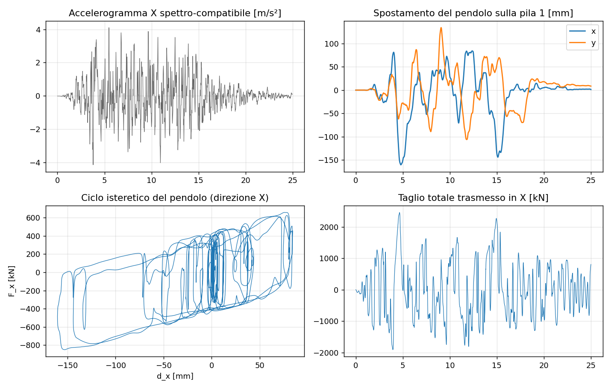

# 40 - Nonlinear time history (isolators, dampers)

`feagent.nl_dynamics` integrates the equation of motion of a **linear structure
carrying nonlinear devices**: friction pendulum and elastomeric isolators,
hysteretic and viscous dampers, gaps and restrainers. This is the analysis the
codes require for the design of seismic isolation (EN 1998-2 §7, NTC 2018 §7.10):
deck and piers stay elastic, the devices concentrate the dissipation, and the
input is a set of accelerograms.

```python
from feagent import (Model, NonlinearLink, FrictionPendulum, Bilinear,
                     ViscousDamper, Gap, solve_time_history_nl)

links = [NonlinearLink(1, node_i=3, node_j=5, law=FrictionPendulum(W=2.9e6, R=3.1, mu=0.05),
                       axes=("x", "y"))]
res = solve_time_history_nl(model, links, [("x", ugx), ("y", ugy)], dt=0.005, t_end=20.0,
                            mass_source={"M": 1.0}, damping=damp)
d, F = res.hysteresis(1)                # loop of device 1 (direction x)
res.link_max_displacement(1)            # design displacement of the isolator
res.energy_dissipated(1)                # hysteretic energy [J]
res.base_shear_history("x")             # force transmitted by ground-connected devices
```

## Model

A `NonlinearLink` connects `node_i` and `node_j` (or `node_j=None` for a device to
the ground) and acts on the **relative translations** `d = u_j - u_i` along the global
`axes` chosen (`("x", "y")` for an isolator in plan, `("x",)` for a longitudinal
damper). The linear structure is any feagent model: beams, shells, linear springs,
kinematic constraints (`add_equal_dof` is the natural way to make the deck follow the
pier top vertically and in rotation while the link governs the horizontal sliding).
The nodes of a link must carry mass (they usually do: the deck mass sits there).

## Device laws

| Law | Force | Typical use |
|---|---|---|
| `Bilinear(k1, k2, Fy, coupled=True)` | elasto-plastic with kinematic hardening in parallel with `k2`: initial stiffness `k1`, post-yield `k2`, yield force `Fy` | lead-rubber bearings, high-damping rubber bearings (equivalent bilinear), hysteretic dampers |
| `FrictionPendulum(W, R, mu, mu_slow=None, a=50, u_y=5e-4)` | `F = (W/R) d + mu W sign(v)` with a stick stiffness `mu W / u_y`; optional velocity-dependent friction `mu(v) = mu_fast - (mu_fast - mu_slow) exp(-a|v|)` (Constantinou et al. 1990) | single friction pendulum; the period `2π√(R/g)` does not depend on the mass |
| `ViscousDamper(c, alpha)` | `F = c |v|^alpha sign(v)` (regularised near `v = 0` for `alpha < 1`) | fluid viscous dampers (EN 15129 §7) |
| `Gap(k, gap, sign)` | contact stiffness `k` once the relative displacement exceeds `gap` | seismic restrainers, abutment pounding |

With `coupled=True` (default) the bilinear laws use a **circular yield surface** in the
plane of the two link directions and a radial-return update (Park, Wen & Ang 1986): the
force under simultaneous X and Y motion is the one of the real device, not two
independent uniaxial springs.

## Integration and damping

Newmark average acceleration with Newton-Raphson iterations on the residual at every
step (consistent tangent of the radial return, `tol` and `max_iter` adjustable); the
result reports the iterations per step and a `converged` flag. The viscous damping
`C = a M + b K` is built on the **linear structure only**: the devices are not in `K`,
so no spurious stiffness-proportional damping acts on the isolator motion (Ryan &
Polanco 2008). In an isolated structure the horizontal deck degrees of freedom have no
linear stiffness, so a modal analysis of the bare model is not possible: calibrate the
damping on a companion model where the devices are replaced by their effective
stiffness (`add_elastic_support`), preferably stiffness-proportional on the piers only
(see `examples/ex18_isolated_bridge_fps.py`).

## Input motion and accelerograms

The excitation is the same as for the linear time history, plus **several ground-motion
components at once**: `[("x", ugx), ("y", ugy)]`. `absolute_acceleration_history` adds
the ground acceleration of every component. `feagent.accelerograms` provides the
tools around it:

- `read_accelerogram`, `resample`, `baseline_correction`;
- `response_spectrum(ug, dt, periods, xi)` with the exact Nigam-Jennings recurrence
  (pseudo-acceleration, displacement, absolute acceleration);
- `spectrum_compatible_accelerogram(target, duration, dt, seed=...)` generates an
  artificial record matched to a target spectrum (Gasparini & Vanmarcke, SIMQKE), for
  instance `seismic.ResponseSpectrum.eurocode8(ag, soil)`;
- `spectrum_match_check(records, dt, target, T1)` applies the EN 1998-1 §3.2.3.1.2 /
  NTC 2018 §3.2.3.6 rule (mean spectrum not below 90 % of the target in the period
  range of interest).

## Validation

The solver is checked against OpenSees run locally and against closed-form results;
the full tables are in [39 - Benchmark report](en-39-benchmark-report.html):

- bilinear isolator and friction pendulum under an EC8-compatible record against
  `zeroLength + Steel01`: displacement and force histories within 0.03 % of the peak;
- coupled bidirectional isolator under two simultaneous components against
  `elastomericBearingPlasticity`: within 0.003 %;
- nonlinear viscous damper against the `Viscous` material: within 0.003 %;
- deck on two friction pendulums under two components: energy balance
  `E_in = E_k + E_s + E_d + E_h` closed to 1e-12 %, device forces equal to the deck
  inertia;
- elastic limit: identical to the linear solver to machine precision.

## Example: bridge deck on friction pendulums

`examples/ex18_isolated_bridge_fps.py` analyses a three-span deck (3 x 40 m) on two
piers and two abutments with a friction pendulum at every support (R = 3.1 m,
period 3.5 s, friction 5 % fast / 3 % slow), under seven pairs of spectrum-compatible
records (EC8, ag = 0.35 g, soil B) with the compatibility check, and reports the
design displacement of the devices, the hysteresis loops, the force transmitted to the
substructures and the dissipated energy.


