# 41 - CLI tutorial: from an Excel workbook to results, step by step

This tutorial takes you from a fresh installation to a solved model using
**only the terminal and Excel**: no Python code. It uses the ready-made
examples shipped with feagent, then shows how to write your own workbook
sheet by sheet, validate it, solve one or many load combinations, read the
results and produce figures and a report.

The commands are shown for PowerShell on Windows; they are identical on macOS
and Linux (bash/zsh). The reference of every option is in
[37 - Command-Line Interface](en-37-cli.html); the Excel format is described in
[11 - Excel I/O](en-11-excel-io.html).

## 1. Install and check the environment

Install feagent with the extras used by the CLI (Excel, plots, report):

```bash
python -m venv .venv                      # optional but recommended
.venv\Scripts\activate                    # Windows  (source .venv/bin/activate on macOS/Linux)
pip install "feagent[all]"                # or pip install -e ".[all]" from a clone
```

Then let feagent check itself:

```bash
feagent doctor
```

<div align="center">
  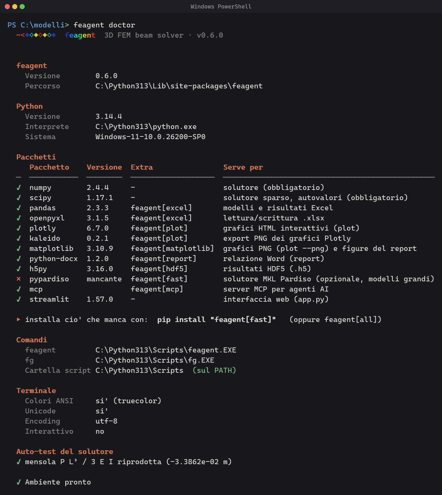
</div>

`doctor` tells you which optional packages are missing and the exact `pip`
line to install them, whether the `feagent` command is on the PATH (if it is
not, use `python -m feagent ...` or add the printed `Scripts` folder to the
PATH) and runs a solver self-test. Full installation notes, including
troubleshooting, are in [01 - Installation](en-01-installation.html).

## 2. Start from a working example

The quickest way to see how a workbook is organized is to write one of the
bundled examples and open it in Excel:

```bash
feagent examples                          # the catalog
feagent examples simply_supported --verify
```

<div align="center">
  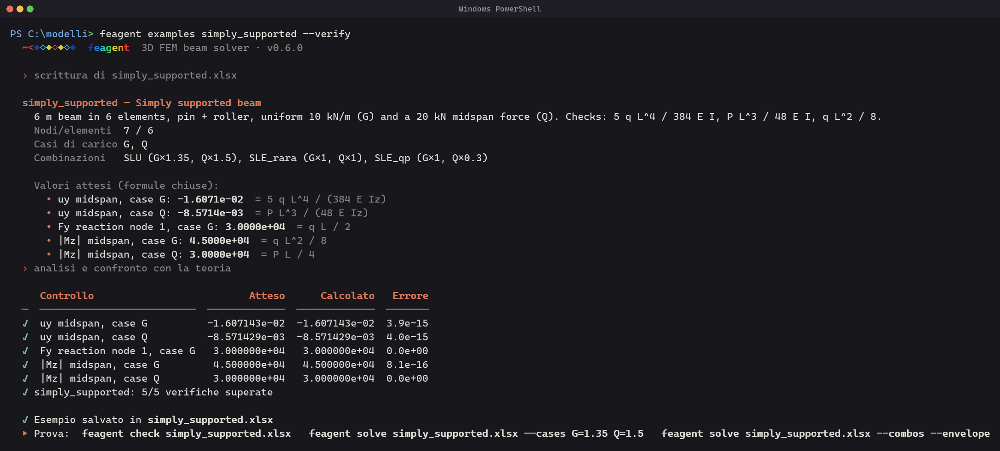
</div>

The command writes `simply_supported.xlsx` in the current folder, reads it
back, solves it and compares the results with the closed-form formulas of a
simply supported beam (`5 q L^4 / 384 E I`, `P L^3 / 48 E I`, `q L / 2`,
`q L^2 / 8`, `P L / 4`): every check is reproduced to machine precision. The
ten examples cover every sheet of the format (nodal, distributed,
concentrated, thermal and prestress loads, settlements, hinges, Timoshenko
elements, 3D frames and grillages): write them all with
`feagent examples --all -o esempi/` and use them as templates.

## 3. Anatomy of the workbook

Create the template and open it:

```bash
feagent template model.xlsx
```

The workbook is a small cantilever (two elements) with one load of every
type, three load cases (`G`, `Q`, `T`) and three combinations. The first
sheet, `README`, documents every column, unit and convention in English and
Italian; it is ignored when the model is read, so you can keep it in your own
files.

<div align="center">
  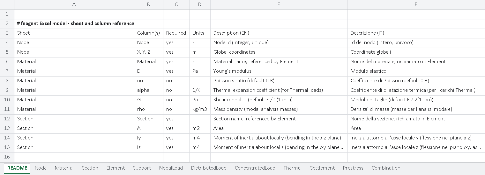
</div>

Only `Node` is mandatory; every other sheet can be missing or empty. Sheet
and column names are recognized without regard to case. Units are SI
throughout (N, m, Pa, kg, K) or any consistent system.

### Node

<div align="center">
  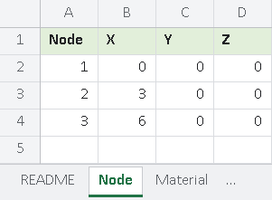
</div>

| Column | Meaning |
|---|---|
| `Node` | integer id, unique |
| `X`, `Y`, `Z` | global coordinates [m] |

Global axes are right-handed. For horizontal beams the default vertical axis
is **Y**: the local `y` axis of the element coincides with global `Y`, so
gravity loads are `fy` components with a negative sign. Use the X-Z plane
for grillages and slabs seen in plan (see the `grillage` example).

### Material

<div align="center">
  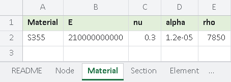
</div>

| Column | Meaning |
|---|---|
| `Material` | name, referenced by `Element` |
| `E` | Young's modulus [Pa] |
| `nu` | Poisson's ratio (default 0.3); `G` optional shear modulus |
| `alpha` | thermal expansion coefficient [1/K], needed by `Thermal` loads |
| `rho` | mass density [kg/m^3], used for the modal masses |

### Section

<div align="center">
  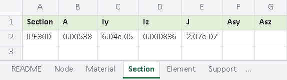
</div>

| Column | Meaning |
|---|---|
| `Section` | name, referenced by `Element` |
| `A` | area [m^2] |
| `Iy` | second moment about local `y` (bending in the local x-z plane, weak axis for gravity) [m^4] |
| `Iz` | second moment about local `z` (bending in the local x-y plane, **strong axis for gravity**) [m^4] |
| `J` | torsion constant [m^4] |
| `Asy`, `Asz` | shear areas, only for Timoshenko elements (`shear = 1`) |

### Element

<div align="center">
  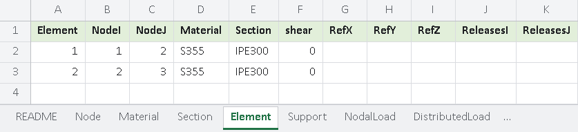
</div>

| Column | Meaning |
|---|---|
| `Element` | integer id, unique |
| `NodeI`, `NodeJ` | end nodes; the local `x` axis runs from I to J |
| `Material`, `Section` | names from the previous sheets |
| `shear` | `1` = Timoshenko beam (needs `Asy`, `Asz`), `0` or empty = Euler-Bernoulli |
| `RefX`, `RefY`, `RefZ` | reference vector defining the local x-y plane; empty = global Y (global X for vertical elements) |
| `ReleasesI`, `ReleasesJ` | end releases, comma-separated among `ux, uy, uz, rx, ry, rz` (`rz` = bending hinge) |

Local axes follow the SAP2000 convention: `x` along the element, `y` from
the reference vector, `z = x cross y`. For **vertical columns** the default
reference is global X, so `Iz` governs the sway in the X direction; set
`RefX = 1, RefY = 0, RefZ = 0` explicitly (as the `portal_frame` example
does) when you want to be sure. Details in
[08 - Section Orientation](en-08-section-orientation.html).

### Support

<div align="center">
  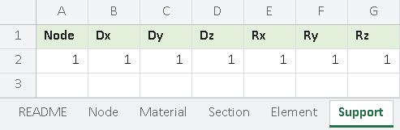
</div>

`Node` plus six 0/1 flags `Dx, Dy, Dz, Rx, Ry, Rz` in **global** axes
(`1` = restrained). A fixed support has six ones; a pin has `1 1 1 0 0 0`.
For a plane beam in the X-Y plane also restrain the out-of-plane freedoms
(`Dz`, `Rx` at the ends), exactly as the examples do.

### NodalLoad, DistributedLoad, ConcentratedLoad

<div align="center">
  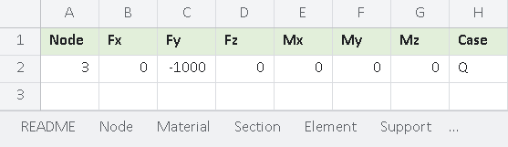
</div>

<div align="center">
  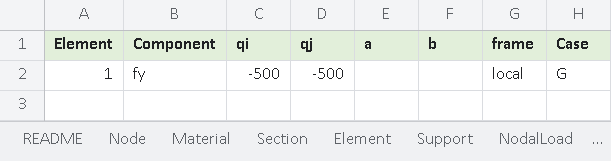
</div>

<div align="center">
  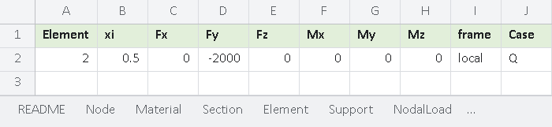
</div>

| Sheet | Columns | Notes |
|---|---|---|
| `NodalLoad` | `Node`, `Fx..Mz`, `Case` | forces [N] and moments [N m] in global axes |
| `DistributedLoad` | `Element`, `Component`, `qi`, `qj`, `a`, `b`, `frame`, `Case` | `Component` = `fx, fy, fz` [N/m] or `mx, my, mz` [N m/m]; `qj` empty = uniform; `a`, `b` = normalized start/end of the loaded stretch in [0, 1] (empty = whole element); `frame` = `local` (default) or `global` |
| `ConcentratedLoad` | `Element`, `xi`, `Fx..Mz`, `frame`, `Case` | force at the normalized position `xi = x/L` in [0, 1] |

Every load belongs to a **load case** (`Case` column; `default` when
empty): the case names are the words you will combine with `--cases` and in
the `Combination` sheet.

### Thermal, Settlement, Prestress

<div align="center">
  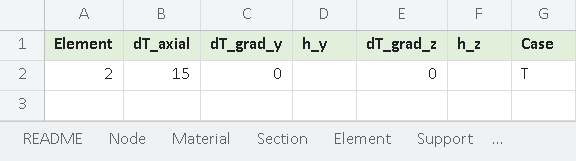
</div>

| Sheet | Columns | Notes |
|---|---|---|
| `Thermal` | `Element`, `dT_axial`, `dT_grad_y`, `h_y`, `dT_grad_z`, `h_z`, `Case` | uniform change [K] and/or linear gradients (temperature difference across the depth `h_y` / `h_z` [m]) |
| `Settlement` | `Node`, `Dof`, `Value` | imposed displacement [m] or rotation [rad] on `ux..rz`; **always active**, it has no load case |
| `Prestress` | `Element`, `P`, `e_i`, `e_j`, `plane`, `sag`, `Case` | tendon force [N], end eccentricities [m], parabolic sag (positive = upward camber) in the plane `y` or `z`; equivalent loads are generated automatically |

### Combination

<div align="center">
  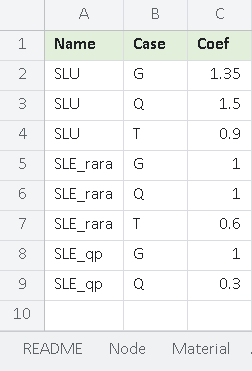
</div>

One row per (combination, load case) pair: `Name`, `Case`, `Coef`. The
template ships with `SLU = 1.35 G + 1.5 Q + 0.9 T`, `SLE_rara = G + Q + 0.6 T`
and `SLE_qp = G + 0.3 Q`. These are the combinations run by
`feagent solve --combos` and reported by `feagent report --combos`.

## 4. Write your own model: a simply supported beam

Let us reproduce the `simply_supported` example by hand. Start from an empty
template (`feagent template beam.xlsx --blank`) and type the following
rows.

**Node** - a 6 m beam in six 1 m elements:

| Node | X | Y | Z |
|---|---|---|---|
| 1 | 0 | 0 | 0 |
| 2 | 1 | 0 | 0 |
| 3 | 2 | 0 | 0 |
| 4 | 3 | 0 | 0 |
| 5 | 4 | 0 | 0 |
| 6 | 5 | 0 | 0 |
| 7 | 6 | 0 | 0 |

**Material** and **Section** (steel, an IPE-like section):

| Material | E | nu | alpha | rho |
|---|---|---|---|---|
| S355 | 210e9 | 0.3 | 1.2e-5 | 7850 |

| Section | A | Iy | Iz | J |
|---|---|---|---|---|
| IPE | 1.2e-2 | 3e-5 | 5e-5 | 2e-5 |

**Element** - six elements in a row:

| Element | NodeI | NodeJ | Material | Section |
|---|---|---|---|---|
| 1 | 1 | 2 | S355 | IPE |
| 2 | 2 | 3 | S355 | IPE |
| 3 | 3 | 4 | S355 | IPE |
| 4 | 4 | 5 | S355 | IPE |
| 5 | 5 | 6 | S355 | IPE |
| 6 | 6 | 7 | S355 | IPE |

**Support** - pin at node 1, roller at node 7 (out-of-plane freedoms `Dz`
and `Rx` restrained at both ends):

| Node | Dx | Dy | Dz | Rx | Ry | Rz |
|---|---|---|---|---|---|---|
| 1 | 1 | 1 | 1 | 1 | 0 | 0 |
| 7 | 0 | 1 | 1 | 1 | 0 | 0 |

**DistributedLoad** - 10 kN/m downward on every element, case `G`
(six rows, one per element):

| Element | Component | qi | qj | a | b | frame | Case |
|---|---|---|---|---|---|---|---|
| 1 | fy | -10000 | | | | local | G |
| ... | fy | -10000 | | | | local | G |
| 6 | fy | -10000 | | | | local | G |

**NodalLoad** - 20 kN downward at midspan, case `Q`:

| Node | Fx | Fy | Fz | Mx | My | Mz | Case |
|---|---|---|---|---|---|---|---|
| 4 | 0 | -20000 | 0 | 0 | 0 | 0 | Q |

**Combination** (optional):

| Name | Case | Coef |
|---|---|---|
| SLU | G | 1.35 |
| SLU | Q | 1.5 |
| SLE_rara | G | 1.0 |
| SLE_rara | Q | 1.0 |

Save and close the file (Excel keeps it locked while open: feagent can read
it, but cannot overwrite it).

## 5. Validate before solving

```bash
feagent check beam.xlsx --solve
```

<div align="center">
  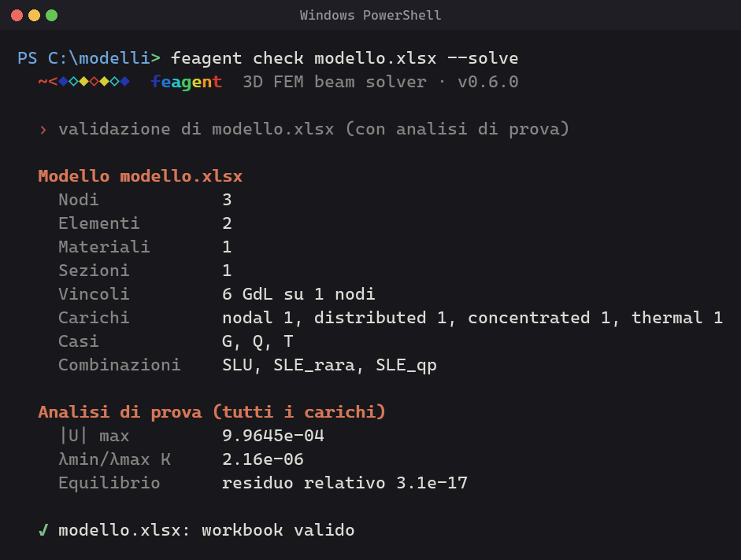
</div>

`check` catches the mistakes that are easy to make in a spreadsheet: a node
number that does not exist, a section name misspelled, an element with
coincident nodes, a missing `Support` sheet, a load position outside
`[0, 1]`, a combination that cites a load case no load uses. Every finding
carries a code, the sheet and the Excel row, so the fix is a click away:

<div align="center">
  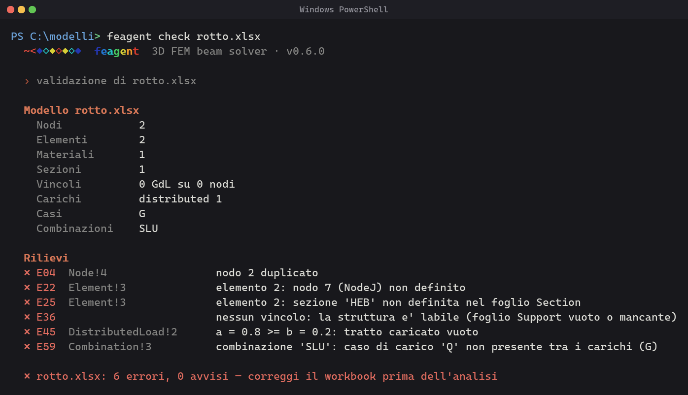
</div>

`--solve` also runs a trial analysis with all the loads and verifies that the
stiffness matrix is well conditioned (a mechanism, for instance a beam free to
slide axially, is reported as `E61`) and that the reactions balance the
applied loads. The exit code is `4` when errors are found, which makes
`check` a natural gate in scripts.

## 6. Inspect the model

```bash
feagent info beam.xlsx
```

<div align="center">
  
</div>

You get the counts, the bounding box, the tables of materials and sections
and, most useful, the **loads per load case** and the combinations found in
the workbook: a quick way to confirm that every load went into the case you
meant.

## 7. Solve one combination

```bash
feagent solve beam.xlsx --cases G --print
```

<div align="center">
  
</div>

The console shows the maximum displacement and its node, the sum of the
reactions and, with `--print`, the tables of displacements (the most displaced
nodes, or those given with `--nodes`) and reactions. The workbook
`beam_results.xlsx` contains the sheets `Displacements`, `Reactions`,
`ElementEndForces` and, with `--n-diagram 21`, `InternalForces` with `N`,
`Vy`, `Vz`, `T`, `My`, `Mz` at 21 stations per element.

For the beam above, case `G` gives at node 4 `uy = 5 q L^4 / 384 E I =
-16.07 mm`, reactions `Fy = 30 kN` at both supports and `Mz = 45 kN m` at
midspan; case `Q` gives `uy = P L^3 / 48 E I = -8.57 mm`. To read a results
file later:

```bash
feagent results beam_results.xlsx --top 5 --element 3
```

<div align="center">
  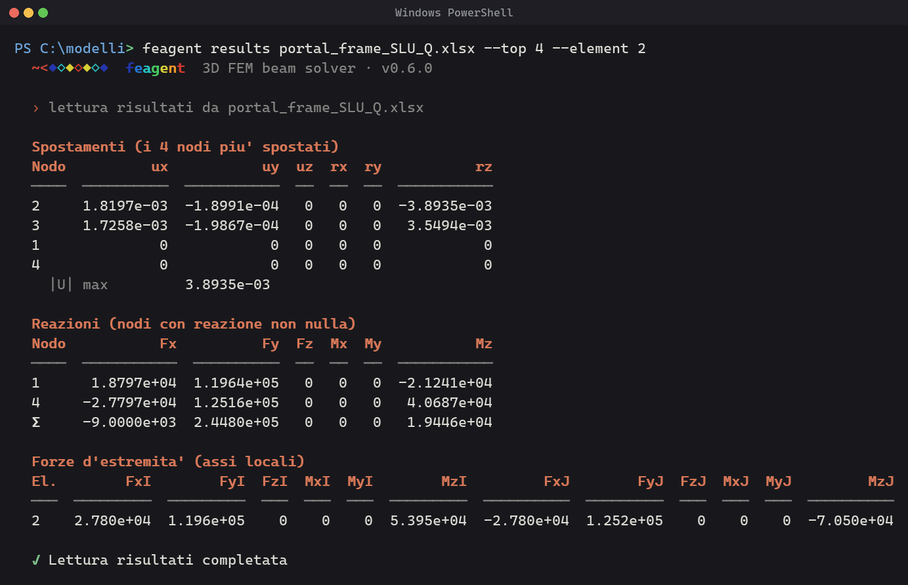
</div>

## 8. Combinations and envelopes

```bash
feagent solve beam.xlsx --combos --envelope
```

<div align="center">
  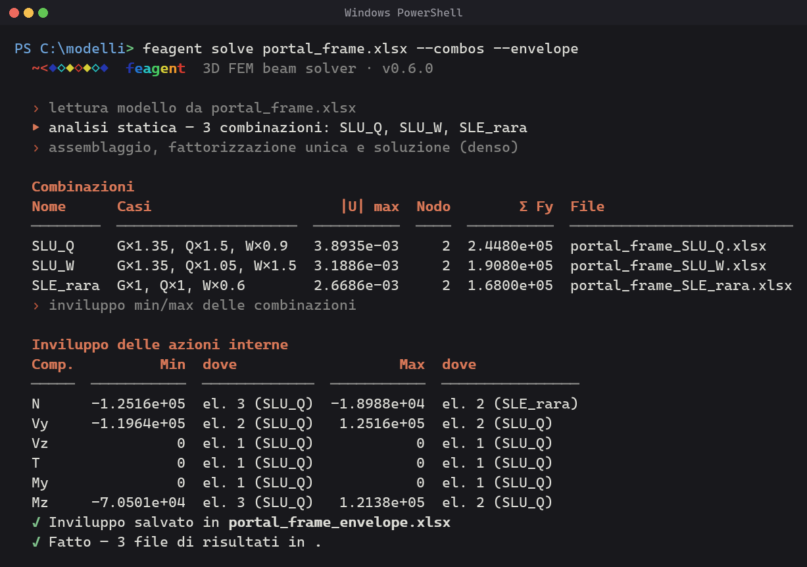
</div>

Every combination of the `Combination` sheet is solved with a single
factorization and written to its own workbook (`beam_SLU.xlsx`,
`beam_SLE_rara.xlsx`); `--envelope` adds `beam_envelope.xlsx`, whose sheets
give the minimum and maximum of every displacement, reaction and internal
force together with the **governing combination** and, for the internal
forces, the position along the element. Combinations can also be written
inline, without touching the workbook:

```bash
feagent solve beam.xlsx --combo SLU --combo Wind=G:1.0,W:1.5 --envelope -o out/
```

## 9. Pictures

```bash
feagent plot beam.xlsx --what deformed --cases G=1.35 Q=1.5 --open   # interactive, in the browser
feagent plot beam.xlsx --what forces --component Mz --png            # static PNG
feagent plot beam.xlsx --what all --cases G Q                        # everything in beam_figs/
```

<div align="center">
  
  
  
</div>

## 10. Modal and buckling analysis

```bash
feagent modal beam.xlsx -n 6 --mass-cases G=1.0 Q=0.3 -o beam_modal.h5
feagent buckling portal_frame.xlsx --cases G
```

The masses of the modal analysis come from the load cases you choose
(`rho` of the materials is used for the self-mass); the buckling analysis
needs a combination that puts axial force in the elements (a portal frame
under gravity, not a beam loaded transversally).

## 11. Report and export

```bash
feagent report beam.xlsx --combos -o beam.docx --title "Simply supported beam"
feagent export beam.xlsx beam.tcl            # OpenSees; .s2k SAP2000, .mct MIDAS, .str Robot
```

The Word report describes the model, shows the loads of every case and the
results of every combination with diagrams; the export writes the model for
an external solver with the same local axes and releases.

## 12. Automate

- **Batch**: `feagent check "models/*.xlsx"` and
  `feagent solve "models/*.xlsx" --outdir results/` process a whole folder
  (patterns are expanded by the CLI, so they also work in PowerShell).
- **JSON**: add `--json` to `doctor`, `check`, `info`, `solve`, `modal`,
  `buckling`, `results`, `examples` to get machine-readable output for
  scripts, notebooks or AI agents (see [38 - MCP Server](en-38-mcp-server.html)
  for the agent-side integration).
- **Exit codes**: `0` success, `2` file not found, `3` missing optional
  package, `4` validation failed: `feagent check m.xlsx && feagent solve m.xlsx --combos`.
- **Completion**: `feagent completion powershell >> $PROFILE`
  (or `bash` / `zsh`) to complete commands and options with <kbd>Tab</kbd>.

## 13. Troubleshooting

| Symptom | Cause and fix |
|---|---|
| `'feagent' is not recognized` | the Python `Scripts` folder is not on the PATH: run `python -m feagent doctor`, which prints the folder to add, or keep using `python -m feagent ...` |
| `ImportError: ... pandas` / exit code 3 | the extra is not installed: `pip install "feagent[excel]"` (or `[all]`) |
| `E36 no restraints` | the `Support` sheet is missing or all flags are 0 |
| `E37 node not connected` | a node is defined but no element uses it: remove it or restrain all six freedoms |
| `E61 singular stiffness` | mechanism: a beam free to slide axially, a hinge chain, a 3D frame without out-of-plane restraints; check `Support` and the releases |
| huge displacements (`W07`) | inconsistent units (mm with Pa, kN with m), a section a thousand times too small, or a mechanism |
| `E26 shear = 1 without Asy/Asz` | Timoshenko elements need the shear areas in the `Section` sheet |
| `combination ... not found` | `--combo NAME` must match a name of the `Combination` sheet or a load case; use `NAME=CASE:COEF,...` to define it inline |
| `modal requires --mass-cases` | masses come from load cases: `--mass-cases G=1.0 Q=0.3` |
| `PermissionError` when writing | the workbook is open in Excel: close it or write elsewhere with `-o` / `--outdir` |
| no colours / odd glyphs | use Windows Terminal or a font with Unicode coverage (Cascadia); `--color never` for plain output |

## Where next

- [11 - Excel I/O](en-11-excel-io.html): the format reference and the Python
  functions behind the CLI (`read_excel`, `read_combinations`, `write_template`, `write_envelope`).
- [07 - Load Cases & Combinations](en-07-load-cases.html) and
  [13 - Conventions](en-13-conventions.html): signs, axes and combination rules.
- [22 - Saving Results](en-22-saving-results.html) and
  [23 - HDF5 format](en-23-hdf5-format.html): what the result files contain.
- [37 - Command-Line Interface](en-37-cli.html): every command and option.
