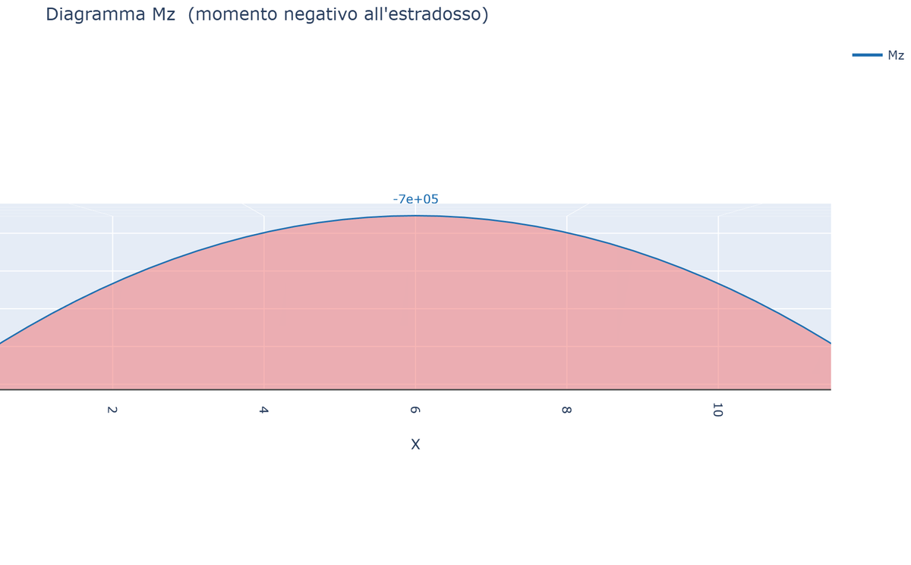
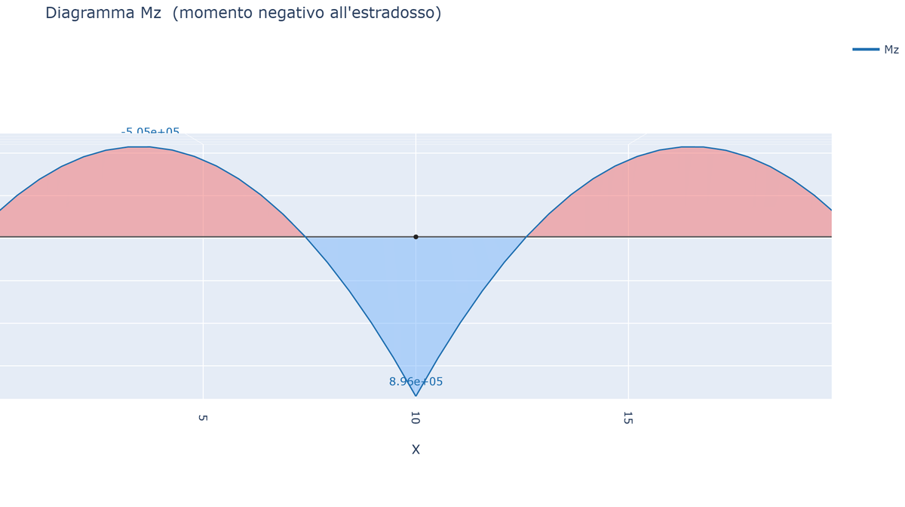

# 04 - Carichi

feagent supporta tutti i principali tipi di carico per l'analisi statica di strutture intelaiate.

## Carichi nodali

Forze e coppie applicati direttamente ai nodi (sistema globale):

```python
m.add_nodal_load(node, Fx=1000, Fy=-5000, Fz=0, Mx=0, My=0, Mz=3000, case="G")
```

Tutti i parametri sono opzionali tranne il nodo. Le componenti sono in coordinate globali.

## Carichi distribuiti

Carichi per unità di lunghezza sugli elementi. Comprende uniformi, parziali e trapezoidali:

```python
# Uniforme su tutto l'elemento
m.add_distributed_load(elem, "fy", -3000.0)

# Parziale (da x=1m a x=3m)
m.add_distributed_load(elem, "fy", -5000.0, a=1.0, b=3.0)

# Trapezoidale completo (q_i a x=0, q_j a x=L)
m.add_distributed_load(elem, "fy", 0, -8000.0)

# Trapezoidale parziale (da x=2m a x=5m)
m.add_distributed_load(elem, "fy", -2000.0, -8000.0, a=2.0, b=5.0)

# In coordinate globali
m.add_distributed_load(elem, "fy", -3000.0, frame="global")
```

**Componenti**: `fx`, `fy`, `fz` (forze), `mx`, `my`, `mz` (coppie distribuite).  
**Parametri**: `q_i` (valore iniziale), `q_j` (valore finale, default = q_i), `a`, `b` (estremi del tratto), `frame` (`"local"` o `"global"`).

## Carichi concentrati in campata

Forze e coppie applicate a un punto interno all'elemento:

```python
# Forza a x = 0.35·L
m.add_concentrated_load(elem, 0.35, Fy=-50000.0)

# Momento a x = 0.70·L
m.add_concentrated_load(elem, 0.70, Mz=80000.0)

# In coordinate globali a metà campata
m.add_concentrated_load(elem, 0.5, Fz=-20000.0, frame="global")
```

`xi ∈ [0, 1]` è l'ascissa normalizzata (0 = nodo i, 1 = nodo j).

## Carichi termici

```python
# Aumento uniforme di temperatura
m.add_thermal_load(elem, dT_axial=20.0)

# Gradiente lungo z (richiede section.h_z)
m.add_thermal_load(elem, dT_axial=20.0, dT_grad_z=15.0)

# Gradiente lungo y
m.add_thermal_load(elem, dT_grad_y=12.0)
```

### Profilo termico generico (EN 1991-1-5)

```python
# Funzione T(s), con s dal baricentro in [-h/2, +h/2]
m.add_thermal_profile(elem, lambda s: 15*(0.5 + s/0.3), axis="z")

# Punti discreti [(s, T)]
m.add_thermal_profile(elem, [(-0.15, 0), (0.05, 2.5), (0.15, 15)],
                       axis="z", width=0.30)
```

Per calcolare le tensioni autoequilibrate (eigenstress):
```python
from feagent.loads import ThermalProfile
tp = ThermalProfile(elem, profile, axis="z", width=B)
sigma = tp.eigenstress(element, s)  # tensione autoequilibrata alla quota s
```

## Cedimenti

```python
m.add_settlement(node, "uy", -0.005)   # cedimento verticale di 5 mm
m.add_settlement(node, "rz", 0.001)     # rotazione imposta
```

Il GdL può essere: `ux`, `uy`, `uz`, `rx`, `ry`, `rz`.

## Precompressione

### Metodo dei carichi equivalenti (cavo interno)

```python
# Cavo parabolico: freccia sag, eccentricità nulla agli estremi
m.add_prestress(elem, P=2.0e6, sag=0.35)

# Cavo rettilineo eccentrico
m.add_prestress(elem, P=1.5e6, e_i=0.20, e_j=0.20, plane="y")

# Profilo di eccentricità generico
m.add_prestress(elem, P=1.0e6, profile=lambda xi: 0.3*(1-(2*xi-1)**2))
```

In struttura isostatica: momenti primari M = P·e, reazioni nulle. In iperstatica: momenti secondari automatici.

### Dalla geometria 3D del cavo

```python
# Cavo definito come polilinea 3D
pts = [(0, 0.3, 0), (5, -0.05, 0), (10, 0.3, 0)]
m.add_cable_prestress(P=3.0e6, points=pts)

# Specificare gli elementi interessati (opzionale)
m.add_cable_prestress(P=3.0e6, points=pts, elements=[1, 2])
```

Il cavo è definito dalle sue coordinate globali e dal tiro P. Le forze di ancoraggio e deviazione vengono calcolate e applicate automaticamente.

## Assegnazione ai Load Case

Ogni carico può avere un `case`:

```python
m.add_nodal_load(2, Fy=-10000, case="G")          # permanente
m.add_distributed_load(1, "fy", -5000, case="G")    # permanente
m.add_nodal_load(2, Fx=30000, case="Q")             # variabile
m.add_thermal_load(1, dT_axial=20, case="T")         # termico

m.load_cases()                    # → ['G', 'Q', 'T']
res = m.solve(cases=["G", "Q"])    # combinazione
res = m.solve(cases="G")           # singolo caso
res = m.solve()                     # tutti i carichi
```

## Esempi illustrati

**Precompressione da cavo parabolico** (momento primario `M = P·sag`):



**Precompressione dalla geometria del cavo** su trave continua a 2 campate
(con momenti secondari iperstatici):



Galleria completa: [Casi studio](it-16-case-studies-gallery.html).

Vedi [Load Case](it-07-load-cases.html) per dettagli.
## Peso proprio automatico

`add_self_weight` applica il peso proprio di **tutto il modello** in un load
case, con vettori di carico consistenti per categoria di elemento:

```python
mat = Material(E=210e9, nu=0.3, gamma=78.5e3)   # peso specifico [N/m^3]
W = m.add_self_weight(case="G1", direction=(0, 0, -1))   # ritorna il peso [N]
```

- **travi** (anche a sezione variabile): carico distribuito `γ·A(x)`
  registrato come `DistributedLoad` → entra nei diagrammi e in
  `internal_forces`;
- **bielle**: metà peso su ciascun nodo;
- **gusci** Q4/T3: nodali tributari `γ·t·A` più l'eventuale sovrappeso
  `extra_weight_per_area` (nervature smeared:
  `ShellSectionOrthotropic.from_stiffeners(gamma_rib=...)`);
- i **cavi** sono esclusi (peso intrinseco in `solve_nonlinear`).

Se `Material.gamma` manca si usa `rho*g`; se mancano entrambi l'errore è
esplicito (`gamma=0` esclude volutamente un materiale, es. elementi rigidi
fittizi). Nei modelli con Y verticale usare `direction=(0, -1, 0)`.

## Carichi di superficie sui gusci

Pressione normale (Q4 e T3) e carico di superficie generico con forze nodali
equivalenti **consistenti** (per il T3 lineare: `q·A/3` per nodo — risultante
e baricentro esatti anche su mesh irregolari):

```python
m.add_shell_pressure(1, -2000.0, case="Q")                # lungo +e3 locale
m.add_shell_surface_load(1, qz=-2000.0, frame="local")     # equivalente
m.add_shell_surface_load(1, qx=800.0, case="W")            # globale (vento)
m.add_shell_surface_load(1, qz=-1200.0, projected=True)    # neve: intensità
                                                            # su area proiettata
```

Con `projected=True` (solo frame globale) l'intensità è riferita all'area
proiettata perpendicolare al carico: sul piano inclinato la risultante è
`q·A·cosθ`.

## Carichi termici sui gusci

Variazione uniforme `dT` sul piano medio e/o gradiente `dT_grad`
(superficie superiore − inferiore sullo spessore t):

```python
m.add_shell_thermal(1, dT=25.0, case="T")            # espansione uniforme
m.add_shell_thermal(1, dT_grad=15.0, case="T")       # curvatura termica
```

Deformazioni imposte `ε₀ = α·dT·[1,1,0]`, `κ₀ = α·dT_grad/t·[1,1,0]`
(Boley & Weiner 1960) e carichi equivalenti con l'**accoppiamento
membrana–flessione B** delle sezioni eccentriche (`from_stiffeners`): su una
piastra irrigidita bloccata nel piano il `dT` uniforme genera curvatura.
Nel recupero (`res.shell_forces`, `res.shell_stresses`) la parte termica
viene sottratta: `N = A(ε−ε₀) + B(κ−κ₀)`, ecc. Serve `Material.alpha`.
