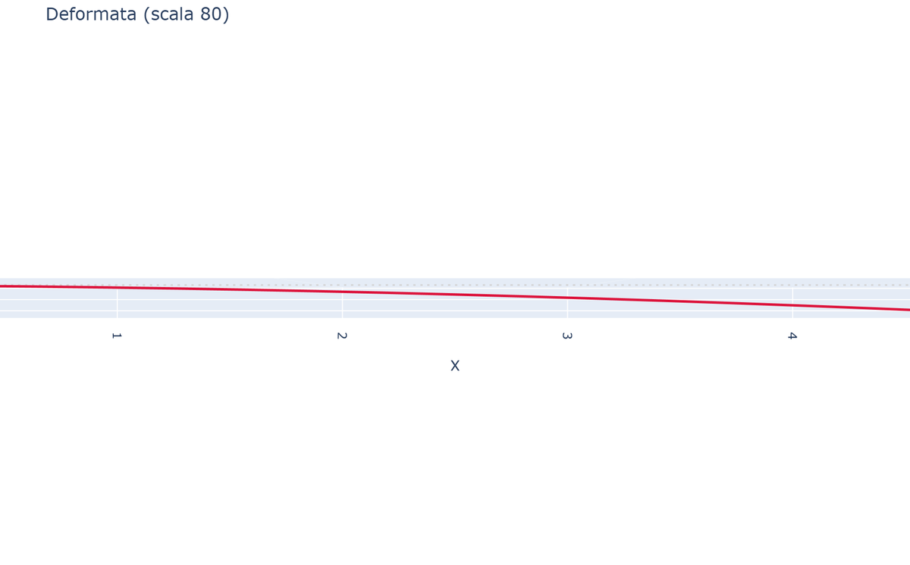
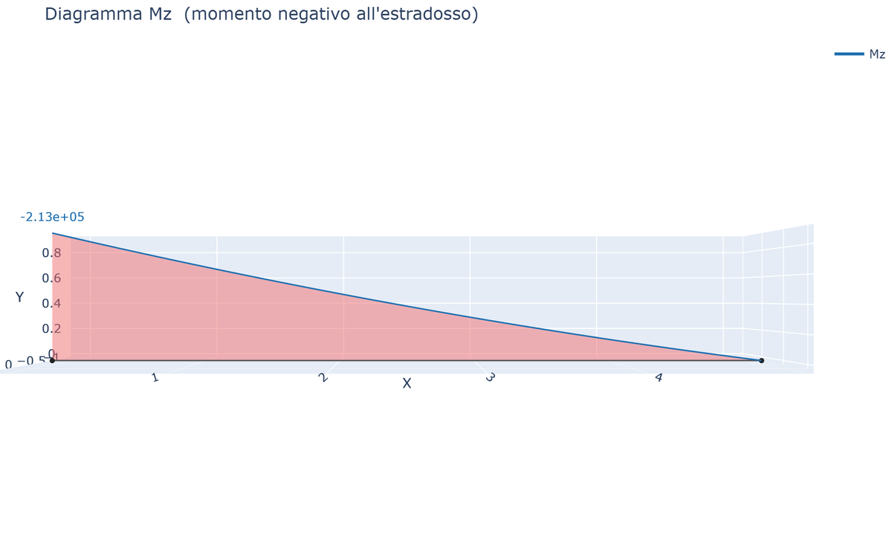

# 05 - Sezione Variabile (Tapered)

L'elemento a sezione variabile usa la formulazione **force-based** (Friedman & Kosmatka 1992; Eisenberger 1991) che fornisce una rigidezza **esatta** per qualsiasi variazione di sezione. **Un solo elemento sostituisce la discretizzazione** in più elementi prismatici.

## VariationSection

```python
from beamfeapy import VariableSection

# Sezione rettangolare con altezza variabile
vs = VariableSection.rectangular(b=0.30, h=lambda xi: 0.70*(1-0.6*xi))

# Sezione generica (tutte le proprietà come funzioni di xi)
vs = VariableSection(A=lambda xi: 0.01*(1+xi),
                     Iy=lambda xi: 2e-5*(1+xi)**2,
                     Iz=lambda xi: 3e-5*(1+xi)**2,
                     J=lambda xi: 1e-5*(1+xi))
```

`xi ∈ [0, 1]` dove 0 = nodo i (radice), 1 = nodo j (punta).

## Tre modi di definire la sezione variabile

### Metodo 1: VariableSection con funzione

```python
vs = VariableSection.rectangular(b=0.30, h=lambda xi: 0.70*(1-0.6*xi))
m.add_tapered_beam(id, ni, nj, mat, vs)
```

### Metodo 2: Sezioni agli estremi (interpolazione lineare)

```python
m.add_section("root", A=1.2e-2, Iy=4e-5, Iz=6e-5, J=3e-5)
m.add_section("tip", A=0.6e-2, Iy=1e-5, Iz=1.5e-5, J=0.8e-5)
m.add_tapered_beam(id, ni, nj, mat, section_i="root", section_j="tip")
```

### Metodo 3: Stazioni intermedie

```python
m.add_section("root", A=1.2e-2, Iy=4e-5, Iz=6e-5, J=3e-5)
m.add_section("mid", A=1.0e-2, Iy=2.5e-5, Iz=4e-5, J=2e-5)
m.add_section("tip", A=0.6e-2, Iy=1e-5, Iz=1.5e-5, J=0.8e-5)
m.add_tapered_beam(id, ni, nj, mat,
                    stations={0.0: "root", 0.4: "mid", 1.0: "tip"})
```

Tra le stazioni l'interpolazione è lineare a tratti. Ogni stazione diventa un *breakpoint* per l'integrazione.

## Timoshenko + Tapered

```python
m.add_tapered_beam(id, ni, nj, mat, vs, shear=True,
                   Asy=lambda xi: 5/6*A(xi), Asz=lambda xi: 5/6*A(xi))
```

## Vantaggi

- **Esattezza**: rigidezza calcolata esattamente (nessun errore di discretizzazione)
- **Efficienza**: un solo elemento invece di decine di elementi prismatici
- **Carichi**: distribuiti (uniformi, parziali, trapezoidali), concentrati, termici — tutti supportati
- **Convergenza**: i risultati FEM coincidono con la soluzione di riferimento a meno di 1e-3 %

## Esempio illustrato (mensola rastremata 0.70 → 0.30 m)

| Deformata | Momento Mz |
|---|---|
|  |  |

Vedi anche i [Casi studio](it-16-case-studies-gallery.html).