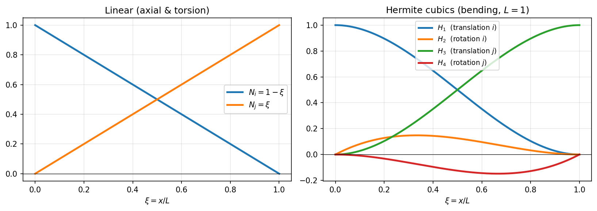

# 20 - Funzioni di forma

Questa pagina illustra le **funzioni di forma** (shape functions) usate dall'elemento
trave 3D di Eulero-Bernoulli a 12 gradi di libertà, da cui derivano la matrice degli
spostamenti $\mathbf{N}(x)$, la matrice delle deformazioni $\mathbf{B}(x)$ e la matrice
di rigidezza.

I riferimenti nel codice sono `BeamElement3D.shape_functions()` e
`BeamElement3D.strain_matrix()` in `beamfeapy/element.py`.

---

## 1. Gradi di libertà dell'elemento

L'elemento ha **2 nodi** e **6 GdL per nodo**, per un totale di **12 GdL locali**
ordinati così:

$$
\mathbf{u}^e = \big[\,
\underbrace{u_{x}^i,\ u_{y}^i,\ u_{z}^i,\ \theta_{x}^i,\ \theta_{y}^i,\ \theta_{z}^i}_{\text{nodo } i},\
\underbrace{u_{x}^j,\ u_{y}^j,\ u_{z}^j,\ \theta_{x}^j,\ \theta_{y}^j,\ \theta_{z}^j}_{\text{nodo } j}
\,\big]^{T}
$$

| Indice | 0 | 1 | 2 | 3 | 4 | 5 | 6 | 7 | 8 | 9 | 10 | 11 |
|--------|---|---|---|---|---|---|---|---|---|---|----|----|
| GdL | $u_x^i$ | $u_y^i$ | $u_z^i$ | $\theta_x^i$ | $\theta_y^i$ | $\theta_z^i$ | $u_x^j$ | $u_y^j$ | $u_z^j$ | $\theta_x^j$ | $\theta_y^j$ | $\theta_z^j$ |

L'asse $x$ è l'asse della trave (da nodo $i$ a nodo $j$); $y$ e $z$ sono gli assi
principali della sezione. La coordinata locale $x \in [0, L]$.

---

## 2. Disaccoppiamento dei comportamenti

In coordinate locali, per l'elemento prismatico di Eulero-Bernoulli, i 12 GdL si
disaccoppiano in **quattro comportamenti indipendenti**:

| Comportamento | GdL coinvolti | Funzioni di forma | Rigidezza |
|---------------|---------------|-------------------|-----------|
| **Assiale** (trazione) | $u_x^i, u_x^j$ | lineari | $EA$ |
| **Torsione** | $\theta_x^i, \theta_x^j$ | lineari | $GJ$ |
| **Flessione piano x-y** | $u_y^i, \theta_z^i, u_y^j, \theta_z^j$ | cubiche di Hermite | $EI_z$ |
| **Flessione piano x-z** | $u_z^i, \theta_y^i, u_z^j, \theta_y^j$ | cubiche di Hermite | $EI_y$ |

---

## 3. Funzioni di forma assiali e torsionali (lineari)

Lo spostamento assiale $u_x(x)$ e la rotazione torsionale $\theta_x(x)$ variano
**linearmente** tra i due nodi:

$$
N_i^{\text{lin}}(x) = 1 - \frac{x}{L},
\qquad
N_j^{\text{lin}}(x) = \frac{x}{L}
$$

Quindi:

$$
u_x(x) = N_i^{\text{lin}}\, u_x^i + N_j^{\text{lin}}\, u_x^j,
\qquad
\theta_x(x) = N_i^{\text{lin}}\, \theta_x^i + N_j^{\text{lin}}\, \theta_x^j
$$

Nel codice (`shape_functions`):

```python
NIx = 1 - x / L      # N_i lineare
NJx = x / L          # N_j lineare
```

> **Partizione dell'unità**: $N_i^{\text{lin}}(x) + N_j^{\text{lin}}(x) = 1$ per ogni
> $x$. È la condizione che garantisce all'elemento di riprodurre **esattamente** un
> moto di corpo rigido (spostamento uniforme) e uno stato di deformazione costante —
> requisito di convergenza del metodo.

---

## 4. Funzioni di forma flessionali (cubiche di Hermite)

La flessione di Eulero-Bernoulli richiede continuità $C^1$ (spostamento **e**
rotazione continui): si usano le **funzioni cubiche di Hermite**. Per la flessione
nel piano x-y, lo spostamento trasversale $u_y(x)$ è interpolato da 4 funzioni
associate a $\{u_y^i, \theta_z^i, u_y^j, \theta_z^j\}$:

$$
\begin{aligned}
H_1(x) &= 1 - 3\frac{x^2}{L^2} + 2\frac{x^3}{L^3} & &\text{(traslazione nodo } i\text{)}\\[4pt]
H_2(x) &= x - 2\frac{x^2}{L} + \frac{x^3}{L^2} & &\text{(rotazione nodo } i\text{)}\\[4pt]
H_3(x) &= 3\frac{x^2}{L^2} - 2\frac{x^3}{L^3} & &\text{(traslazione nodo } j\text{)}\\[4pt]
H_4(x) &= -\frac{x^2}{L} + \frac{x^3}{L^2} & &\text{(rotazione nodo } j\text{)}
\end{aligned}
$$

così che:

$$
u_y(x) = H_1\, u_y^i + H_2\, \theta_z^i + H_3\, u_y^j + H_4\, \theta_z^j
$$

Nel codice queste sono le variabili `NIy, NIz, NJy, NJz`:

```python
NIy = 1 - 3*x**2/L**2 + 2*x**3/L**3   # H1
NIz = x - 2*x**2/L + x**3/L**2        # H2
NJy = 3*x**2/L**2 - 2*x**3/L**3       # H3
NJz = -x**2/L + x**3/L**2             # H4
```



*A sinistra le funzioni lineari $N_i, N_j$; a destra le quattro cubiche di Hermite
$H_1\dots H_4$ in funzione di $\xi = x/L \in [0,1]$ (con $L=1$). Si osservi: $H_1, H_3$
valgono 1 ad un estremo e 0 all'altro con **tangente nulla** ai nodi (sono associate
alle traslazioni), mentre $H_2, H_4$ sono nulle agli estremi ma hanno **derivata
unitaria** ad un nodo (sono associate alle rotazioni).*

### Derivazione (perché cubiche)

Ciascuna $H_k(x)$ è un **polinomio di terzo grado** $a_0 + a_1 x + a_2 x^2 + a_3 x^3$:
i suoi quattro coefficienti sono determinati imponendo le quattro condizioni nodali
della tabella sottostante (valore e derivata della funzione ai due nodi). Quattro
condizioni ⇒ polinomio di grado 3, che è il **grado minimo** in grado di garantire la
continuità $C^1$ (spostamento *e* rotazione continui) tra elementi adiacenti. La
risoluzione del sistema lineare $4\times4$ produce esattamente le espressioni di
$H_1\dots H_4$ riportate sopra.

### Proprietà nodali (interpolazione)

Le funzioni di Hermite soddisfano le condizioni di interpolazione che garantiscono
che i coefficienti siano esattamente i valori nodali:

| Funzione | $H(0)$ | $H'(0)$ | $H(L)$ | $H'(L)$ |
|----------|--------|---------|--------|---------|
| $H_1$ | 1 | 0 | 0 | 0 |
| $H_2$ | 0 | 1 | 0 | 0 |
| $H_3$ | 0 | 0 | 1 | 0 |
| $H_4$ | 0 | 0 | 0 | 1 |

### Derivate prime (rotazioni)

La rotazione è la derivata dello spostamento. Le derivate delle cubiche sono:

$$
\begin{aligned}
H_1'(x) &= -\frac{6x}{L^2} + \frac{6x^2}{L^3} \\
H_2'(x) &= 1 - \frac{4x}{L} + \frac{3x^2}{L^2} \\
H_3'(x) &= \frac{6x}{L^2} - \frac{6x^2}{L^3} \\
H_4'(x) &= -\frac{2x}{L} + \frac{3x^2}{L^2}
\end{aligned}
$$

```python
dNIy = -6*x/L**2 + 6*x**2/L**3
dNIz = 1 - 4*x/L + 3*x**2/L**2
dNJy = 6*x/L**2 - 6*x**2/L**3
dNJz = -2*x/L + 3*x**2/L**2
```

---

## 5. La matrice degli spostamenti N(x)

La matrice $\mathbf{N}(x)$ è **6×12**: mappa i 12 GdL nodali sui 6 campi di
spostamento generalizzato $[u_x, u_y, u_z, \theta_x, \theta_y, \theta_z]$ in un
punto $x$:

$$
\begin{bmatrix} u_x \\ u_y \\ u_z \\ \theta_x \\ \theta_y \\ \theta_z \end{bmatrix}
= \mathbf{N}(x)\, \mathbf{u}^e
$$

### Convenzione importante sui segni delle rotazioni

In questa libreria vale la convenzione:

$$
\theta_z = +\frac{du_y}{dx},
\qquad
\theta_y = -\frac{du_z}{dx}
$$

Il segno negativo per $\theta_y$ deriva dalla regola della mano destra: una rotazione
positiva attorno a $y$ produce uno spostamento **negativo** in $z$ man mano che
$x$ cresce. Questa convenzione (anziché lo standard $\theta_y = +du_z/dx$) è alla
base di alcune trasformazioni di segno in tutta la libreria (es. matrice geometrica).

### Riempimento di N(x)

```python
N = np.zeros((6, 12))
# u_x : lineare
N[0, 0]  = NIx;  N[0, 6]  = NJx
# u_y : Hermite (piano x-y, GdL uy_i=1, rz_i=5, uy_j=7, rz_j=11)
N[1, 1]  = NIy;  N[1, 5]  = NIz;  N[1, 7]  = NJy;  N[1, 11] = NJz
# u_z : Hermite (piano x-z, GdL uz_i=2, ry_i=4, uz_j=8, ry_j=10)
N[2, 2]  = NIy;  N[2, 4]  = -NIz; N[2, 8]  = NJy;  N[2, 10] = -NJz
# theta_x : lineare
N[3, 3]  = NIx;  N[3, 9]  = NJx
# theta_y = -du_z/dx
N[4, 2]  = -dNIy; N[4, 4]  = dNIz;  N[4, 8]  = -dNJy; N[4, 10] = dNJz
# theta_z = +du_y/dx
N[5, 1]  = dNIy;  N[5, 5]  = dNIz;  N[5, 7]  = dNJy;  N[5, 11] = dNJz
```

> Nota i segni alterni nella riga di $u_z$ e $\theta_y$ (indici 2 e 4): sono la
> conseguenza diretta di $\theta_y = -du_z/dx$.

---

## 6. La matrice delle deformazioni B(x)

La matrice $\mathbf{B}(x)$ è **4×12** e fornisce le **deformazioni generalizzate**
$[\varepsilon,\ \chi_y,\ \chi_z,\ \theta_x']$ a partire dai GdL nodali:

$$
\begin{bmatrix} \varepsilon \\ \chi_y \\ \chi_z \\ \theta_x' \end{bmatrix}
= \mathbf{B}(x)\, \mathbf{u}^e
$$

dove:

- $\varepsilon = \dfrac{du_x}{dx}$ — deformazione assiale
- $\chi_y = -\dfrac{d^2 u_z}{dx^2}$ — curvatura nel piano x-z (associata a $EI_y$)
- $\chi_z = +\dfrac{d^2 u_y}{dx^2}$ — curvatura nel piano x-y (associata a $EI_z$)
- $\theta_x' = \dfrac{d\theta_x}{dx}$ — torsione unitaria

Le curvature richiedono le **derivate seconde** delle cubiche di Hermite:

$$
\begin{aligned}
H_1''(x) &= -\frac{6}{L^2} + \frac{12x}{L^3}, &
H_2''(x) &= -\frac{4}{L} + \frac{6x}{L^2}, \\
H_3''(x) &= \frac{6}{L^2} - \frac{12x}{L^3}, &
H_4''(x) &= -\frac{2}{L} + \frac{6x}{L^2}
\end{aligned}
$$

```python
d2NIy = -6/L**2 + 12*x/L**3
d2NIz = -4/L + 6*x/L**2
d2NJy =  6/L**2 - 12*x/L**3
d2NJz = -2/L + 6*x/L**2

B = np.zeros((4, 12))
# epsilon = du_x/dx (lineare -> derivata costante ±1/L)
B[0, 0] = -1/L;  B[0, 6] = 1/L
# chi_y (piano x-z, EIy)
B[1, 2] = -d2NIy; B[1, 4] = d2NIz; B[1, 8] = -d2NJy; B[1, 10] = d2NJz
# chi_z (piano x-y, EIz)
B[2, 1] =  d2NIy; B[2, 5] = d2NIz; B[2, 7] =  d2NJy; B[2, 11] = d2NJz
# theta_x' (torsione)
B[3, 3] = -1/L;  B[3, 9] = 1/L
```

---

## 7. Dalle deformazioni alla rigidezza

La matrice costitutiva $\mathbf{D}$ lega le deformazioni generalizzate alle azioni
interne $[N,\ M_y,\ M_z,\ T]$:

$$
\mathbf{D} = \mathrm{diag}\!\left(EA,\ EI_y,\ EI_z,\ GJ\right)
$$

```python
def D_matrix(self):
    return np.diag([E*A, E*Iy, E*Iz, G*J])
```

La matrice di rigidezza dell'elemento si ottiene per integrazione del **principio dei
lavori virtuali**:

$$
\boxed{\ \mathbf{k}^e = \int_0^L \mathbf{B}(x)^{T}\, \mathbf{D}\, \mathbf{B}(x)\ dx\ }
$$

Per l'elemento prismatico di Eulero-Bernoulli questo integrale ha **forma chiusa** ed è
quello che la libreria implementa direttamente in `stiffness_local()` (vedi
[21 - Assemblaggio della rigidezza](it-21-stiffness-assembly.html)).

Per l'elemento a **sezione variabile** (tapered), $\mathbf{D} = \mathbf{D}(x)$ varia
con $x$ e l'integrale viene valutato numericamente con quadratura di Gauss
(`equivalent_local_initial_strain`, `_condensed_feq`).

### 7.1 Travi di Timoshenko (deformabilità a taglio)

Quando si attiva `shear=True`, **le funzioni di forma $\mathbf{N}(x)$ e
$\mathbf{B}(x)$ non cambiano**: restano le cubiche di Hermite di Eulero-Bernoulli (sono
quelle usate da `shape_functions()`/`strain_matrix()` per ricostruire deformata e
azioni interne). La deformabilità a taglio entra invece nella **matrice di rigidezza**
tramite i parametri adimensionali di taglio $\Phi$, calcolati da `shear_phi()`:

$$
\Phi_y = \frac{12\,E\,I_z}{G\,A_{sy}\,L^2},
\qquad
\Phi_z = \frac{12\,E\,I_y}{G\,A_{sz}\,L^2}
$$

Il blocco flessionale $4\times4$ nel piano x-y (GdL $\{u_y^i, \theta_z^i, u_y^j,
\theta_z^j\}$) della rigidezza locale diventa:

$$
\mathbf{k}_{xy} = \frac{E I_z}{1+\Phi_y}
\begin{bmatrix}
12/L^3 & 6/L^2 & -12/L^3 & 6/L^2 \\[2pt]
6/L^2 & (4+\Phi_y)/L & -6/L^2 & (2-\Phi_y)/L \\[2pt]
-12/L^3 & -6/L^2 & 12/L^3 & -6/L^2 \\[2pt]
6/L^2 & (2-\Phi_y)/L & -6/L^2 & (4+\Phi_y)/L
\end{bmatrix}
$$

(in modo analogo nel piano x-z con $I_y$, $A_{sz}$, $\Phi_z$). Per $\Phi = 0$ — cioè
nessuna deformabilità a taglio, oppure aree di taglio $A_s \to \infty$ — si ricade
**esattamente** nella rigidezza di Eulero-Bernoulli. È la formulazione **a
interpolazione interdipendente** in forma chiusa: esatta per l'elemento a 2 nodi e
immune da *shear locking*. Riferimenti: `stiffness_local()` e
[06 - Timoshenko e Rilasci](it-06-timoshenko-releases.html).

---

## 8. Usi delle funzioni di forma

Oltre alla rigidezza, $\mathbf{N}(x)$ e $\mathbf{B}(x)$ servono per:

| Uso | Formula | Funzione |
|-----|---------|----------|
| **Deformata** in punti interni | $\mathbf{u}(x) = \mathbf{N}(x)\,\mathbf{u}^e$ | `postprocess.deformed_shape_global` |
| **Azioni interne** in $x$ | $\boldsymbol{\sigma}(x) = \mathbf{D}\,\mathbf{B}(x)\,\mathbf{u}^e$ | `postprocess.internal_forces` |
| **Forze nodali equivalenti** da carico distribuito | $\mathbf{f}^e = \int \mathbf{N}^T \mathbf{q}\,dx$ | `DistributedLoad.equivalent_local` |
| **Forze equivalenti termiche** | $\mathbf{f}^e = \int \mathbf{B}^T \mathbf{D}\,\boldsymbol{\varepsilon}_0\,dx$ | `ThermalLoad.equivalent_local` |

---

## Verifica numerica

Le proprietà nodali delle funzioni di forma si possono verificare direttamente:

```python
import numpy as np
from beamfeapy import Material, Model, Section

m = Model()
m.add_node(1, 0, 0, 0); m.add_node(2, 4.0, 0, 0)
m.add_beam(1, 1, 2, Material(210e9, 0.3), Section(A=1e-2, Iy=1e-5, Iz=1e-5, J=1e-5))
el = m.elements[1]
L = el.length

# N(0) deve estrarre i GdL del nodo i
N0 = el.shape_functions(0.0)
assert np.isclose(N0[0, 0], 1.0)   # u_x(0) = u_x^i
assert np.isclose(N0[1, 1], 1.0)   # u_y(0) = u_y^i

# N(L) deve estrarre i GdL del nodo j
NL = el.shape_functions(L)
assert np.isclose(NL[0, 6], 1.0)   # u_x(L) = u_x^j
assert np.isclose(NL[1, 7], 1.0)   # u_y(L) = u_y^j

# La derivata di u_y in 0 è la rotazione theta_z^i
assert np.isclose(N0[5, 5], 1.0)   # theta_z(0) = theta_z^i
print("Funzioni di forma verificate.")
```

---

*Vedi anche:*
[21 - Assemblaggio della rigidezza](it-21-stiffness-assembly.html) |
[13 - Convenzioni](it-13-conventions.html) |
[06 - Timoshenko e Rilasci](it-06-timoshenko-releases.html)
