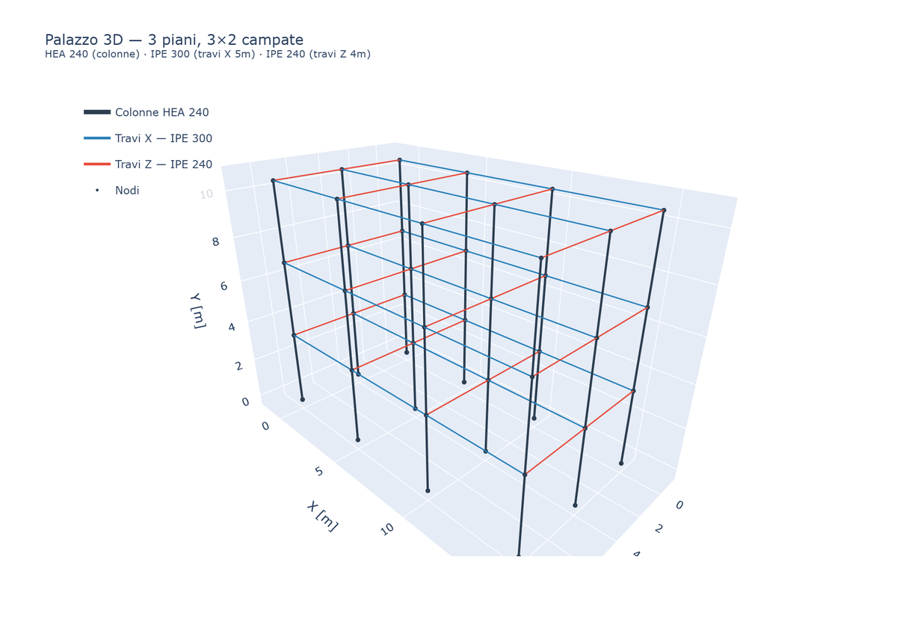
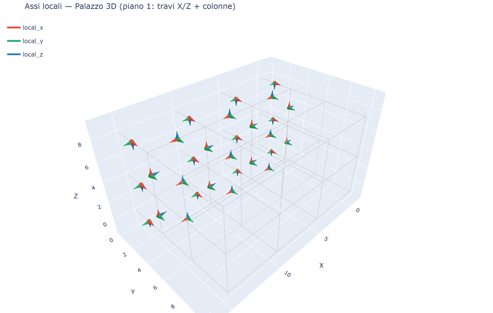
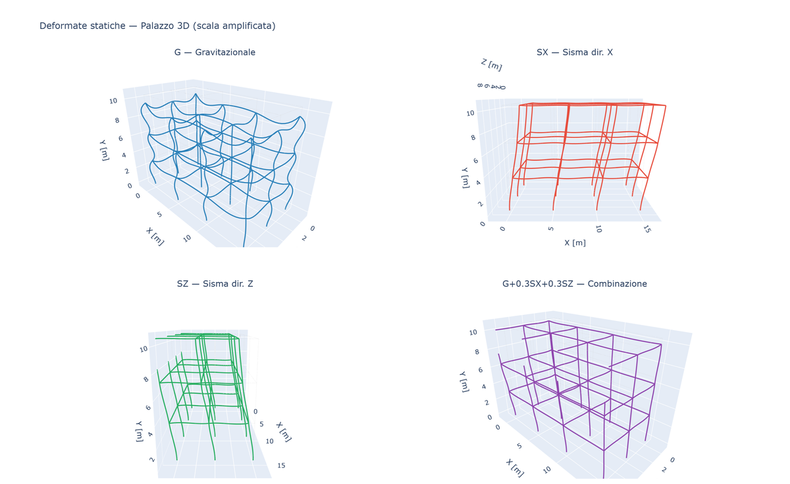
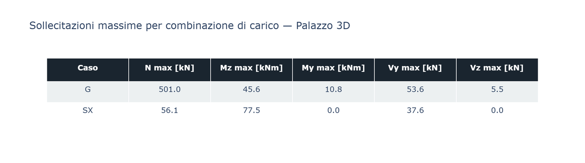
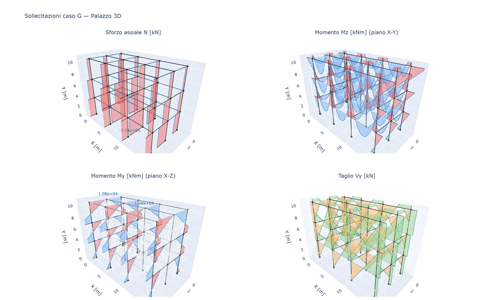
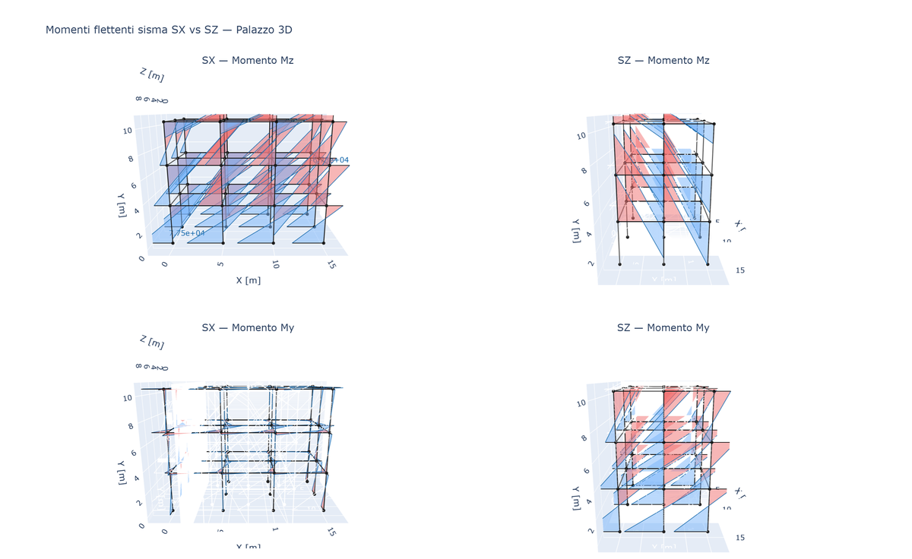
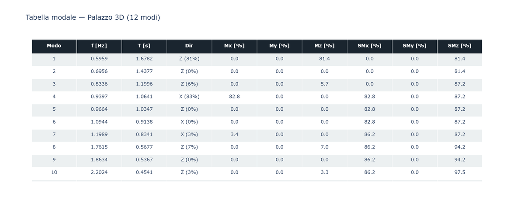
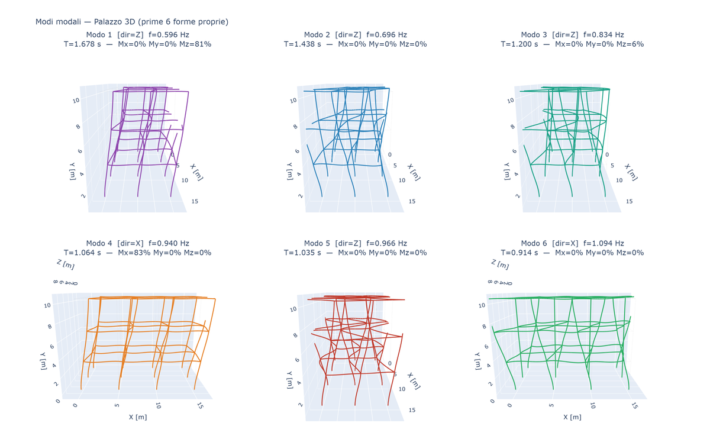
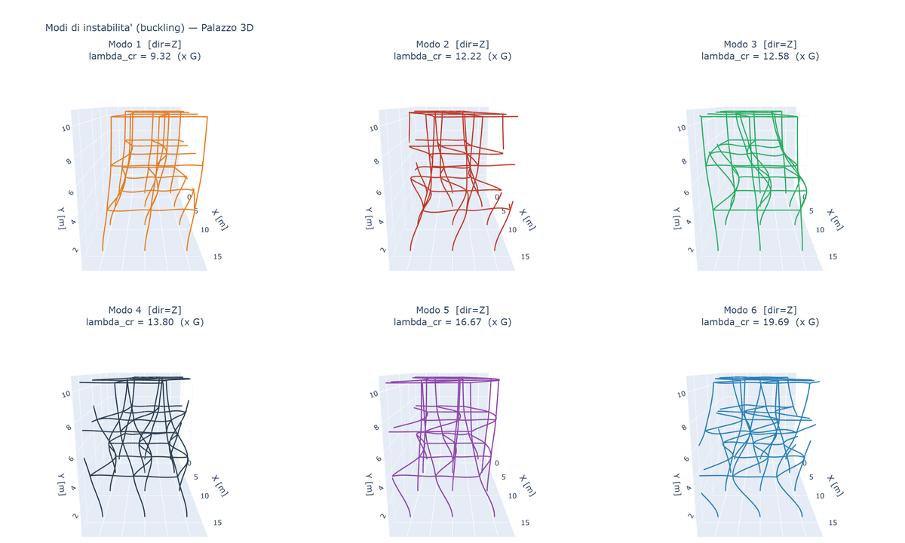

# 25 - Caso studio: Palazzo 3D

Analisi completa di un **edificio multipiano in acciaio** con telai spaziali in entrambe
le direzioni orizzontali.  
Questo è l'esempio più articolato della libreria: combina geometria 3D, analisi statica
multi-caso, analisi modale, analisi di instabilità lineare e visualizzazione 3D di
deformate, diagrammi di sollecitazione e assi locali.

---

## Geometria e materiali

| Parametro | Valore |
|-----------|--------|
| N. piani | 3 |
| Campate X | 3 (interasse 5 m) |
| Campate Z | 2 (interasse 4 m) |
| Altezza piano | 3.5 m |
| Materiale | Acciaio S275 — E = 210 GPa, ν = 0.3 |
| Colonne | HEA 240 |
| Travi X | IPE 300 |
| Travi Z | IPE 240 |
| Nodi totali | 48 |
| Elementi | 87 (36 col + 27 bx + 24 bz) |
| DOF totali | 288 |

La struttura 3D visualizzata:



Colori: **grigio scuro** = colonne HEA 240 · **blu** = travi X IPE 300 · **rosso** = travi Z IPE 240.

---

## Costruzione del modello

```python
from beamfeapy import Material, Model, Section

NX, NZ, NF = 4, 3, 3         # nodi in X, Z; n. piani
LX, LZ, H  = 5.0, 4.0, 3.5   # interassi [m]; altezza piano [m]

mat = Material(210e9, 0.3)

# Convenzione SAP2000: Iz = asse forte, Iy = asse debole
sec_col = Section(A=76.8e-4, Iy=2769e-8, Iz=7763e-8, J=41.5e-8)  # HEA 240
sec_bx  = Section(A=53.8e-4, Iy=604e-8,  Iz=8356e-8, J=20.1e-8)  # IPE 300
sec_bz  = Section(A=39.1e-4, Iy=284e-8,  Iz=3892e-8, J=12.9e-8)  # IPE 240

m = Model()

def nid(f, ix, iz):
    return f * NX * NZ + iz * NX + ix + 1

# Nodi: X globale = longitudinale, Y = verticale, Z = trasversale
for f in range(NF + 1):
    for iz in range(NZ):
        for ix in range(NX):
            m.add_node(nid(f, ix, iz), ix*LX, f*H, iz*LZ)

# Colonne verticali: ref=(1,0,0) → local_y = X globale
for f in range(NF):
    for iz in range(NZ):
        for ix in range(NX):
            m.add_beam(eid, nid(f,ix,iz), nid(f+1,ix,iz),
                       mat, sec_col, ref_vector=(1.,0.,0.))

# Travi orizzontali: default ref → local_y = Y globale per X e Z
for f in range(1, NF+1):
    for iz in range(NZ):
        for ix in range(NX-1):
            m.add_beam(eid, nid(f,ix,iz), nid(f,ix+1,iz), mat, sec_bx)
    for ix in range(NX):
        for iz in range(NZ-1):
            m.add_beam(eid, nid(f,ix,iz), nid(f,ix,iz+1), mat, sec_bz)

# Incastri alla base
for iz in range(NZ):
    for ix in range(NX):
        m.fix(nid(0, ix, iz))
```

### Assi locali degli elementi

La funzione `plot_local_axes()` permette di verificare visivamente l'orientamento
della sezione prima dell'analisi.

```python
from beamfeapy import plot_local_axes
fig = plot_local_axes(m, scale=0.65)
fig.show()
```



**Colori:** rosso = `local_x` (asse trave) · verde = `local_y` (asse forte / gravità) · blu = `local_z`.

Per le travi orizzontali il verde punta **verso l'alto** (Y globale), confermando
che `'fy'` è il carico gravitazionale.

---

## Carichi

```python
# Gravitazionali: 'fy' in locale = Y globale (con default ref → local_y = Y)
for e in bx_eids:
    m.add_distributed_load(e, 'fy', -20_000., case='G')   # 20 kN/m su travi X
for e in bz_eids:
    m.add_distributed_load(e, 'fy', -15_000., case='G')   # 15 kN/m su travi Z

# Sismici: forze nodali con distribuzione triangolare sull'altezza (V = 400 kN)
heights = [H*(f+1) for f in range(NF)]
for f in range(NF):
    Fnode = 400e3 * heights[f] / sum(heights) / (NX * NZ)
    for iz in range(NZ):
        for ix in range(NX):
            m.add_nodal_load(nid(f+1,ix,iz), Fx=Fnode, case='SX')
            m.add_nodal_load(nid(f+1,ix,iz), Fz=Fnode, case='SZ')
```

Casi di carico:

| Caso | Descrizione |
|------|-------------|
| `G` | Permanente gravitazionale |
| `SX` | Sisma in direzione X |
| `SZ` | Sisma in direzione Z |
| `G + 0.3·SX + 0.3·SZ` | Combinazione Eurocodice-like |

---

## Analisi statica

```python
res_G    = m.solve(cases='G')
res_SX   = m.solve(cases='SX')
res_SZ   = m.solve(cases='SZ')
res_comb = m.solve(cases={'G': 1.0, 'SX': 0.3, 'SZ': 0.3})
```

### Deformate nei 4 casi (scala amplificata)



| Caso | Spostamento max al 3° piano |
|------|-----------------------------|
| G | ux ≈ 0.09 mm, uz ≈ 0.03 mm — quasi nullo (colonne molto rigide assialmente) |
| **SX** | **ux = 38.6 mm** — sway longitudinale |
| **SZ** | **uz = 91.8 mm** — sway trasversale (**2.4× più flessibile** in Z) |
| Combo | Combinazione obliqua delle precedenti |

> L'edificio è **2.4× più flessibile in Z** (2 campate) rispetto a X (3 campate).
> Il sisma trasversale governa il progetto.

### Sollecitazioni massime per combinazione



| Caso | N max [kN] | Mz max [kNm] | My max [kNm] | Vy max [kN] | Vz max [kN] |
|------|-----------|--------------|--------------|-------------|-------------|
| **G** | **501** | 10.8 | 45.6 | 5.5 | 53.6 |
| SX | 56 | ≈ 0 | **77.5** | ≈ 0 | 37.6 |
| SZ | 49 | **84.2** | ≈ 0 | 37.1 | ≈ 0 |
| Combo | 511 | 37.5 | 60.3 | 16.2 | 70.4 |

> Il momento sismico **My_SX = 77.5 kNm** supera il momento gravitazionale
> **My_G = 45.6 kNm**: il sisma governa la verifica delle colonne.

### Diagrammi di sollecitazione — caso G



| Diagramma | Osservazione |
|-----------|-------------|
| **N** (in alto sx) | Compressione crescente verso la base; colonne d'angolo meno caricate |
| **Mz** (in alto dx) | Piccoli momenti da interazione trave–colonna |
| **My** (in basso sx) | Grande flessione nelle travi X (campata 5 m, 20 kN/m); `Iz` governa |
| **Vy** (in basso dx) | Taglio proporzionale al gradiente di My |

### Momenti flettenti sismici — SX vs SZ



- **SX — Mz (alto sx)**: sisma X attiva bending in Z (quasi nullo per le colonne orientate con forte in X)
- **SX — My (basso sx)**: sisma X genera grande My sulle colonne (sway nel piano X-Y)
- **SZ — Mz (alto dx)**: sisma Z genera grande Mz (sway nel piano Z-Y)
- **SZ — My (basso dx)**: My quasi nullo per SZ (ortogonale al piano Z-Y)

La simmetria rotazionale delle due mappe conferma la corretta orientazione delle sezioni.

---

## Analisi modale

```python
modal = m.modal(n_modes=12, mass_source={'G': 1.0}, g=9.81)
mp    = modal.mass_participation()
```

### Tabella di partecipazione modale (12 modi)



| Modo | f [Hz] | T [s] | Dir | Mx [%] | My [%] | Mz [%] | ΣMx | ΣMz |
|------|--------|-------|-----|--------|--------|--------|-----|-----|
| **1** | 0.596 | 1.678 | **Z (81%)** | 0 | 0 | **81** | 0 | 81 |
| 2 | 0.696 | 1.438 | Tors | 0 | 0 | 0 | 0 | 81 |
| 3 | 0.834 | 1.200 | Z (6%) | 0 | 0 | 6 | 0 | 87 |
| **4** | 0.940 | 1.064 | **X (83%)** | **83** | 0 | 0 | 83 | 87 |
| 5–6 | — | — | — | 83 | 0 | 87 | … | … |
| 7 | 1.199 | 0.834 | X (3%) | 86 | 0 | 87 | … | … |
| 8 | 1.761 | 0.568 | Z (7%) | 86 | 0 | **94** | … | … |
| 12 | 2.868 | 0.349 | X (6%) | **92** | 0 | 98 | ← | ← |

**Lettura:**

- **Modo 1** (T = 1.68 s, Z 81%) — sway trasversale dominante.
  Con 81% di massa al primo modo la struttura si comporta quasi da oscillatore
  singolo in Z. È il modo sismico principale in Z.
- **Modo 2** — torsionale (partecipazione traslazionale ~0%).
  Presente perché la struttura è asimmetrica (NX ≠ NZ).
- **Modo 4** (T = 1.06 s, X 83%) — sway longitudinale.
  T₄ < T₁ perché la struttura è più rigida in X (3 campate contro 2).
- Con 12 modi si copre: **SMx ≈ 92%, SMz ≈ 98%** → sufficiente per analisi sismica.

### Forme proprie (prime 6)

```python
from beamfeapy.plotting import plot_mode
fig = plot_mode(modal, mode=0)   # 1° modo
fig.show()
```



Le forme mostrano chiaramente:
- **Modo 1** (viola, T=1.68s): sway globale in Z — tutta la struttura si sposta insieme
- **Modo 2** (blu, T=1.44s): rotazione d'insieme (torsionale)
- **Modo 4** (arancio, T=1.06s): sway globale in X
- **Modi 3,5,6**: modi di piano (distorsione relativa tra piani adiacenti)

---

## Analisi di instabilità lineare (buckling)

```python
buck = m.buckling(n_modes=6, cases='G')
# load_factors = moltiplicatori adimensionali del carico G:
# l'edificio è instabile se il carico G viene amplificato di lambda_cr
```

### Fattori di carico critici

| Modo | λ_cr | Direzione | Interpretazione |
|------|------|-----------|-----------------|
| **1** | **9.32 × G** | Z | Sidesway fuori-piano — **più critico** |
| 2 | 12.22 × G | Z | Sway Z al 2° piano |
| 3 | 12.58 × G | Z | Sway Z combinato |
| 4 | 13.80 × G | Z | Sway Z 3° piano |
| 5 | 16.67 × G | Z | Modo locale trave |
| 6 | 19.69 × G | Z | Modo locale superiore |

> **λ_cr = 9.32** significa che la struttura reggge **9.3× il carico di progetto**
> prima di instabilizzarsi: ottimo margine di sicurezza.
>
> Tutti e 6 i modi sono in **direzione Z** perché è la direzione con meno campate
> (2 vs 3) e quindi meno rigida al sidesway laterale.

### Forme di instabilità (6 modi)

```python
from beamfeapy.plotting import plot_buckling_mode
fig = plot_buckling_mode(buck, mode=0)
fig.show()
```



La progressione dei modi mostra:
- **Modo 1**: sidesway dell'intero edificio in Z — instabilità di insieme
- **Modi 2–4**: combinazioni di piani che swaggiano a fasi diverse
- **Modi 5–6**: instabilità locale di singoli elementi (travi lunghe)

---

## Convenzione assi locali e sezioni

La libreria usa la **convenzione SAP2000 / Przemieniecki**:

```
local_x = asse della trave (da node_i a node_j)
local_y = proiezione di ref_vector ⊥ local_x   ← definisce il piano x-y
local_z = local_x × local_y                      ← sistema destrorso
```

| Elemento | `ref_vector` | `local_y` | Carico gravità | Inerzia forte |
|----------|-------------|-----------|---------------|--------------|
| Trave X o Z (default) | `None` → `(0,1,0)` | Y globale ↑ | `'fy'` | `Iz` |
| Colonna verticale | `(1,0,0)` | X globale → | — | `Iz` (sway X) |

Sezioni (Iz = forte, Iy = debole):

```python
# IPE 300 — trave orizzontale
sec_bx = Section(A=53.8e-4, Iy=604e-8,  Iz=8356e-8, J=20.1e-8)
#                             ^debole     ^forte

# HEA 240 — colonna con ref=(1,0,0), forte in sway X
sec_col = Section(A=76.8e-4, Iy=2769e-8, Iz=7763e-8, J=41.5e-8)
#                             ^sway Z     ^sway X
```

Per modificare l'orientazione di un elemento dopo la costruzione:

```python
# Via modello
m.set_element_axes(eid, ey=(0, 1, 0))   # imposta local_y
m.set_element_axes(eid, ez=(0, 0, 1))   # imposta local_z
m.set_element_axes(eid, R=matrice_3x3)  # matrice completa

# Via elemento
el.set_axes(ey=(0, 1, 0))
el.reset_axes()   # ripristina default
```

---

## File di riferimento

| File | Contenuto |
|------|-----------|
| `_palazzo_3d.py` | Modello base + modale + buckling |
| `_palazzo_verifiche.py` | Analisi completa G + SX + SZ + combo + 6 plot |

```bash
python _palazzo_3d.py
python _palazzo_verifiche.py
# Output: demo_plots/
```

---

*Vedi anche:*
[08 - Orientazione Sezione](it-08-section-orientation.html) |
[19 - Analisi Modale](it-19-modal-analysis.html) |
[16 - Galleria Esempi](it-16-case-studies-gallery.html)
