# 27 - Casi Studio Avanzati II

Questa pagina presenta due ulteriori esempi complessi: una struttura con tetto a
due falde e un caso di validazione con la letteratura mediante confronto analitico.

---

## Esempio 29 — Tetto a due falde con 4 colonne (Tetto a due falde)

Una struttura in acciaio con:
- **4 colonne** (HEB 200, altezza 3.5 m)
- **Tetto a due falde** con due travi inclinate IPE 270 per lato (pendenza 20%)
- **Trave di colmo** (IPE 220) che collega fronte e retro
- **Catene** e **controventi incrociati** in sommità delle colonne
- Luce totale: 12 m, altezza al colmo: 4.7 m, profondità: 8 m
- **10 nodi**, **13 elementi**

### Carichi

| Caso | Tipo | Descrizione |
|------|------|-------------|
| G | Distribuito | 8 kN/m sulle travi di copertura (peso proprio + permanente) |
| S | Distribuito | 4.5 kN/m sulle travi di copertura (neve) |
| W | Nodale | 15 kN orizzontali totali in sommità delle colonne (vento, direzione X) |

### Analisi

- **Statica SLU**: combinazione `{G: 1.35, S: 1.5, W: 0.9}`
- **Modale**: masse da `{G: 1.0, S: 0.3}`

### Risultati

```
Static analysis (ULS: 1.35G + 1.5S + 0.9W):
  Ridge displacement: uz=-5.51 mm, ux=0.47 mm
  Column top horizontal displacement: 0.05 mm

Modal analysis:
  Mode    f [Hz]    T [s]     mpX     mpY     mpZ
     1     3.052    0.328   0.000   0.724   0.000
     2     5.560    0.180   1.000   0.000   0.000
     3     6.015    0.166   0.000   0.000   0.000
     4     8.042    0.124   0.000   0.000   0.000
     5     8.588    0.116   0.000   0.252   0.000
     6     9.033    0.111   0.000   0.000   0.507
```

### Script

<details markdown="block">
<summary>Mostra lo script completo</summary>

```python
"""Example 29 - Pitched roof with 4 columns (tetto a due falde)."""

import _common  # noqa: F401
from beamfeapy import Material, Model, Section
from beamfeapy.plotting import (
    plot_deformed, plot_diagram, plot_loads, plot_model, plot_mode, plot_reactions,
)

def main():
    L = 12.0; H_col = 3.5; slope = 0.20
    H_ridge = H_col + (L / 2) * slope; D = 8.0

    mat = Material(E=210e9, nu=0.3, alpha=1.2e-5)
    col_sec = Section(A=0.0149, Iy=2.57e-4, Iz=1.94e-4, J=3.5e-5)
    roof_sec = Section(A=0.0116, Iy=1.94e-4, Iz=5.70e-5, J=2.3e-5)
    ridge_sec = Section(A=0.0088, Iy=1.25e-4, Iz=3.89e-5, J=1.6e-5)

    m = Model()
    # Column bases
    for i, (x, y) in enumerate([(0,0),(L,0),(0,D),(L,D)], 1):
        m.add_node(i, x, y, 0)
    # Column tops
    for i, (x, y) in enumerate([(0,0),(L,0),(0,D),(L,D)], 5):
        m.add_node(i, x, y, H_col)
    # Ridge
    m.add_node(9, L/2, 0, H_ridge)
    m.add_node(10, L/2, D, H_ridge)

    # Columns
    for i in range(1, 5):
        m.add_beam(i, i, i+4, mat, col_sec)
    # Roof beams front/back
    m.add_beam(5, 5, 9, mat, roof_sec, ref_vector=(0,0,1))
    m.add_beam(6, 9, 6, mat, roof_sec, ref_vector=(0,0,1))
    m.add_beam(7, 7, 10, mat, roof_sec, ref_vector=(0,0,1))
    m.add_beam(8, 10, 8, mat, roof_sec, ref_vector=(0,0,1))
    # Ridge beam
    m.add_beam(9, 9, 10, mat, ridge_sec, ref_vector=(1,0,0))
    # Tie beams and bracing
    m.add_beam(10, 5, 6, mat, col_sec, ref_vector=(0,0,1))
    m.add_beam(11, 7, 8, mat, col_sec, ref_vector=(0,0,1))
    m.add_beam(12, 5, 7, mat, col_sec, ref_vector=(0,0,1))
    m.add_beam(13, 6, 8, mat, col_sec, ref_vector=(0,0,1))

    for i in range(1, 5): m.fix(i)
    for e_id in [5, 6, 7, 8]:
        m.add_distributed_load(e_id, "fy", -8e3, case="G")
        m.add_distributed_load(e_id, "fy", -4.5e3, case="S")
    for node in [5, 6, 7, 8]:
        m.add_nodal_load(node, Fx=15e3/4, case="W")

    res = m.solve(cases={"G": 1.35, "S": 1.5, "W": 0.9})
    mr = m.modal(n_modes=8, mass_source={"G": 1.0, "S": 0.3}, g=9.81)

    _common.save(plot_model(m), "ex29_tetto_falde_model.html")
    _common.save(plot_loads(m, case="G"), "ex29_tetto_falde_loads_G.html")
    _common.save(plot_deformed(res, scale=100), "ex29_tetto_falde_deformed.html")
    _common.save(plot_diagram(res, "Mz"), "ex29_tetto_falde_Mz.html")
    _common.save(plot_diagram(res, "N"), "ex29_tetto_falde_N.html")
    _common.save(plot_reactions(res), "ex29_tetto_falde_reactions.html")
    for i in range(3):
        _common.save(plot_mode(mr, i, scale=5.0), f"ex29_tetto_falde_mode{i+1}.html")
```

</details>

### Galleria

| Modello | Carichi G (permanenti) | Carichi S (neve) |
|---|---|---|
| 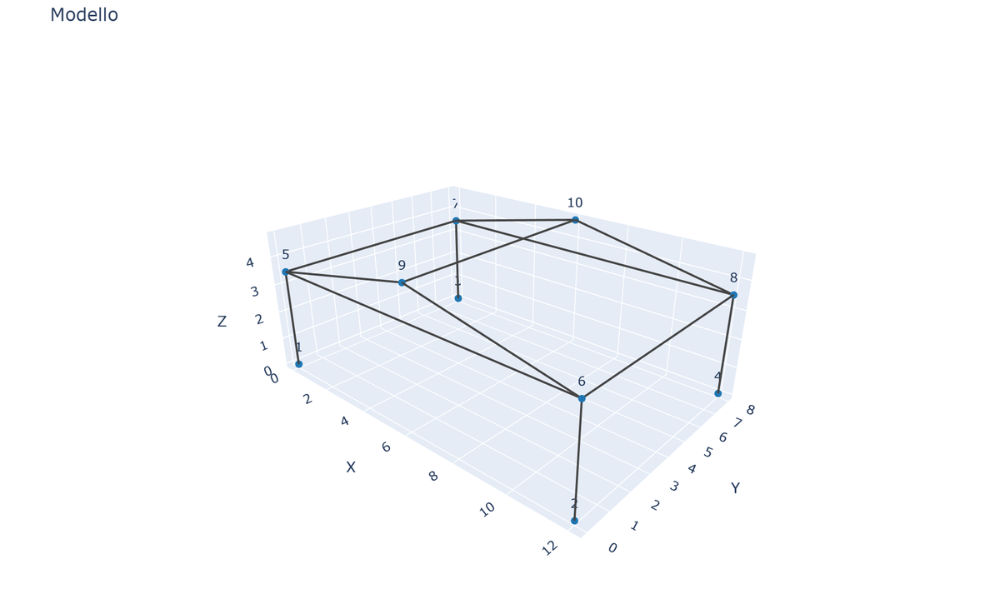 | 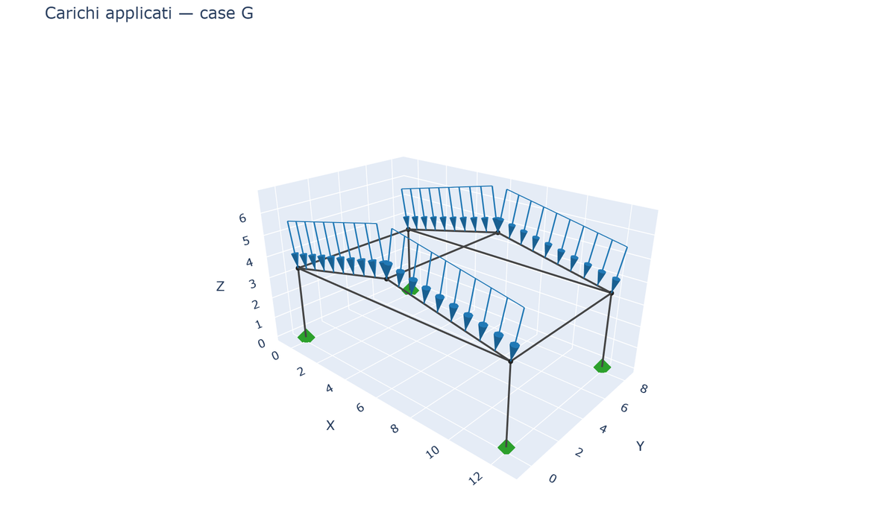 |  |

| Carichi W (vento) | Configurazione deformata | Momento Mz |
|---|---|---|
| 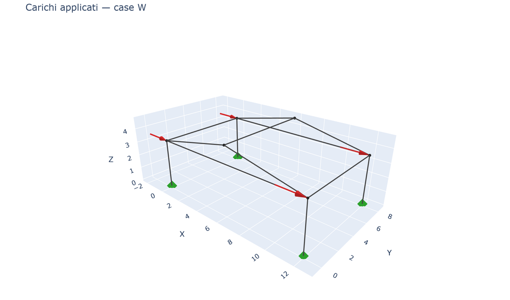 | 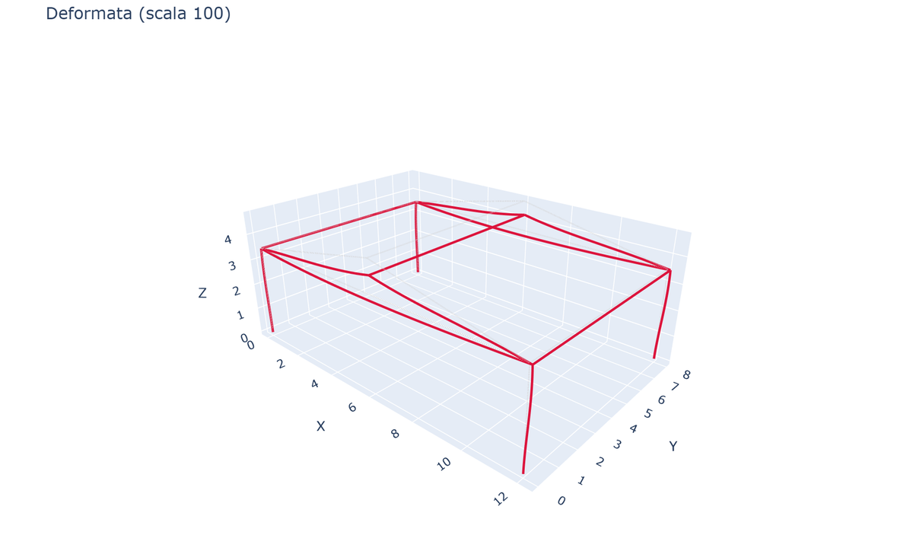 | 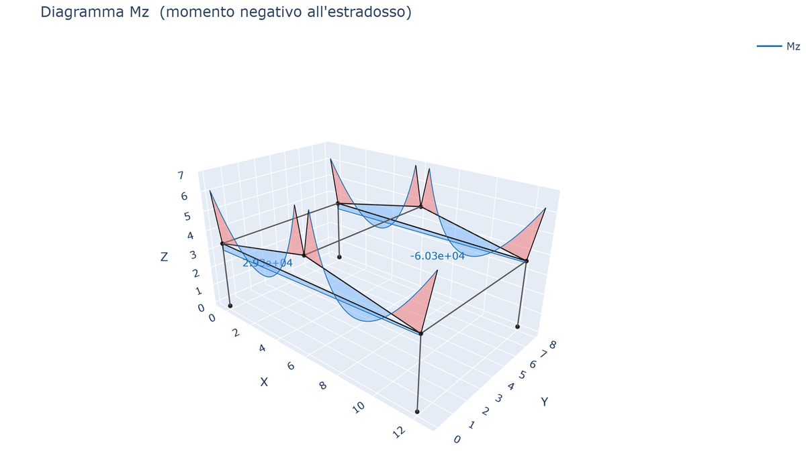 |

| Sforzo assiale N | Reazioni |
|---|---|
| 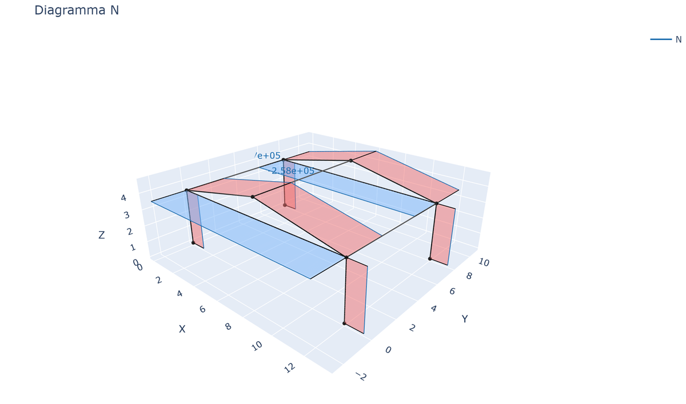 | 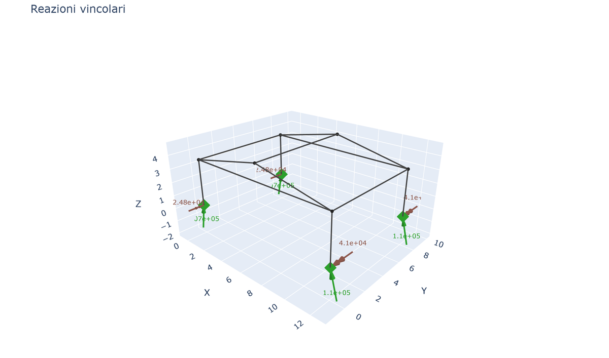 |

| Modo 1 (T=0.33s) | Modo 2 (T=0.18s) | Modo 3 (T=0.17s) |
|---|---|---|
| 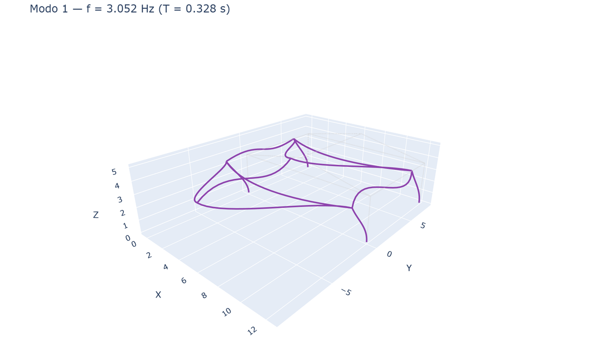 | 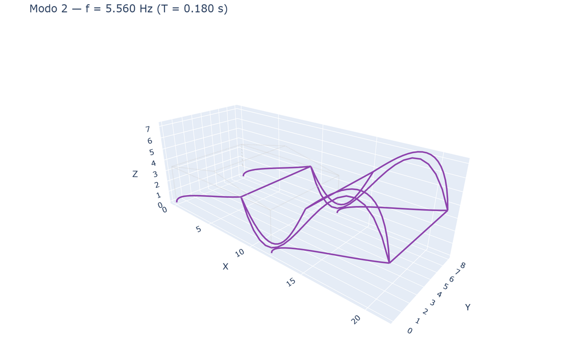 | 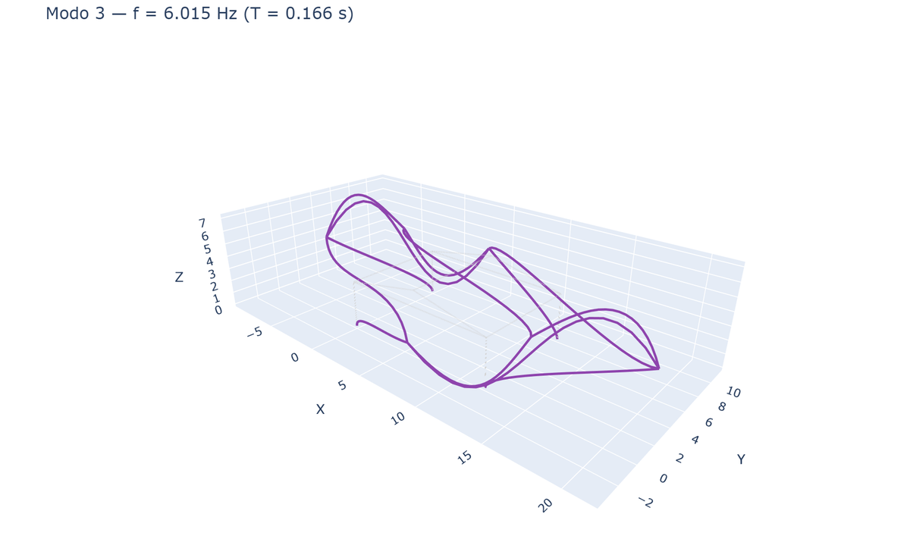 |

---

## Esempio 30 — Validazione con la letteratura: telaio a portale vs soluzione analitica

Validazione di beamfeapy rispetto al classico problema del **telaio a portale**
utilizzando il **metodo degli spostamenti (slope-deflection)** (Hibbeler, *Structural Analysis*; Kleinlogel,
*Rigid Frame Formulas*).

### Definizione del problema

- **Luce** L = 10 m, **altezza colonne** h = 5 m
- **Incastrato** alla base di entrambe le colonne
- **Carico uniformemente distribuito** q = 20 kN/m sulla trave
- **Stesso EI** per tutti gli elementi (E = 210 GPa, I = 5.0×10⁻⁴ m⁴)

### Soluzione analitica (slope-deflection, senza spostamento laterale)

Per un telaio a portale simmetrico con carico simmetrico:

$$\theta = \frac{q L^2}{24 EI \left(\frac{2}{h} + \frac{1}{L}\right)}$$

$$M_{base} = \frac{2EI}{h} \theta, \quad M_{top} = \frac{4EI}{h} \theta$$

$$M_{joint} = \left|\frac{2EI}{L} \theta - \frac{qL^2}{12}\right|$$

$$M_{midspan} = \frac{qL^2}{8} - M_{joint}$$

$$H = \frac{M_{base} + M_{top}}{h}, \quad V = \frac{qL}{2}$$

### Risultati del confronto

| Grandezza | Analitica | FEM (beamfeapy) | Errore |
|----------|-----------|-----------------|-------|
| H [kN] | 40.00 | 39.62 | 0.95% |
| V [kN] | 100.00 | 100.00 | 0.00% |
| M_base [kNm] | 66.67 | 65.24 | 2.14% |
| M_joint [kNm] | 133.33 | 132.86 | 0.36% |
| M_midspan [kNm] | 116.67 | 117.14 | 0.41% |

**Tutti gli errori < 3%** — la piccola discrepanza su M_base è dovuta alla
deformabilità assiale delle colonne (inclusa nel FEM, trascurata nella formula analitica).

### Script

<details markdown="block">
<summary>Mostra lo script completo</summary>

```python
"""Example 30 - Literature validation: portal frame vs analytical solution."""

import _common  # noqa: F401
from beamfeapy import Material, Model, Section, postprocess
from beamfeapy.plotting import (
    plot_deformed, plot_diagram, plot_loads, plot_model, plot_reactions,
)

def analytical_portal_frame(q, L, h, EI):
    theta = q * L**2 / (24 * EI * (2/h + 1/L))
    M_base = 2 * EI / h * theta
    M_top = 4 * EI / h * theta
    M_joint = abs(2 * EI / L * theta - q * L**2 / 12)
    M_midspan = q * L**2 / 8 - M_joint
    H = (M_base + M_top) / h
    V = q * L / 2
    return {"H": H, "V": V, "M_base": M_base, "M_joint": M_joint, "M_midspan": M_midspan}

def main():
    L, h, q = 10.0, 5.0, 20e3
    E, I_val, A, J = 210e9, 5.0e-4, 0.01, 1e-5

    mat = Material(E=E, nu=0.3)
    sec = Section(A=A, Iy=I_val, Iz=I_val, J=J)

    m = Model()
    m.add_node(1, 0, 0, 0); m.add_node(2, 0, 0, h)
    m.add_node(3, L, 0, h); m.add_node(4, L, 0, 0)
    m.add_beam(1, 1, 2, mat, sec)
    m.add_beam(2, 2, 3, mat, sec, ref_vector=(0, 0, 1))
    m.add_beam(3, 3, 4, mat, sec)
    m.fix(1); m.fix(4)
    m.add_distributed_load(2, "fy", -q)

    res = m.solve()
    ana = analytical_portal_frame(q, L, h, E * I_val)

    # Compare and print results...
    # (see full script in usage_examples/30_validazione_letteratura.py)

    _common.save(plot_model(m), "ex30_portal_validation_model.html")
    _common.save(plot_loads(m), "ex30_portal_validation_loads.html")
    _common.save(plot_deformed(res, scale=200), "ex30_portal_validation_deformed.html")
    _common.save(plot_diagram(res, "Mz"), "ex30_portal_validation_Mz.html")
    _common.save(plot_reactions(res), "ex30_portal_validation_reactions.html")
```

</details>

### Galleria

| Modello | Carichi | Configurazione deformata |
|---|---|---|
| 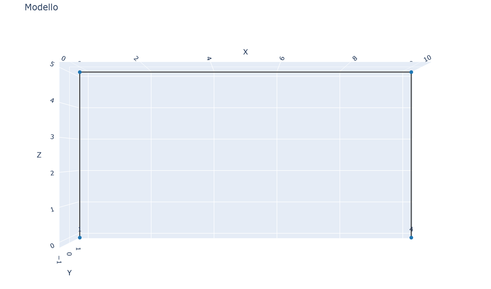 | 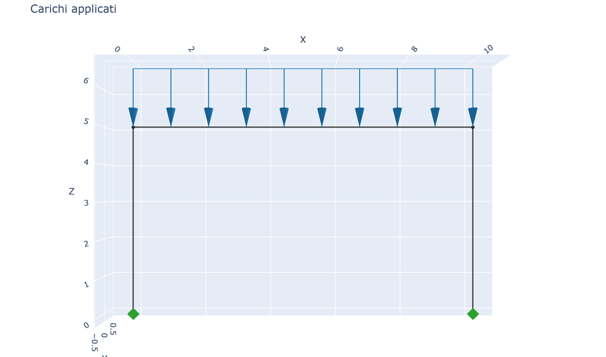 | 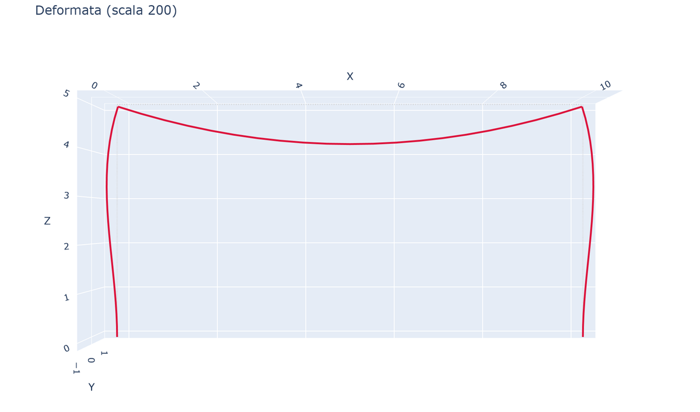 |

| Momento Mz | Sforzo assiale N | Taglio Vy |
|---|---|---|
| 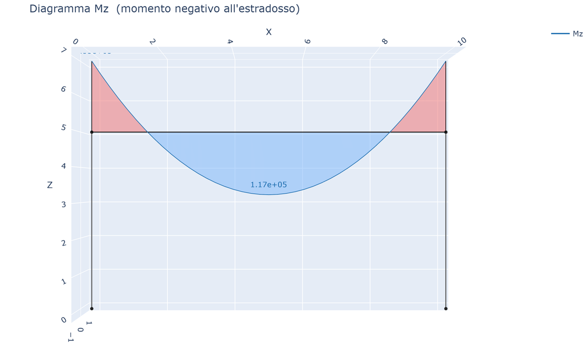 | 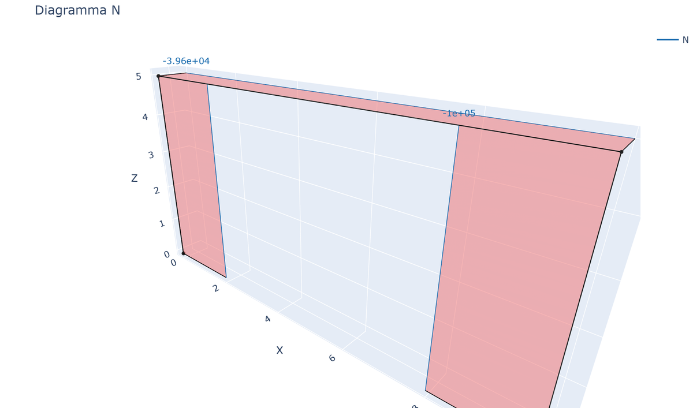 | 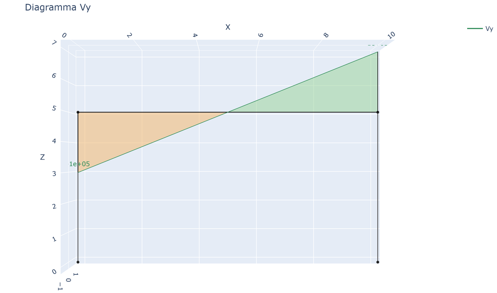 |

| Reazioni |
|---|
| 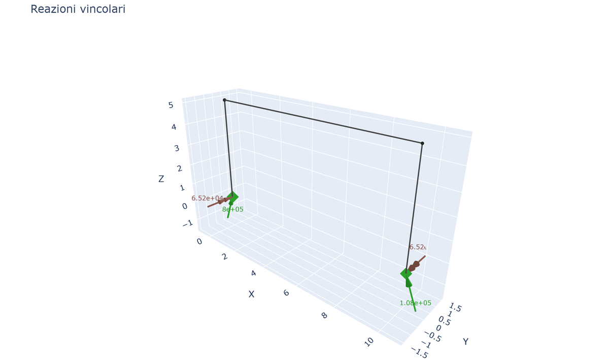 |
