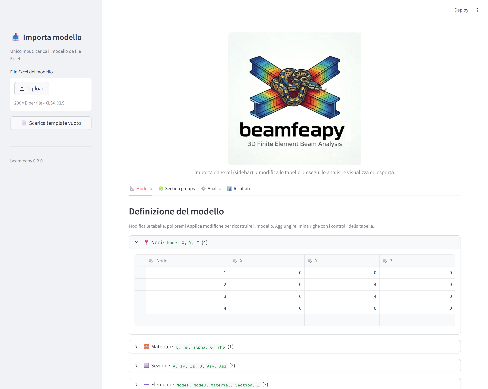
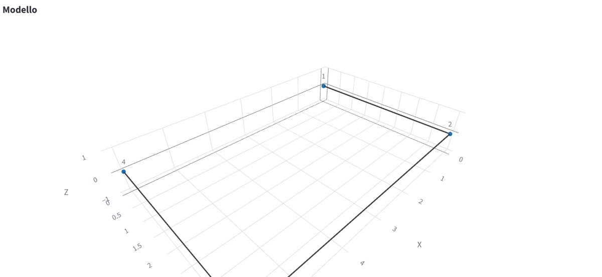
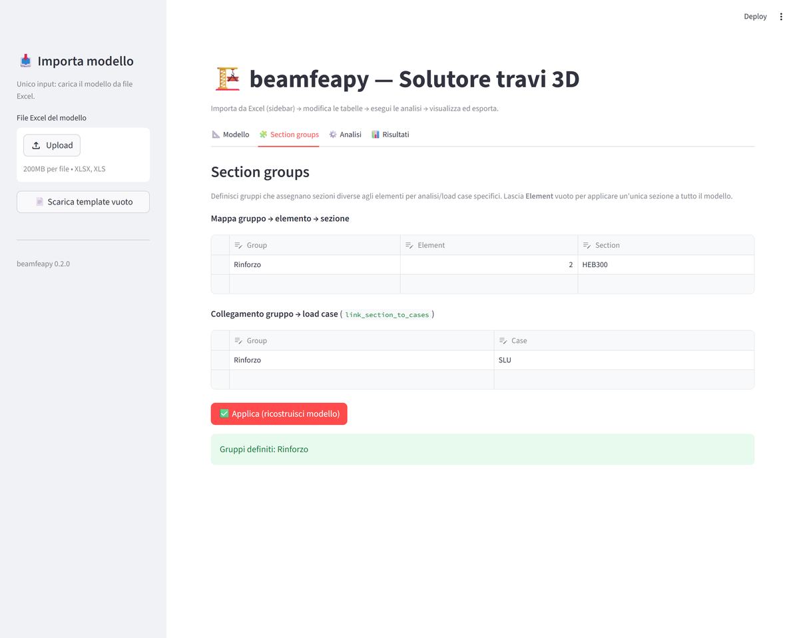
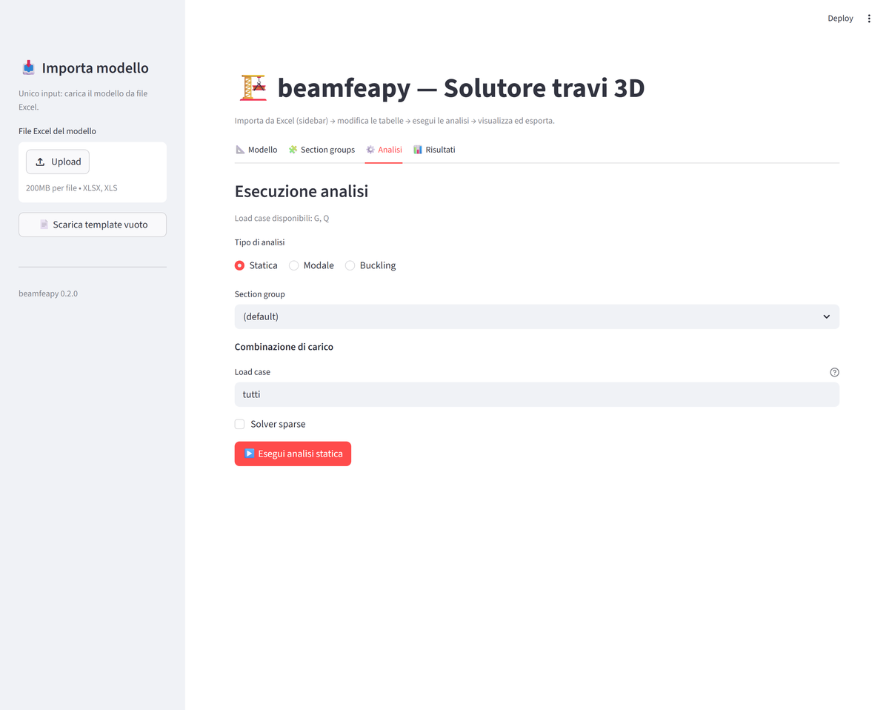
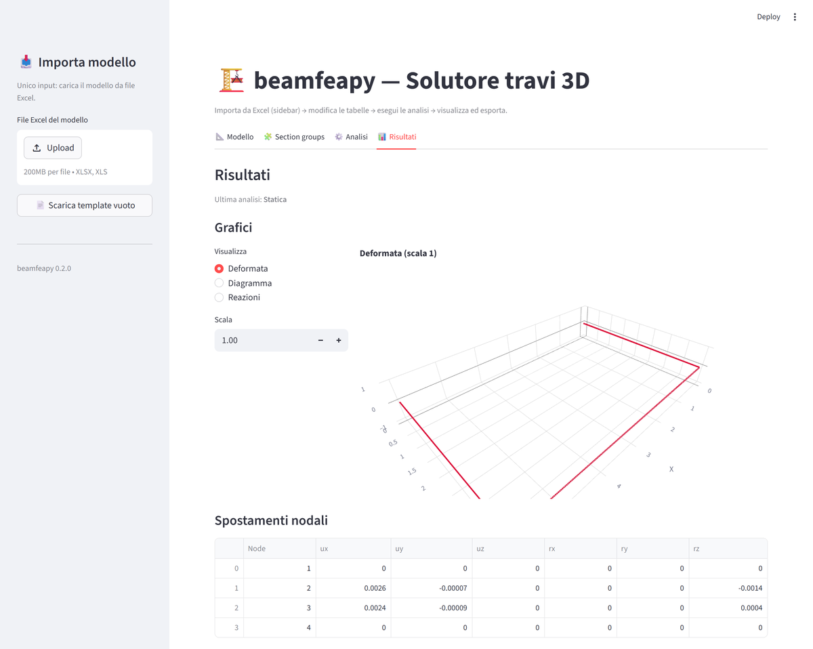
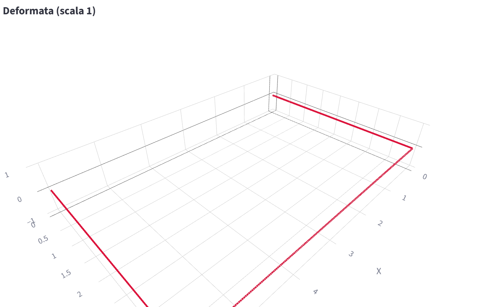
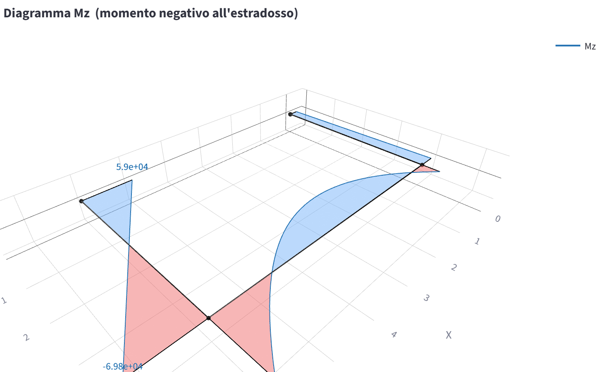

# 28 - Interfaccia Streamlit (UI)

`beamfeapy` include una **interfaccia grafica web** scritta in
[Streamlit](https://streamlit.io/) (`app.py` nella radice del repository) che
permette di costruire, analizzare e visualizzare modelli FEM di travi 3D
**senza scrivere codice**.

L'app è organizzata secondo un flusso lineare:

> **Importa da Excel** (sidebar) → **modifica le tabelle** → **esegui le analisi**
> → **visualizza ed esporta**.

---

## Avvio

Dalla cartella del repository:

```bash
pip install beamfeapy streamlit plotly openpyxl
streamlit run app.py
```

Il browser si apre automaticamente su `http://localhost:8501`.

> 💡 **Modalità demo** — per esplorare l'app con un modello già pronto (un
> telaio 3D con statica e modale già calcolate) avvia con la variabile
> d'ambiente `BEAMFEAPY_DEMO=1` **oppure** apri l'URL con il parametro
> `?demo=1` (es. `http://localhost:8501/?demo=1`). Tutte le immagini di questa
> guida usano la modalità demo.

---

## Panoramica del layout

L'interfaccia segue una regola precisa: **la sidebar di sinistra contiene solo
il caricamento del modello da Excel**. Tutto il resto (modello, analisi,
risultati) vive nell'area principale, organizzata in quattro tab.



| Zona | Contenuto |
|------|-----------|
| **Sidebar** | `Upload` del file Excel del modello + `Scarica template vuoto`. Nient'altro. |
| **Tab 📐 Modello** | Tabelle editabili (una per menù a tendina) di nodi, materiali, sezioni, elementi, vincoli e carichi + anteprima 3D. |
| **Tab 🧩 Section groups** | Definizione dei gruppi di sezioni e collegamento ai load case. |
| **Tab ⚙️ Analisi** | Esecuzione di analisi statica, modale e di buckling. |
| **Tab 📊 Risultati** | Grafici 3D, tabelle dei risultati ed export. |

Lo stato del modello è conservato in `st.session_state`: le modifiche
permangono passando da un tab all'altro.

---

## 1. Importare il modello (sidebar)

L'unico input nella sidebar è il **caricamento di un file Excel**. I fogli
riconosciuti (case-insensitive) sono `Node`, `Material`, `Section`, `Element`,
`Support`, `NodalLoad`, `DistributedLoad`, `ConcentratedLoad`, `Thermal`,
`Settlement`, `Prestress` — gli stessi descritti in
[11 - Excel I/O](it-11-excel-io.html).

- **Upload** → trascina o seleziona il file `.xlsx`. Il modello viene letto e
  le tabelle dell'area principale si popolano automaticamente.
- **Scarica template vuoto** → genera un file Excel con tutti i fogli e le
  intestazioni corrette, da compilare e ricaricare.

Non è obbligatorio partire da Excel: si può anche costruire il modello da zero
compilando direttamente le tabelle nel tab **Modello**.

---

## 2. Tab Modello

Qui si definisce o si modifica l'intero modello tramite **tabelle editabili**
(`st.data_editor`). Ogni tabella consente di **aggiungere righe** (riga vuota in
fondo) ed **eliminarle** (selezione riga + tasto cestino).

Ogni tabella è racchiusa in un **menù a tendina** (expander) con icona, elenco
delle colonne e **numero di righe** mostrato tra parentesi nel titolo. In questo
modo si visualizza **solo la tabella che interessa**, mantenendo la pagina
compatta. All'apertura del tab è espansa solo la tabella **Nodi**; le altre si
aprono con un clic sul rispettivo titolo.


Le tabelle disponibili (un menù a tendina ciascuna):

| Tabella | Colonne principali |
|---------|--------------------|
| **Nodi** | `Node, X, Y, Z` |
| **Materiali** | `Material (nome), E, nu, alpha, G, rho` |
| **Sezioni** | `Section (nome/ID), A, Iy, Iz, J, Asy, Asz` |
| **Elementi** | `Element, NodeI, NodeJ, Material, Section, shear, RefX/Y/Z, ReleasesI, ReleasesJ` |
| **Vincoli** | `Node, Dx, Dy, Dz, Rx, Ry, Rz` (spunta = grado bloccato) |
| **Carichi nodali** | `Node, Fx..Mz, Case` |
| **Carichi distribuiti** | `Element, Component (fy…), qi, qj, a, b, frame, Case` |

Note pratiche:

- **Materiali e sezioni** sono riferiti **per nome** nella tabella Elementi: il
  nome deve corrispondere esattamente.
- **`ReleasesI` / `ReleasesJ`**: svincoli ai due estremi, come lista separata da
  virgola (es. `rz,ry`).
- **`RefX/Y/Z`**: vettore di riferimento per orientare la sezione
  (vedi [08 - Orientazione Sezione](it-08-section-orientation.html)); lasciare vuoto
  per l'orientazione di default.
- **`a, b`** dei carichi distribuiti sono **normalizzati in [0, 1]** lungo
  l'elemento; `frame` può essere `local` o `global`.

### Applicare le modifiche

Il pulsante **✅ Applica modifiche** ricostruisce l'oggetto `Model` a partire
dalle tabelle. Gli input vengono **validati** (numeri, riferimenti a nodi e
sezioni esistenti, ID duplicati): eventuali errori vengono mostrati con un
messaggio rosso **senza far crashare l'app**. A modello valido compare il
riepilogo (numero di nodi, elementi e sezioni).

Con il pulsante **⬇️ Esporta modello (Excel)** si riesporta il modello corrente
in formato Excel ricaricabile.

### Anteprima 3D

In fondo al tab è disponibile un'anteprima interattiva (Plotly) con tre viste
selezionabili: **Geometria**, **Assi locali** e **Carichi** (per load case).



---

## 3. Tab Section groups

I **section group** permettono di assegnare **sezioni diverse agli elementi** in
funzione dell'analisi o del load case (utile, ad esempio, per fasi costruttive o
per stati limite con sezioni fessurate/integre).



- **Mappa gruppo → elemento → sezione**: ogni riga associa, all'interno di un
  gruppo, un `Element` a una `Section`. Lasciando **`Element` vuoto** la sezione
  indicata viene applicata **a tutti** gli elementi del gruppo.
- **Collegamento gruppo → load case** (`link_section_to_cases`): associa un
  gruppo a uno o più load case, così le analisi possono rilevarlo
  automaticamente.

Il pulsante **✅ Applica** ricostruisce il modello includendo i gruppi. I gruppi
definiti vengono poi proposti nel menu a tendina del tab Analisi.

---

## 4. Tab Analisi

Si sceglie il **tipo di analisi** e i relativi parametri, poi si preme
**▶️ Esegui**. Il risultato viene salvato in sessione e mostrato nel tab
Risultati.



Per tutte le analisi è possibile selezionare un **Section group** (oppure
`(default)`).

### Statica

Campo **Load case** flessibile:

| Sintassi | Significato |
|----------|-------------|
| `tutti` (o vuoto) | somma di tutti i load case |
| `G` | singolo load case |
| `G, Q` | più load case (coefficiente 1) |
| `G:1.35, Q:1.5` | **combinazione** con coefficienti |

Opzione **Solver sparse** per modelli di grandi dimensioni
(vedi [12 - Solver Sparso](it-12-sparse-solver.html)).

### Modale

Parametri: **numero di modi**, accelerazione **g**, e **mass_source** (sorgente
di massa dai load case, es. `G:1.0, Q:0.3`).
Vedi [19 - Analisi Modale](it-19-modal-analysis.html).

### Buckling

Parametri: **numero di modi** e **load case di riferimento** (con la stessa
sintassi della statica). Calcola i moltiplicatori critici λ.

---

## 5. Tab Risultati

Il contenuto si adatta all'ultima analisi eseguita.



### Statica
- **Grafici**: *Deformata* (con fattore di scala), *Diagramma* delle azioni
  interne con componente selezionabile (`N, Vy, Vz, T, My, Mz`), *Reazioni*.
- **Tabelle**: spostamenti nodali, reazioni vincolari e azioni interne lungo un
  elemento (numero di punti regolabile).

Il selettore *Visualizza* a sinistra del grafico commuta tra le tre viste. La
**deformata** mostra la configurazione spostata sovrapposta a quella indeformata
(amplificabile con il campo *Scala*):



Scegliendo *Diagramma* e la componente desiderata si ottiene il diagramma delle
**sollecitazioni** lungo gli elementi (qui il momento `Mz`, con campitura
positiva/negativa):



Più in basso, la sezione *Sollecitazioni (azioni interne lungo l'elemento)*
permette di scegliere un elemento e il numero di punti per ottenere la **tabella
dei valori** di `N, Vy, Vz, T, My, Mz` (utile per le verifiche di sezione).

### Modale
- **Forma modale** con slider sul modo e fattore di scala.
- **Tabella** di frequenze, periodi e masse partecipanti (X, Y, Z).

### Buckling
- **Forma di instabilità** con slider sul modo.
- **Tabella** dei moltiplicatori critici λ.

### Export

In fondo al tab:

- **Risultati (Excel)** e **Risultati (HDF5)** — vedi
  [22 - Salvataggio Risultati](it-22-saving-results.html) e
  [23 - Formato HDF5](it-23-hdf5-format.html).
- **Export modello** nei sei formati esterni — OpenSees TCL/Py, SAP2000, MIDAS,
  Robot, Straus7 — vedi
  [24 - Export Software Esterni](it-24-external-export.html).

---

## Suggerimenti

- **Niente modello attivo?** I tab Analisi e Risultati mostrano un avviso:
  importa un Excel o compila le tabelle e premi *Applica modifiche*.
- Le modifiche alle tabelle **non** ricostruiscono il modello finché non si
  preme *Applica modifiche*: è quindi sicuro fare più correzioni di seguito.
- I grafici sono Plotly 3D **interattivi**: ruota, zoom e pan con il mouse.
- Gli errori di validazione non interrompono l'app: correggi la tabella e
  riprova.

---

### Voci correlate
- [02 - Quick Start](it-02-quick-start.html)
- [11 - Excel I/O](it-11-excel-io.html)
- [19 - Analisi Modale](it-19-modal-analysis.html)
- [22 - Salvataggio Risultati](it-22-saving-results.html)
- [24 - Export Software Esterni](it-24-external-export.html)
