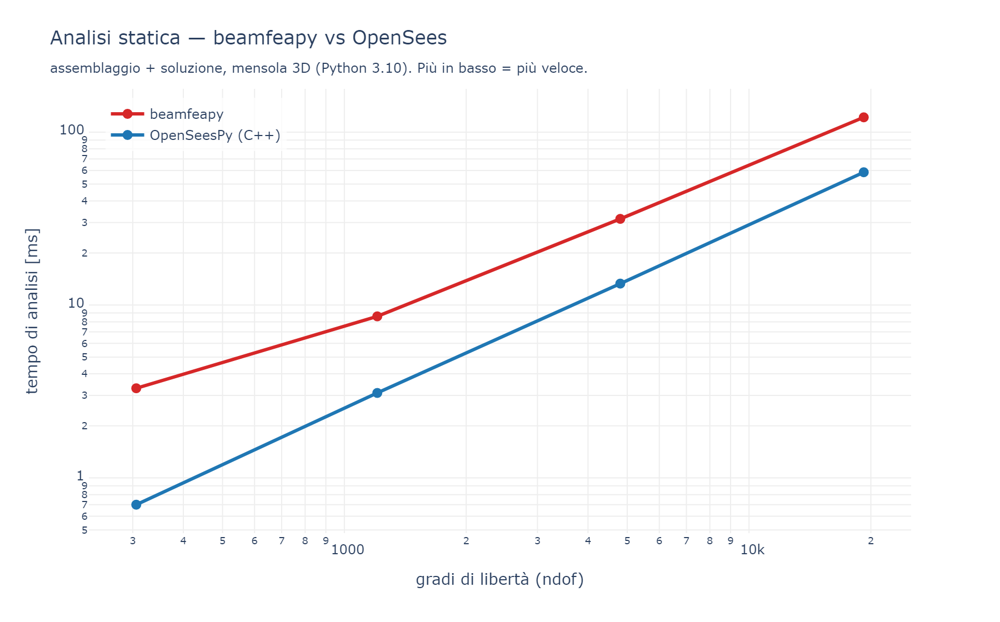
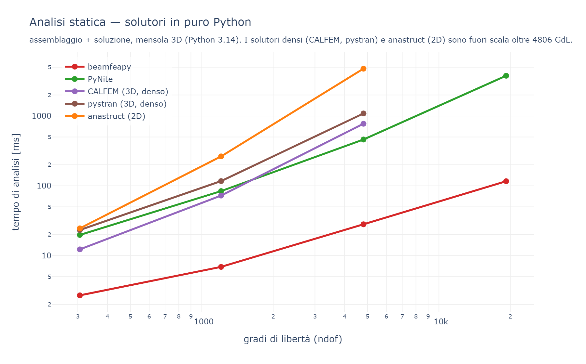
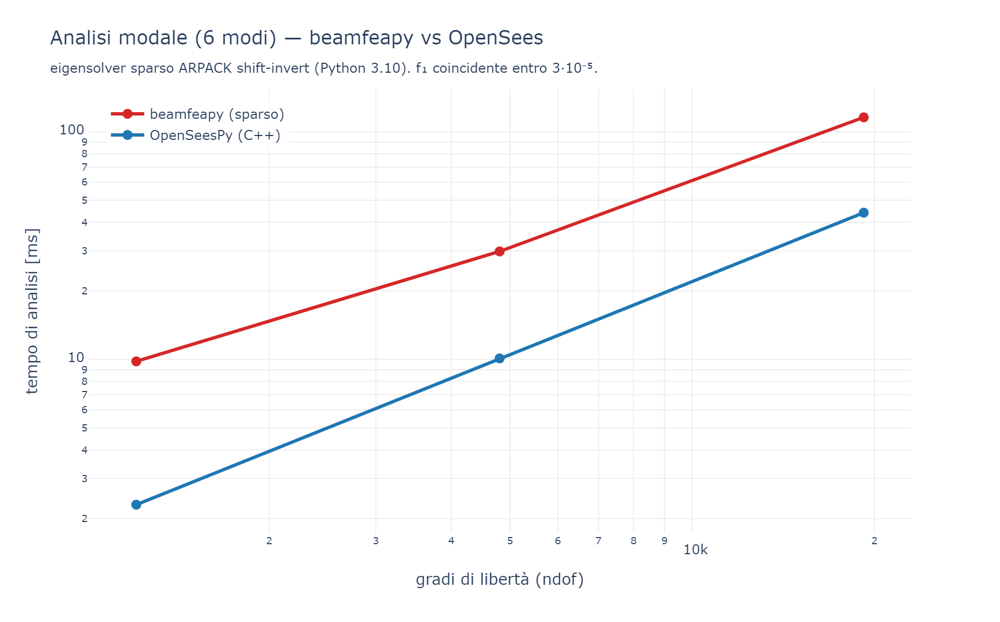
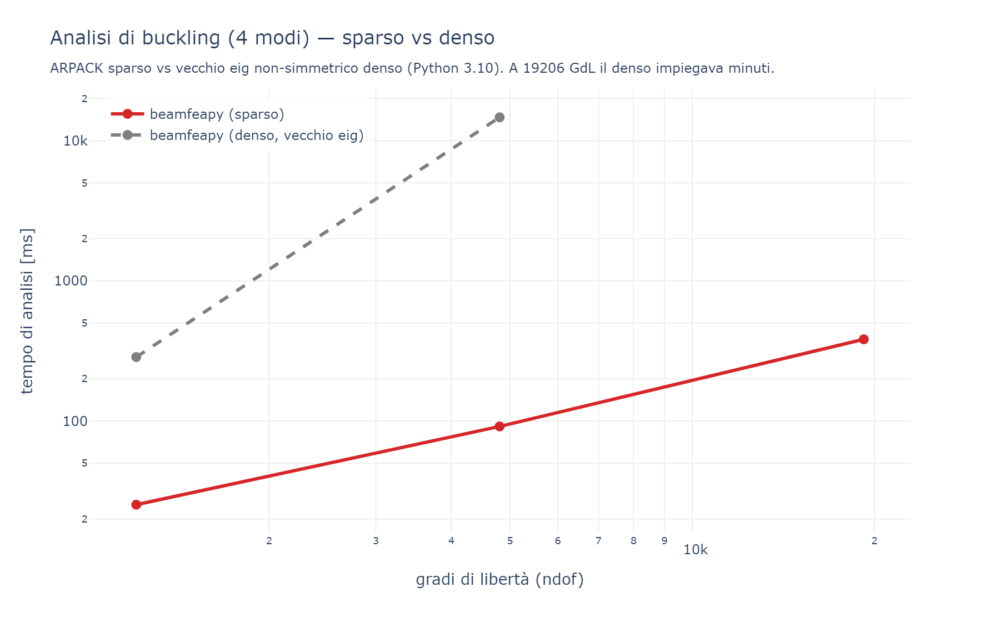

# 29 - Prestazioni e Benchmark

beamfeapy è scritto in Python/NumPy/SciPy, ma adotta tecniche di vettorizzazione
e algebra sparsa che lo avvicinano ai solutori compilati (OpenSees, C++) e lo
rendono nettamente più rapido degli altri solutori in puro Python.

Tutti i confronti usano lo stesso modello: una **mensola 3D** di `N` elementi
trave (lunghezza totale 50 m), carico distribuito + forza in punta per la statica,
massa propria per la modale, compressione assiale per il buckling. Si misura il
tempo della **sola analisi** (assemblaggio + soluzione), escludendo la
costruzione del modello. Le misure sono eseguite isolate (un benchmark per volta)
sulla stessa macchina; i grafici sono prodotti da `benchmark/gen_benchmark_charts.py`
a partire dagli script `benchmark/benchmark_multi.py` (statica) e
`benchmark/benchmark_eigen.py` (modale/buckling).

Solutori a confronto: **beamfeapy**, **OpenSeesPy** (FEM C++ di riferimento),
**PyNite** (frame 3D in puro Python), **CALFEM** (`calfem-python`, trave 3D
`beam3e`, assemblaggio denso), **pystran** (frame 3D in puro Python, denso) e
**anastruct** (frame 2D). Tutti concordano sulla freccia in punta (errore
relativo ≤ ~3·10⁻⁵, in genere a precisione macchina), quindi il confronto sui
tempi è significativo.

> OpenSeesPy si importa su Python 3.10 (problema di DLL su 3.14): i confronti con
> OpenSees sono eseguiti su Python 3.10. I solutori in puro Python (beamfeapy,
> PyNite, CALFEM, pystran, anastruct) sono confrontati su Python 3.14.

## Analisi statica — beamfeapy vs OpenSees



| GdL | beamfeapy | OpenSeesPy (C++) | rapporto |
|----:|----------:|-----------------:|---------:|
| 306 | 3.3 ms | 0.7 ms | 4.7× |
| 1 206 | 8.6 ms | 3.1 ms | 2.8× |
| 4 806 | 32 ms | 13 ms | 2.4× |
| 19 206 | 122 ms | 59 ms | **2.1×** |

La freccia in punta coincide con OpenSees a precisione macchina sui modelli ben
condizionati. Il divario si **riduce al crescere del problema** (l'overhead Python
si ammortizza): a 19 000 GdL beamfeapy è circa **2× OpenSees**, un risultato
notevole per un solutore in puro Python.

## Analisi statica — solutori in puro Python



| GdL | beamfeapy | PyNite | CALFEM (3D) | pystran (3D) | anastruct (2D) |
|----:|----------:|-------:|------------:|-------------:|---------------:|
| 306 | 2.7 ms | 20 ms | 12 ms | 23 ms | 25 ms |
| 1 206 | 6.9 ms | 84 ms | 73 ms | 117 ms | 264 ms |
| 4 806 | 28 ms | 461 ms | 775 ms | 1 087 ms | 4 765 ms |
| 19 206 | 116 ms | 3 773 ms | fuori scala | fuori scala | fuori scala |

beamfeapy è di gran lunga il più rapido fra i solutori in puro Python: **~16× più
veloce di PyNite**, **~28× di CALFEM**, **~39× di pystran** e **~170× di anastruct**
a 4806 GdL. CALFEM, pystran e anastruct usano assemblaggio/soluzione densi
(O(n³), memoria O(n²)): oltre ~5000 GdL diventano impraticabili, mentre beamfeapy
(sparso) sale a decine di migliaia di GdL. Tutti danno la stessa freccia
(errore relativo ≤ ~3·10⁻⁵).

## Analisi modale (6 modi)



Eigensolver sparso ARPACK (shift-invert a σ=0):

| GdL | beamfeapy | OpenSeesPy | errore f₁ |
|----:|----------:|-----------:|----------:|
| 1 206 | 9.8 ms | 2.3 ms | 7·10⁻⁹ |
| 4 806 | 30 ms | 10 ms | 5·10⁻⁷ |
| 19 206 | 116 ms | 44 ms | 2·10⁻⁵ |

Circa **2.6–4× OpenSees**, con le prime frequenze coincidenti. Prima del percorso
sparso la modale usava un `eigh` denso con condensazione di Guyan, oltre 100× più
lenta su modelli grandi.

## Analisi di buckling (4 moltiplicatori critici)



Eigensolver sparso generalizzato `(−K_g) φ = μ K φ`, μ = 1/λ:

| GdL | beamfeapy (sparso) | beamfeapy (denso, vecchio `eig`) | speed-up |
|----:|-------------------:|---------------------------------:|---------:|
| 1 206 | 25 ms | 286 ms | 11× |
| 4 806 | 92 ms | 14 676 ms | **160×** |
| 19 206 | 383 ms | minuti | — |

Il primo moltiplicatore coincide con la soluzione di Eulero. Il passaggio
dall'`eig` non-simmetrico denso all'`eigsh` sparso porta a uno **speed-up fino a
~160×** sui modelli grandi.

## Cosa rende veloce il solutore

- **Forme chiuse** per le forze nodali equivalenti dei carichi distribuiti
  (niente quadratura di Gauss).
- **Assemblaggio vettorizzato** con `np.matmul` in batch su `(ne, 12, 12)`.
- **Cache geometriche** (vettore d'asse, `R`, `T`, `K` locale) con chiave sui valori.
- **Indice dei carichi per elemento** calcolato in una passata e riusato.
- **Eigensolver sparsi** (ARPACK) per modale e buckling.
- **`solve_many`**: più combinazioni con una sola fattorizzazione.
- **pypardiso** opzionale (MKL) come solutore sparso (`pip install beamfeapy[fast]`).

## Riproducibilità

```bash
# i solutori extra si installano con:
pip install calfem-python pystran anastruct PyNiteFEA

python   benchmark/benchmark_multi.py    # statica: beamfeapy, PyNite, CALFEM, pystran, anastruct
py -3.10 benchmark/benchmark_multi.py    # aggiunge OpenSeesPy (DLL su Python 3.10)
py -3.10 benchmark/benchmark_eigen.py    # modale + buckling vs OpenSeesPy
python   benchmark/gen_benchmark_charts.py   # rigenera i grafici di questa pagina
```

I tempi assoluti dipendono dalla macchina; contano i rapporti.
