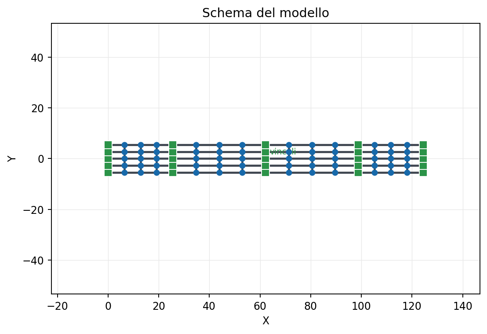
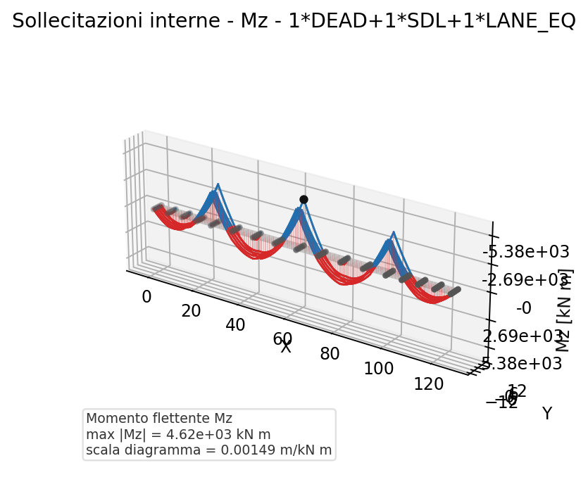

# 30 - Ponte a Graticcio IABSE

Questo esempio mostra come generare un report Word apribile anche in Pages per
un ponte reale studiato con modello a graticcio.

Il riferimento scelto e' il paper IABSE-JSCE 2020 di **Lu, Barker e Judd** sul
ponte **Evanston I-80**, in Wyoming. La geometria e lo schema a graticcio sono
ricavati dal caso pubblicato. I truck load del paper non vengono simulati qui,
perche' beamfeapy non espone ancora una API per carichi mobili.

Fonte: [Experimental and Numerical Studies on Post-Facture Behavior of Simple-Span Steel Girder Bridges](https://iabse-bd.org/2020/pdf/50.pdf)

## Schema del modello

- ponte autostradale I-80 presso Evanston, Wyoming
- 4 campate: 25.6 + 36.6 + 36.6 + 25.6 m
- soletta in calcestruzzo su travi d'acciaio
- modello equivalente a graticcio con 5 travi longitudinali e traversi di soletta
- vista 3D con asse Z mantenuto verticale



## Casi di carico

| Caso | Descrizione |
|------|-------------|
| DEAD | Peso proprio nominale del graticcio |
| SDL | Permanenti portati ripartiti sulle travi |
| LANE_EQ | Carico di corsia statico equivalente distribuito |
| THERM | Variazione termica uniforme e gradiente verticale |
| SHR | Ritiro come deformazione imposta (assiale + curvatura $N\cdot e$), applicato ai soli conci non fessurati |

> Approfondimento: la teoria del ritiro nelle sezioni composte (effetto
> primario isostatico $N$, $N\cdot e$ ed effetto secondario iperstatico) e la
> sua modellazione sono trattate in
> [31 - Ritiro nelle sezioni composte](it-31-ritiro-sezioni-composte.html).

Lo schema del modello resta mostrato in pianta. Sollecitazioni e reazioni sono
invece generate in vista 3D, cosi' i diagrammi risultano leggibili anche per un
graticcio planare.

## Combinazioni analizzate

- Permanenti: `DEAD + SDL`
- Esercizio: `DEAD + SDL + LANE_EQ`
- Termico e ritiro: `THERM + SHR`
- Rara: `DEAD + SDL + LANE_EQ + THERM + SHR`

Nel report le sollecitazioni e le reazioni sono riportate separatamente per
ogni load case e per ogni combinazione.

## Unità di misura nei diagrammi

Tutte le figure del report usano le unità tecniche tipiche dell'ingegneria
strutturale, ricavate per conversione dai valori SI interni del solutore:

| Grandezza | Unità |
|-----------|-------|
| Momenti flettenti e torcente (Mz, My, T) | kN·m |
| Tagli e sforzo normale (Vy, Vz, N) | kN |
| Spostamenti (deformata) | mm |

La deformata è tracciata in vista 3D anche per il graticcio planare, così lo
spostamento verticale dominante resta leggibile; il punto di massimo è
annotato in millimetri. Nei diagrammi di sollecitazione l'asse fuori-piano non
riporta più la coordinata Z ma direttamente il valore della sollecitazione
(kN·m o kN), così l'ampiezza del diagramma è leggibile in unità tecniche.



## Report Word

[Scarica il report Word del ponte IABSE](assets/ex30_ponte_graticcio_iabse_report.docx)

Per rigenerare il documento:

```bash
python scripts/generate_composite_bridge_word_report.py
```

Il nucleo del flusso e':

```python
from scripts.generate_composite_bridge_word_report import (
    build_iabse_evanston_grillage_model,
    solve_bridge_cases,
)
from beamfeapy.reporting import create_word_report

model, groups = build_iabse_evanston_grillage_model()
results, combinations = solve_bridge_cases(model)

report = create_word_report(
    model,
    results,
    options={
        "title": "Ponte a graticcio IABSE Evanston I-80 - Report FEM",
        "load_cases": ["DEAD", "SDL", "LANE_EQ", "THERM", "SHR"],
        "combinations": combinations,
        "force_components": ["Mz", "Vy", "N"],
    },
)
```
