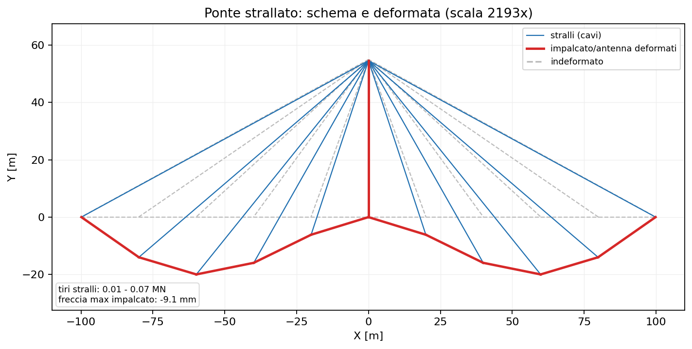
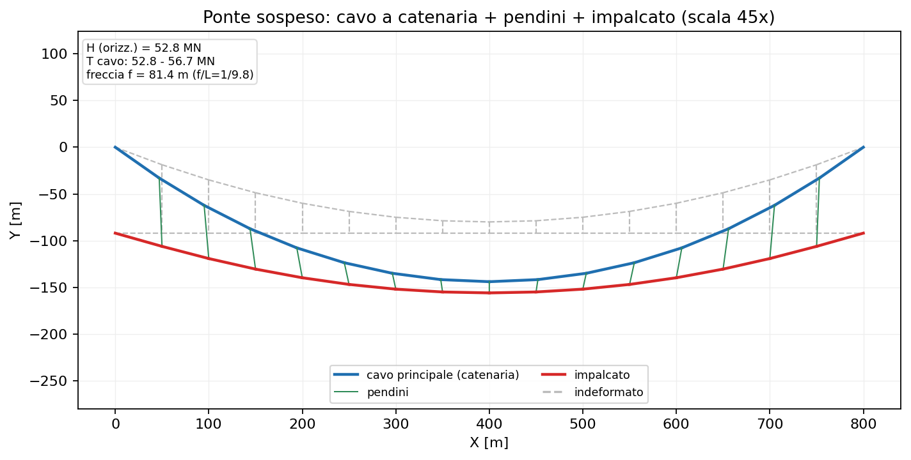

# 33 - Cavi: ponti strallati e sospesi

beamfeapy include **elementi cavo** a sola trazione e grandi spostamenti, adatti
a modellare **stralli** (ponti strallati) e **cavi di sospensione** (ponti
sospesi). I cavi rendono il problema **non lineare** (la rigidezza dipende dal
tiro e dalla configurazione) e si risolvono con `solve_nonlinear`
(Newton-Raphson).

## 1. Due elementi cavo

| Elemento | Classe | Uso tipico |
|----------|--------|------------|
| Asta corotazionale | `CableElement` (`add_cable`) | stralli, pendini; cavo discretizzato in più segmenti |
| Catenaria elastica esatta | `CatenaryCableElement` (`add_catenary_cable`) | cavo principale di sospensione, **peso proprio esatto** con un solo elemento per pannello |

- **`add_cable`** — barra a sola trazione con rigidezza materiale $EA/L_0$ e
  rigidezza geometrica "di corda" $N/L$ (rigidità trasversale proporzionale al
  tiro). Se il cavo va in compressione il tiro è posto a zero (sola trazione).
  Opzionalmente usa il **modulo di Ernst** per gli stralli inclinati.
- **`add_catenary_cable`** — catenaria elastica di Irvine: porta la **propria
  freccia da peso proprio** ($w>0$) senza discretizzazione; un elemento per
  pannello rappresenta esattamente il cavo sospeso.

> La pretensione si imposta con `N0` (tiro iniziale, da cui si ricava la
> lunghezza indeformata $L_0$) oppure direttamente con `L0`.

### Matrice di rigidezza tangente (forma simbolica)

Il cavo agisce solo sulle **3 traslazioni** per nodo: la matrice è $6\times6$ sui
GdL $[u_x^i, u_y^i, u_z^i,\ u_x^j, u_y^j, u_z^j]$. È **non lineare** → si scrive
la rigidezza *tangente* nella configurazione corrente. Detti $L_0$ la lunghezza
indeformata, $L$ quella corrente, $\mathbf{d}$ il versore corrente da $i$ a $j$,
$\varepsilon = (L-L_0)/L_0$ la deformazione e $N = E_{\text{eff}} A\,\varepsilon$
il tiro ($>0$ trazione):

$$
\mathbf{g} = N \begin{bmatrix} -\mathbf{d} \\ \mathbf{d} \end{bmatrix},
\qquad
\mathbf{K}_t = \begin{bmatrix} \mathbf{k} & -\mathbf{k} \\ -\mathbf{k} & \mathbf{k} \end{bmatrix},
\qquad
\mathbf{k} = \underbrace{\frac{E_{\text{eff}} A}{L_0}\,\mathbf{d}\,\mathbf{d}^{\mathsf T}}_{\text{materiale (assiale)}}
+ \underbrace{\frac{N}{L}\big(\mathbf{I}_3 - \mathbf{d}\,\mathbf{d}^{\mathsf T}\big)}_{\text{geometrica (di corda)}}
$$

Esplicitando $\mathbf{d} = [d_x, d_y, d_z]^{\mathsf T}$, il blocco $3\times3$
$\mathbf{k}$ vale:

$$
\mathbf{k} =
\frac{E_{\text{eff}} A}{L_0}
\begin{bmatrix}
d_x^2 & d_x d_y & d_x d_z \\
d_x d_y & d_y^2 & d_y d_z \\
d_x d_z & d_y d_z & d_z^2
\end{bmatrix}
+ \frac{N}{L}
\begin{bmatrix}
1-d_x^2 & -d_x d_y & -d_x d_z \\
-d_x d_y & 1-d_y^2 & -d_y d_z \\
-d_x d_z & -d_y d_z & 1-d_z^2
\end{bmatrix}
$$

- il **termine materiale** $\frac{E_{\text{eff}}A}{L_0}\mathbf{d}\mathbf{d}^{\mathsf T}$ dà rigidezza solo lungo l'asse del cavo $\mathbf{d}$;
- il **termine geometrico** $\frac{N}{L}(\mathbf{I}_3 - \mathbf{d}\mathbf{d}^{\mathsf T})$ proietta sul piano **trasversale** a $\mathbf{d}$ e cresce con il tiro $N$ (effetto "corda tesa"): un cavo scarico ($N=0$) non ha rigidezza laterale ed è instabile.

Per la **sola trazione**, se $\varepsilon < 0$ (cavo lasco) si pone $N=0$ con una
rigidezza materiale residua minima per evitare la singolarità.

> Il **cavo a catenaria** (`CatenaryCableElement`) ha la stessa struttura
> $6\times6$ ma le forze interne discendono dalle equazioni di compatibilità
> della catenaria elastica (Irvine, 1981) e la tangente è calcolata per
> **differenze finite** (poi simmetrizzata), non in forma chiusa.

## 2. Modulo equivalente di Ernst

Uno strallo inclinato modellato con **un solo elemento** ha una rigidezza
assiale apparente ridotta dalla freccia del peso proprio. beamfeapy usa il
modulo di Ernst (`ernst=True`):

$$
E_{\text{eff}} = \dfrac{E}{1 + \dfrac{w^2\,A\,L_h^2\,E}{12\,N^3}}
$$

con $w$ peso per unità di lunghezza, $L_h$ proiezione orizzontale, $N$ tiro.
Per uno strallo lungo ($L_h = 250$ m, $T = 3$ MN, $A = 0.01\ \text{m}^2$):
$E_{\text{eff}} \approx 158$ GPa, cioè una **riduzione del ~19 %** rispetto a
$E = 195$ GPa.

## 3. Esempio: ponte strallato

Antenna centrale, impalcato continuo e stralli a ventaglio (fan) dalla sommità
ai nodi dell'impalcato; gli stralli usano il modulo di Ernst.



**Validazioni** (script
[`scripts/generate_cable_bridges_figures.py`](https://github.com/DomenicoGaudioso/beamfeapy/blob/main/scripts/generate_cable_bridges_figures.py),
e l'esempio [`usage_examples/37_ponte_strallato.py`](https://github.com/DomenicoGaudioso/beamfeapy/blob/main/usage_examples/37_ponte_strallato.py)):

- **singolo strallo**: l'equilibrio del nodo dà $T = P/\sin\theta$; il FEM lo
  riproduce **esattamente** (errore 0.00 %);
- **modulo di Ernst**: la riduzione di rigidezza coincide con la formula chiusa;
- **equilibrio globale**: la somma delle reazioni verticali eguaglia il carico
  totale (peso impalcato + peso proprio stralli).

```python
import math
from beamfeapy import Material, Model, Section

m = Model()
m.add_node(1, 0.0, 55.0, 0.0)     # sommita' antenna
m.add_node(2, 100.0, 0.0, 0.0)    # ancoraggio impalcato
theta = math.atan2(55.0, 100.0)
# strallo con modulo di Ernst e pretensione di form-finding
m.add_cable(1, 1, 2, E=195e9, A=0.010, N0=1.5e5 / math.sin(theta),
            w=78.5e3 * 0.010, ernst=True)
# ... travi di impalcato/antenna, vincoli, carichi ...
r = m.solve_nonlinear(max_iter=200)
T = r.cable_force(1)              # tiro dello strallo [N]
```

## 4. Esempio: ponte sospeso

Cavo principale a **catenaria elastica** (un elemento per pannello, peso proprio
esatto) + **pendini** verticali (cavi a sola trazione) + impalcato (trave di
irrigidimento).



**Validazione** (teoria classica del cavo parabolico): per carico verticale
uniforme la componente orizzontale del tiro vale $H = w\,L^2/(8f)$. Con
$L = 800$ m e freccia $f \approx 81$ m ($f/L \approx 1/9.8$):

| Grandezza | FEM | Teoria $wL^2/8f$ | Scarto |
|-----------|----:|-----------------:|-------:|
| $H$ (orizzontale) | 52.8 MN | 52.6 MN | 0.3 % |

Il tiro nel cavo principale varia da ~52.8 MN (mezzeria) a ~56.7 MN (sommità
delle torri), dove $T_{\max} = \sqrt{H^2 + V^2}$.

```python
from beamfeapy import Material, Model, Section

m = Model()
# cavo principale: un elemento a CATENARIA per pannello (peso proprio esatto)
m.add_catenary_cable(1, n_a, n_b, E=200e9, A=0.30, w=78.5e3 * 0.30)
# pendini: cavi verticali a sola trazione dal cavo all'impalcato
m.add_cable(10, n_cable, n_deck, E=200e9, A=0.012, N0=1.5e6)
# ... impalcato (travi), vincoli, carichi ...
r = m.solve_nonlinear(max_iter=400)
H    = r.cable_horizontal(1)     # componente orizzontale del tiro [N]
Tmax = r.cable_force(1)          # tiro massimo del pannello [N]
```

## 5. API rapida

| Metodo | Descrizione |
|--------|-------------|
| `Model.add_cable(id, ni, nj, E, A, N0=…, L0=…, w=…, ernst=…)` | cavo-asta a sola trazione (stralli, pendini) |
| `Model.add_catenary_cable(id, ni, nj, E, A, w, N0=…, L0=…)` | cavo a catenaria elastica (peso proprio esatto) |
| `Model.solve_nonlinear(cases=…, max_iter=…)` | soluzione non lineare (Newton-Raphson) |
| `Result.cable_force(id)` | tiro assiale del cavo [N] (>0 trazione) |
| `Result.cable_horizontal(id)` | componente orizzontale $H$ (catenaria) [N] |

> Riferimenti: H.J. Ernst, *Der Bauingenieur* 40 (1965); H.M. Irvine, *Cable
> Structures*, MIT Press, 1981; N.J. Gimsing & C.T. Georgakis, *Cable Supported
> Bridges*, Wiley, 2012.
