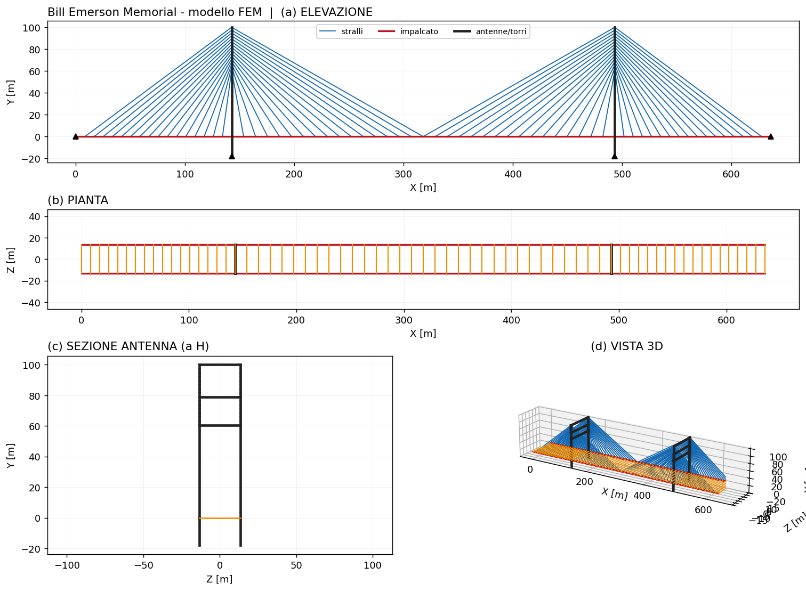
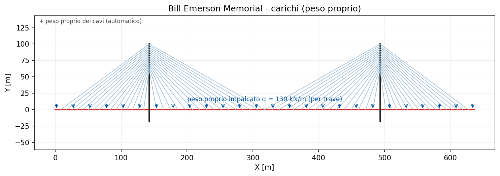
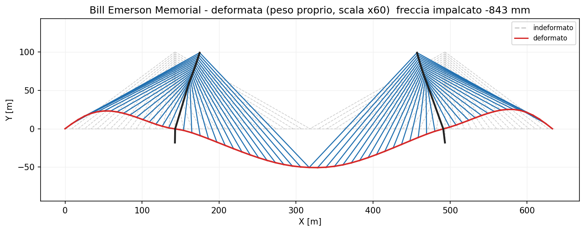
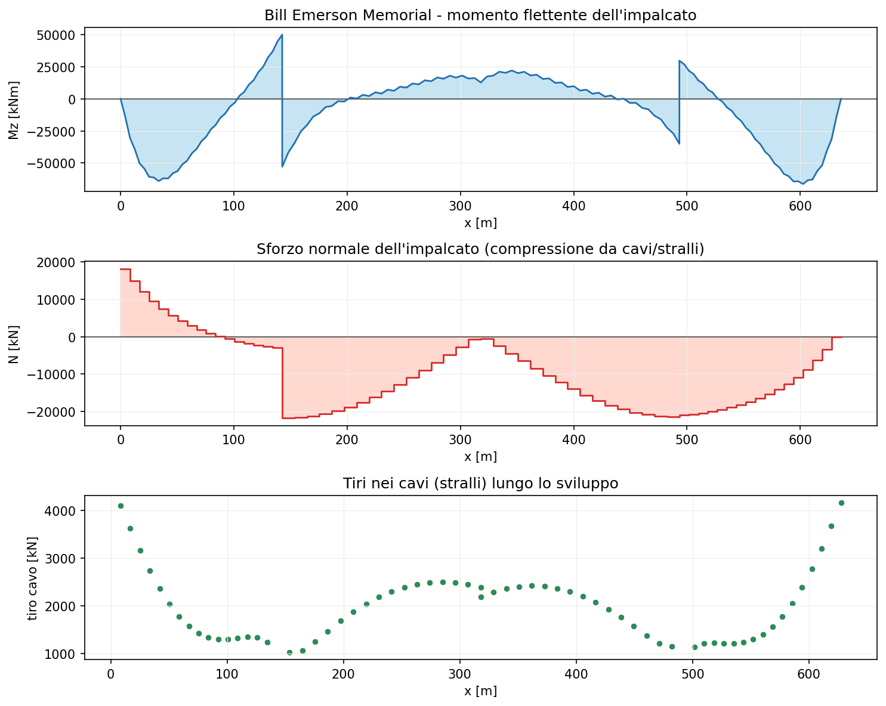
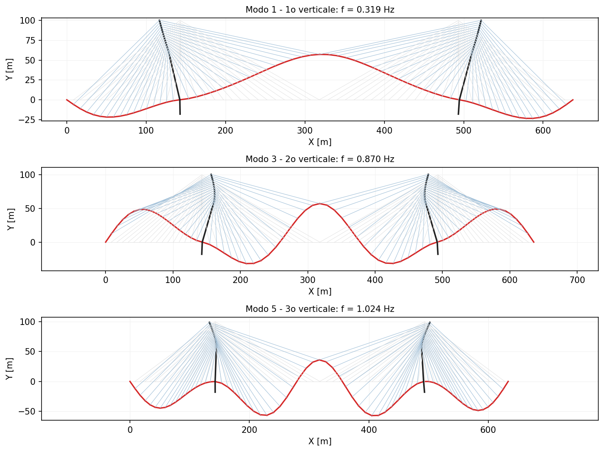
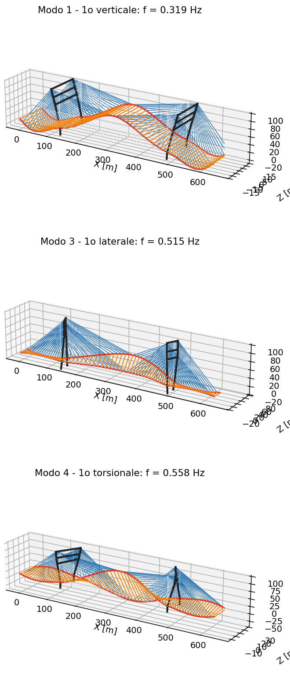

# 34 - Ponte strallato Bill Emerson (Cape Girardeau)

Ricostruzione 3D e analisi sotto peso proprio del **Bill Emerson Memorial
Bridge** (Cape Girardeau, MO), benchmark ASCE per il controllo strutturale dei
ponti strallati (Dyke, Caicedo et al., 2003). Il modello usa gli
[elementi cavo](it-33-cavi-ponti-strallati-sospesi.html) (stralli con modulo di
Ernst) e la soluzione non lineare `solve_nonlinear`.

> **Nota sui dati.** Le proprietà di sezione del benchmark ASCE non sono
> pubbliche. Si usa quindi la **geometria reale** con sezioni rappresentative
> dell'impalcato composto e delle antenne in c.a., **calibrando** rigidezza e
> massa dell'impalcato in modo che il 1° modo verticale coincida con quello del
> modello benchmark/identificato.

## 1. Geometria reale

| Grandezza | Valore |
|-----------|-------:|
| Campata principale | 1150 ft = 350.6 m |
| Campate laterali | 468 ft = 142.7 m |
| Antenne (a H, c.a.) | 356 ft ≈ 108 m |
| Stralli | 128, a semi-ventaglio (due piani) |
| Larghezza impalcato | ~26.7 m |

## 2. Modello FEM

L'impalcato è modellato a spina su **due piani** di travi (impalcato composto),
collegati da traversi. Le **antenne sono a H**: due gambe in c.a. collegate da
traversi, con la base alla pila (sotto l'impalcato) e gli stralli ancorati a
**semi-ventaglio** lungo la parte alta delle gambe. La sezione (c) mostra la
forma a H dell'antenna con i traversi.



## 3. Carichi

Carico = **peso proprio** dell'impalcato (distribuito sulle travi) + peso proprio
degli stralli (automatico). Nessun carico mobile.



## 4. Analisi statica

Soluzione non lineare (Newton-Raphson), convergenza in poche iterazioni.





**Validazione:** l'**equilibrio verticale globale** è soddisfatto esattamente
(ΣR = carico totale). I tiri degli stralli crescono dai più corti (vicino alle
antenne) ai back-stay più lunghi (≈ 1 000 → 4 200 kN). La freccia sotto solo
peso proprio è quella del modello *as-built*, senza la controfreccia di
costruzione.

## 5. Analisi modale

La massa propria dei cavi è inclusa e gli stralli sono linearizzati attorno
all'equilibrio. Le frequenze verticali calcolate sono confrontate con quelle
**identificate** sperimentalmente (NExT/ERA) e con il **modello FE benchmark**:

| Modo verticale | beamfeapy | identificato | FE benchmark |
|----------------|----------:|-------------:|-------------:|
| 1° | **0.319 Hz** | 0.323 Hz | 0.290 Hz |
| 2° | 0.870 Hz | 0.414 Hz | 0.370 Hz |
| 3° | 1.024 Hz | 0.573 Hz | 0.581 Hz |

Il **1° modo verticale** (0.319 Hz) coincide con quello identificato
sperimentalmente (0.323 Hz, scarto **−1 %**). Lo spettro reale ai modi superiori
è più fitto (7 modi verticali sotto 1 Hz, con modi antisimmetrici intercalati):
il modello a spina, più rigido, non li riproduce tutti.



**Forme di vibrare in 3D.** Rilasciando i gradi di libertà fuori-piano il modello
diventa 3D e fornisce anche i modi laterale e torsionale:

| Modo 3D | beamfeapy | riferimento |
|---------|----------:|------------:|
| 1° verticale | 0.319 Hz | 0.323 Hz (identificato) |
| 1° laterale | 0.515 Hz | 0.649 Hz (benchmark, lat-tors.) |
| 1° torsionale | 0.558 Hz | — |



## 6. Riferimenti

- S.J. Dyke, J.M. Caicedo, G. Turan, L.A. Bergman, S. Hague, *Phase I benchmark
  control problem for seismic response of cable-stayed bridges*, J. Struct. Eng.
  129(7), 2003, 857-872.
- Y. Zhang, J.M. Caicedo, *Modal identification of the Bill Emerson Bridge*,
  14WCEE, 2008 (frequenze identificate).
- H.J. Ernst, *Der E-Modul von Seilen…*, Der Bauingenieur 40, 1965.

## 7. Come rigenerare

```bash
python scripts/generate_real_bridges_figures.py   # modello, carichi, deformata, sollecitazioni, modi (2D e 3D)
python scripts/modal_real_bridges.py              # tabella di confronto modale
```

Vedi anche il [ponte sospeso Vincent Thomas](it-35-ponte-sospeso-vincent-thomas.html)
e la [teoria degli elementi cavo](it-33-cavi-ponti-strallati-sospesi.html).
