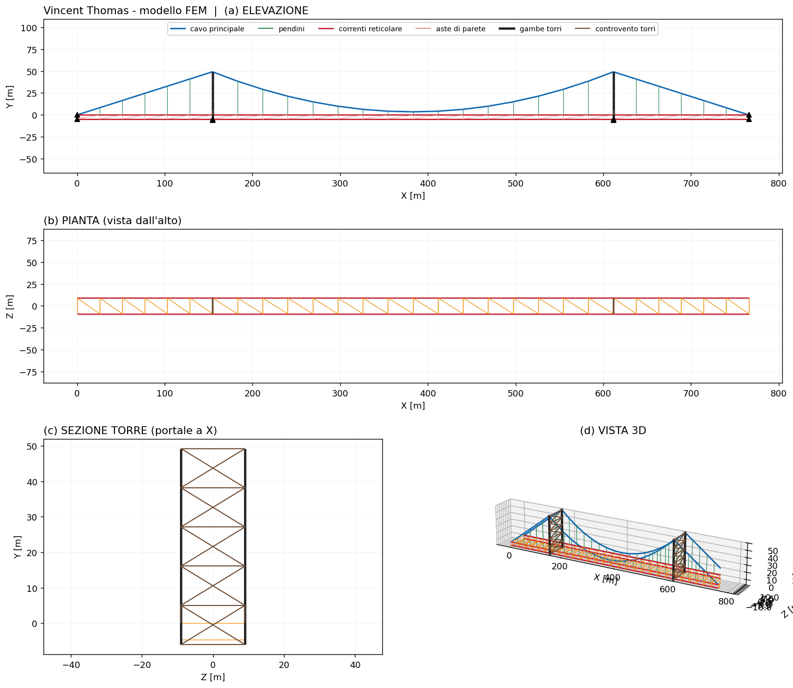
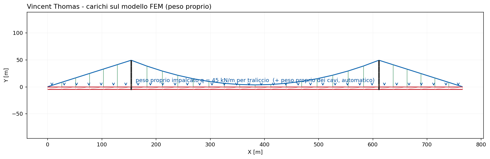
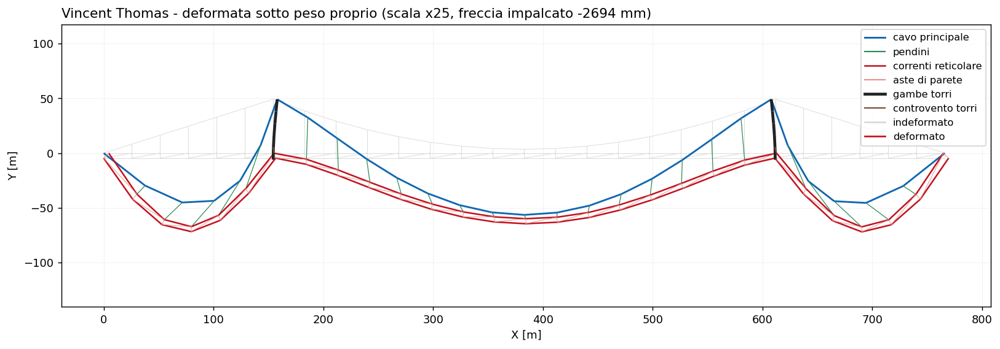
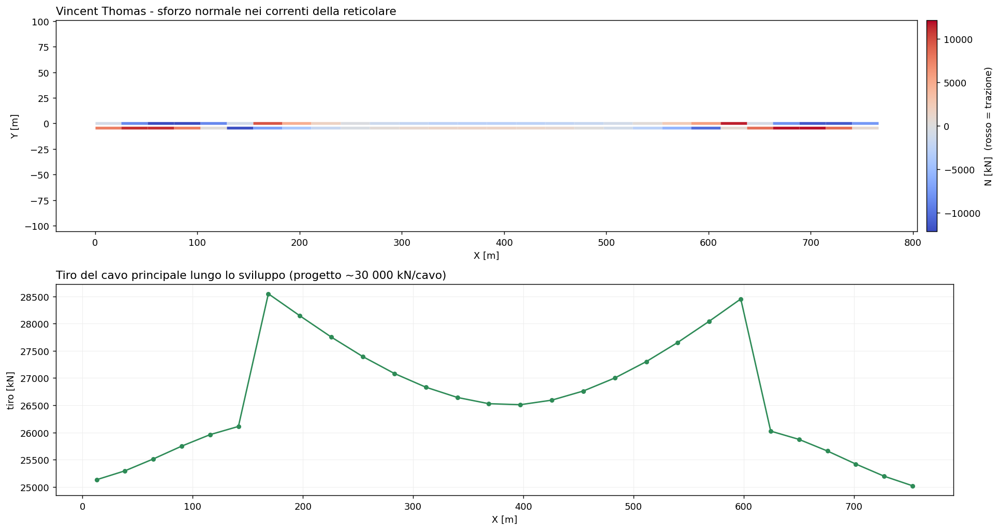
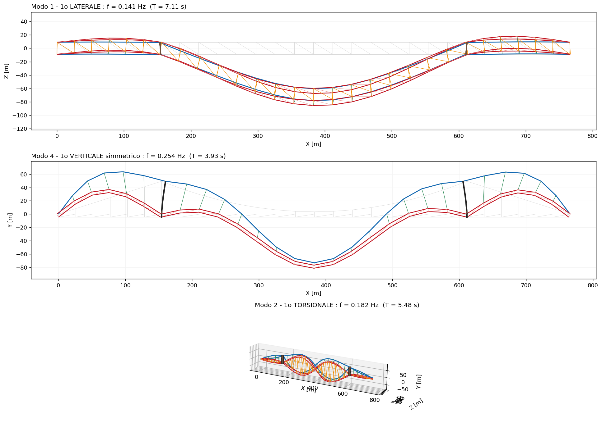

# 35 - Ponte sospeso Vincent Thomas (San Pedro)

Ricostruzione 3D **fedele** e analisi sotto peso proprio del **Vincent Thomas
Bridge** (San Pedro, CA), benchmark sismico molto studiato. Geometria, sezioni e
carichi sono i **valori reali** pubblicati da Abdel-Ghaffar & Housner nei report
dell'Earthquake Engineering Research Laboratory del Caltech; le frequenze
calcolate sono confrontate con quelle **misurate** sullo stesso ponte.

Il modello usa gli [elementi cavo](it-33-cavi-ponti-strallati-sospesi.html): cavo
principale a **catenaria elastica**, **pendini** a sola trazione e soluzione non
lineare con *load-stepping*.

## 1. Dati reali

Dall'esempio numerico del Vincent Thomas in A.M. Abdel-Ghaffar, *Dynamic
analyses of suspension bridge structures*, EERL 76-01, Caltech 1976 (pp.
199-200):

| Grandezza | Valore reale |
|-----------|-------------:|
| Campata principale | 1500 ft = 457.2 m |
| Campate laterali | 506.5 ft = 154.4 m |
| Freccia del cavo | 150 ft = 45.72 m |
| Interasse travi/cavi *b* | 59.17 ft = 18.03 m |
| Altezza travi reticolari *d* | 15 ft = 4.572 m |
| Area di un cavo | 121 in² = 0.0781 m² |
| Area di un corrente | 53.78 in² = 0.0347 m² |
| Area di una diagonale | 16.9 in² = 0.0109 m² |
| Peso proprio impalcato | 6.15 kips/ft (≈ 45 kN/m per traliccio) |
| Tiro orizzontale del cavo (progetto) | 6 750 kips = 30 027 kN/cavo |

## 2. Modello FEM

L'impalcato è formato dalle due **travi di irrigidimento reticolari** reali
(correnti, montanti e diagonali tipo Pratt) collegate da traversi e controvento
inferiore, a formare il **sistema a cassone** torsionalmente rigido. Il cavo
principale è modellato con elementi a **catenaria elastica** (uno per pannello,
peso proprio esatto), i **pendini** sono cavi a sola trazione e le **torri sono
a portale** (due gambe collegate da controvento a X su più livelli).



## 3. Carichi

Carico = peso proprio dell'impalcato (distribuito sui correnti superiori) + peso
proprio dei cavi (aggiunto automaticamente).



## 4. Analisi statica

Soluzione non lineare (Newton-Raphson con *load-stepping*). Il cavo assume la sua
forma di equilibrio sotto peso proprio e l'impalcato lo segue tramite i pendini.



Lo **sforzo normale** nei correnti alterna trazione/compressione lungo lo
sviluppo; il **tiro del cavo** cresce dalla mezzeria verso le torri.



**Validazione statica:** il tiro orizzontale calcolato è **28 585 kN/cavo**,
contro il valore di progetto pubblicato di **30 027 kN/cavo** (scarto −5 %),
senza carichi mobili — un ottimo accordo con i soli dati reali.

## 5. Analisi modale

Con la massa propria dei cavi inclusa e i cavi linearizzati attorno
all'equilibrio, l'analisi modale 3D fornisce modi verticali, laterali e
torsionali. Le frequenze verticali misurate da Abdel-Ghaffar & Housner (prove di
vibrazione ambientale, EERL 77-01, Fig. 18) valgono **0.234 / 0.385 / 0.835 Hz**
(modi simmetrici).

| Modo | beamfeapy 3D | misurato (1977) | scarto |
|------|-------------:|----------------:|-------:|
| 1° laterale | 0.141 Hz | — | — |
| 1° torsionale | 0.182 Hz | — | — |
| 1° verticale simmetrico | **0.254 Hz** | 0.234 Hz | +9 % |
| 2° verticale | 0.395 Hz | 0.385 Hz | +3 % |

Usando **le sezioni reali del report** (nessuna calibrazione), il 1° modo
verticale è entro il **+9 %** del misurato e il 2° entro il **+3 %**: la
ricostruzione è fedele in geometria, rigidezza e massa.



## 6. Riferimenti

- A.M. Abdel-Ghaffar, *Dynamic analyses of suspension bridge structures*, EERL
  76-01, Caltech, 1976 (dati strutturali, esempio Vincent Thomas).
- A.M. Abdel-Ghaffar, G.W. Housner, *An analysis of the dynamic characteristics
  of a suspension bridge by ambient vibration measurements*, EERL 77-01, Caltech,
  1977 (frequenze misurate).
- H.M. Irvine, *Cable Structures*, MIT Press, 1981.

## 7. Come rigenerare

```bash
python scripts/vincent_thomas_real.py        # costruzione modello + analisi
python scripts/gen_vincent_thomas_figures.py # tutte le figure di questa pagina
```

Vedi anche il [ponte strallato Bill Emerson](it-34-ponte-strallato-emerson.html),
il [Ponte sullo Stretto di Messina](it-36-ponte-stretto-messina.html) (modello
globale 3.300 m) e la [teoria degli elementi cavo](it-33-cavi-ponti-strallati-sospesi.html).
