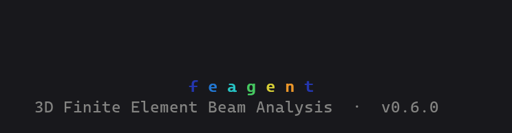
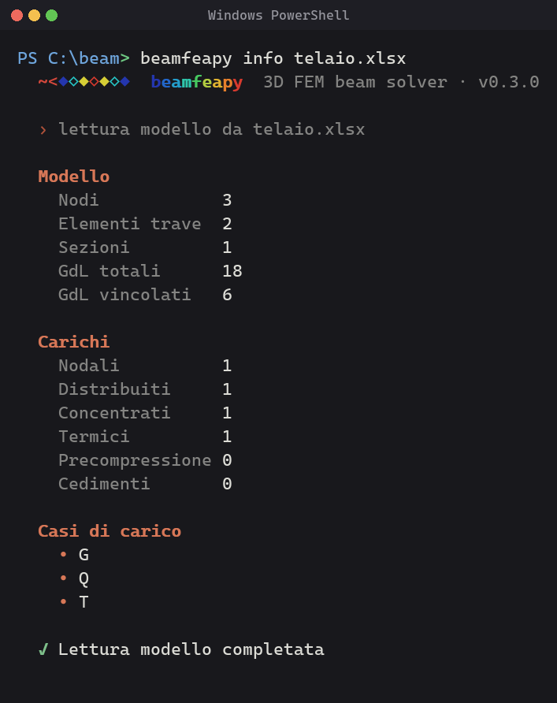
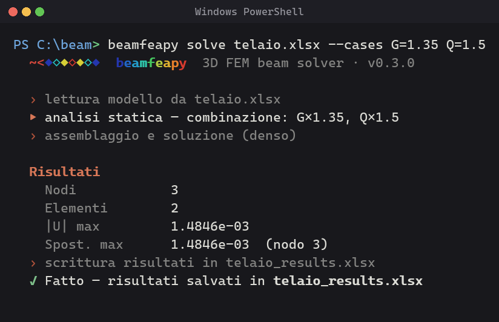
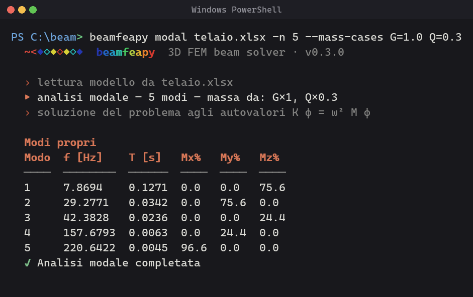
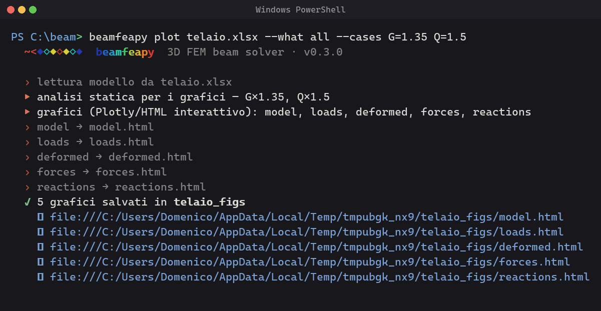
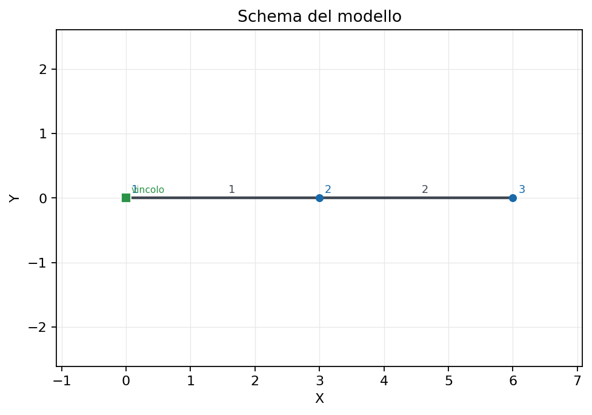
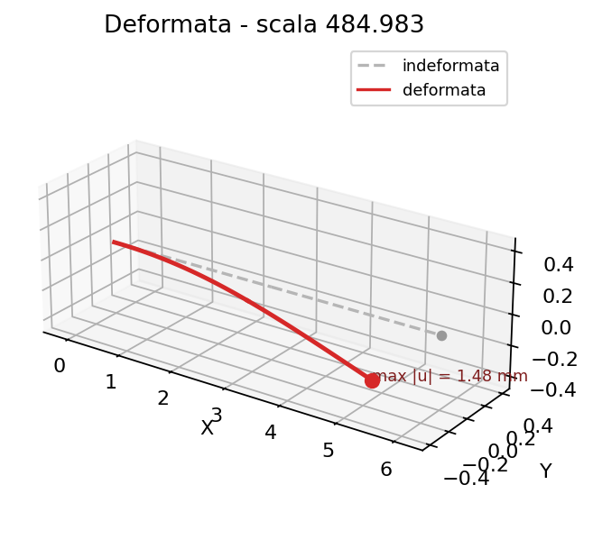
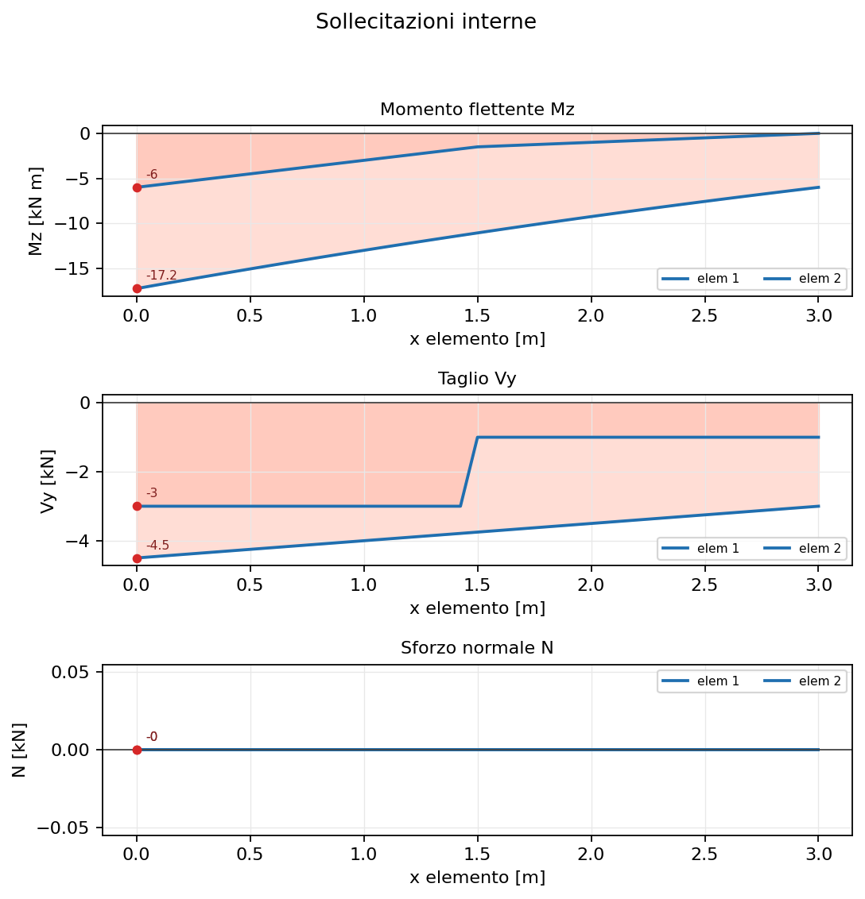

# 37 - Interfaccia a riga di comando (CLI)

L'installazione del pacchetto registra una **interfaccia a riga di comando** che
permette di creare, analizzare, visualizzare ed esportare i modelli direttamente
dal terminale, **senza scrivere codice Python**. Vengono installati due comandi
equivalenti: `beamfeapy` e l'alias breve `bfp` (in alternativa `python -m beamfeapy`).

<div align="center">
  
</div>

Il cuore della CLI non ha dipendenze: i colori usano sequenze ANSI native (con
abilitazione del Virtual Terminal su Windows) e i comandi che richiedono
dipendenze opzionali (pandas/openpyxl, matplotlib, plotly, python-docx) mostrano
un messaggio chiaro se un pacchetto manca.

```bash
beamfeapy                 # logo + elenco comandi
beamfeapy --help          # guida completa
beamfeapy <comando> --help
```

## I comandi in breve

| Comando | Cosa fa |
|---|---|
| `new` | crea un modello con un **wizard** guidato e lo salva in Excel |
| `template` | genera un **template** Excel editabile da cui partire |
| `info` | stampa un **riepilogo** del modello (nodi, carichi, casi) |
| `solve` | analisi **statica** da modello Excel |
| `modal` | analisi **modale** (frequenze proprie / forme modali) |
| `buckling` | analisi di **buckling** lineare (moltiplicatori critici) |
| `plot` | **visualizza** modello, carichi, deformata, sollecitazioni, reazioni |
| `export` | **esporta** il modello verso solutori esterni |
| `report` | genera una **relazione di calcolo** Word |
| `logo` | mostra il logo animato dell'applicazione |
| `version` | stampa la versione |

## Creare un modello

### Wizard guidato — `new`

`beamfeapy new modello.xlsx` avvia un wizard interattivo che chiede nodi,
materiale, sezione, elementi, vincoli e carichi nodali, poi salva il modello
Excel — pronto per `solve` o `plot`:

```text
beamfeapy new portale.xlsx
  ? Numero di nodi [2]: 2
  ? Nodo 1 — X Y Z [m] [0 0 0]: 0 0 0
  ? Nodo 2 — X Y Z [m] [0 0 0]: 6 0 0
  ? Materiale  E [Pa] [210e9]:
  ? Sezione  A Iy Iz J [1e-2 1e-5 1e-5 2e-5]:
  ? Numero di elementi (travi) [1]: 1
  ? Elemento 1 — nodo_i nodo_j [1 2]: 1 2
  ? Vincolo: 1 111111          # 6 cifre 0/1 → Dx Dy Dz Rx Ry Rz
  ? Vincolo:                   # riga vuota → fine
  ? Carico: 2 0 -1000 0 0 0 0 Q   # nodo Fx Fy Fz Mx My Mz [Case]
  ? Carico:
  ✓ Modello creato — 2 nodi, 1 elementi → portale.xlsx
```

Premi <kbd>Invio</kbd> per accettare il valore di default proposto; lascia una
riga vuota per terminare le liste di vincoli / carichi.

### Template Excel — `template`

Preferisci compilare un foglio di calcolo? `beamfeapy template modello.xlsx`
genera un workbook pronto (fogli Node / Material / Section / Element / Support /
Load) da modificare in Excel e poi risolvere con `solve`.

## Ispezionare un modello — `info`

```bash
beamfeapy info modello.xlsx
```

<div align="center">
  
</div>

## Eseguire le analisi

### Statica — `solve`

```bash
beamfeapy solve modello.xlsx -o risultati.xlsx --cases G=1.35 Q=1.5
```

<div align="center">
  
</div>

Opzioni utili: `--sparse` (solver sparso, consigliato per modelli grandi),
`--client` (tabulato cliente esteso, solo Excel), `-o out.h5` (scrive i
risultati in HDF5 invece che in Excel — dedotto dall'estensione).

### Modale — `modal`

```bash
beamfeapy modal modello.xlsx -n 12 --mass-cases G=1.0 Q=0.3 -o modale.h5
```

<div align="center">
  
</div>

Le masse derivano dai casi di carico scelti, quindi `--mass-cases` è obbligatorio.

### Buckling — `buckling`

```bash
beamfeapy buckling modello.xlsx -n 4 --cases P
```

Stampa i moltiplicatori critici λ per la combinazione di riferimento. La
combinazione deve indurre sforzo normale (`N ≠ 0`) in almeno un elemento.

## Sintassi delle combinazioni di carico

Ogni comando che accetta `--cases` / `--mass-cases` riconosce:

| Forma | Significato |
|---|---|
| *(omesso)* | tutti i carichi, coefficiente 1 |
| `G` | un singolo caso di carico |
| `G Q` | combinazione, coefficiente 1 ciascuno |
| `G=1.35 Q=1.5` | combinazione con coefficienti moltiplicativi |

## Visualizzare — `plot`

`beamfeapy plot` disegna il modello e i risultati. L'opzione `--what` sceglie
cosa disegnare:

| `--what` | Grafico |
|---|---|
| `model` | geometria, nodi e vincoli |
| `loads` | carichi applicati per la combinazione |
| `deformed` | deformata (scala automatica; forzala con `--scale`) |
| `forces` | diagrammi delle sollecitazioni N/V/T/M (una sola con `--component Mz`) |
| `reactions` | reazioni vincolari |
| `all` | tutte le figure, salvate in una cartella |

Di default produce un **HTML Plotly 3D interattivo** e stampa un **link
`file://`** cliccabile da aprire nel browser; con `--open` lo apre
automaticamente. Usa `--png` per un'immagine statica Matplotlib.

```bash
# HTML interattivo (default), aperto nel browser
beamfeapy plot modello.xlsx --what deformed --cases G=1.35 Q=1.5 --open

# diagramma del momento flettente come PNG statico
beamfeapy plot modello.xlsx --what forces --component Mz --png

# tutte le figure in modello_figs/
beamfeapy plot modello.xlsx --what all --cases G Q
```

<div align="center">
  
</div>

Le figure statiche `--png` hanno questo aspetto (modello, deformata, momento
flettente `Mz`):

<div align="center">
  
  
  
</div>

## Esportare — `export`

```bash
beamfeapy export modello.xlsx out.tcl     # formato dedotto dall'estensione
beamfeapy export modello.xlsx out.s2k --format sap2000
```

Formati: OpenSees (`.tcl` / OpenSeesPy `.py`), SAP2000 (`.s2k`), MIDAS (`.mct`),
Robot (`.str`), Straus7 (`.txt`).

## Relazione Word — `report`

```bash
beamfeapy report modello.xlsx -o relazione.docx --cases G=1.35 Q=1.5
```

Risolve il modello e produce una relazione di calcolo Word con figure
Matplotlib. Usa `--no-solve` per una relazione dei soli dati del modello.

## Il logo animato — `logo`

`beamfeapy logo` riproduce il logo animato: un piccolo **python arcobaleno che
striscia nel terminale da destra verso sinistra**, lingua in testa, con il
wordmark `beamfeapy` che brilla sotto. Il logo statico (`--still`) è il
**serpente disegnato come trave appoggiata su due sezioni di tronco**: il corpo
segue il gradiente FEM (blu agli appoggi, rosso in mezzeria), quindi è anche il
diagramma del momento flettente di una trave appoggiata.

```bash
beamfeapy logo            # si anima per qualche secondo
beamfeapy logo --loop     # anima fino a Ctrl-C
beamfeapy logo --still    # fotogramma statico
beamfeapy logo --image    # il logo fotografico (half-block truecolor)
```

## Colori e terminale

L'output è colorato automaticamente (ANSI a 24 bit). Per controllarlo:

- `--color {auto,always,never}` — forza o disabilita i colori.
- `NO_COLOR=1` (ambiente) — disabilita i colori; ricade su un banner a riquadro.
- `--no-banner` — nasconde il logo/intestazione.

Su Windows la CLI abilita automaticamente il Virtual Terminal, quindi i colori
funzionano in Windows Terminal e nelle console PowerShell moderne. Perché i
caratteri box-drawing e le forme si rendano nitidi, usa un font con buona
copertura Unicode come **Cascadia Code/Mono** (il default di Windows Terminal).

{: .note }
Il logo animato e `plot` (HTML) richiedono un terminale reale e,
rispettivamente, `plotly` per l'output HTML e `matplotlib` per `--png`. Installa
tutto con `pip install "beamfeapy[all]"`.
