# 42 - Interfaccia desktop e online

`feagent gui` avvia l'**interfaccia grafica** del solutore: un server locale
(solo sul tuo PC, indirizzo `127.0.0.1`) e una finestra applicazione nel
browser. Si lavora come in un programma FEM classico: albero del modello a
sinistra, vista 3D al centro, proprietà a destra, menu e barra strumenti in
alto, messaggi in basso.

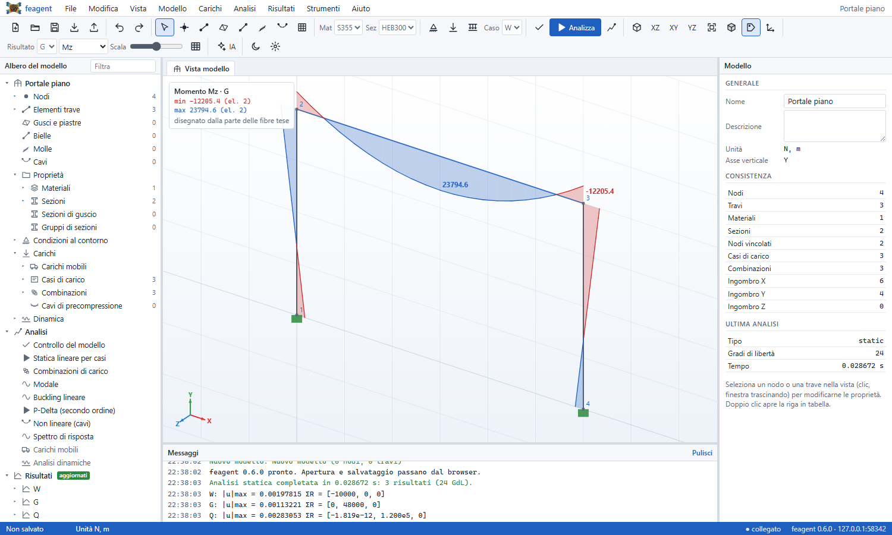

Il modello si può costruire in tre modi, liberamente mescolati:

* **disegnandolo** nella vista (nodi e travi con aggancio alla griglia e ai nodi);
* **in forma tabellare**, come in Excel, con copia e incolla da e verso Excel;
* **importandolo** da un workbook feagent, da tabelle SAP2000/MIDAS/Robot o da
  una specifica JSON del connettore AI.

## Avvio

```bash
pip install "feagent[gui]"      # aggiunge pandas e openpyxl
feagent gui                     # modello vuoto
feagent gui telaio.xlsx         # apre un modello
```

Su Windows si può usare anche `feagent-gui` (senza finestra di terminale),
adatto a un collegamento sul desktop. L'interfaccia si apre in una finestra di
Edge o Chrome in modalità applicazione; se nessuno dei due è presente, nel
browser predefinito.

| Opzione | Effetto |
|---|---|
| `--port 8777` | porta preferita (se occupata se ne sceglie una libera) |
| `--no-browser` | non apre la finestra: stampa l'indirizzo da aprire |
| `--keep-alive` | il server resta attivo anche a finestra chiusa |
| `--online` | server multiutente (vedi [Uso online](#uso-online)) |

Il server si ferma con **File > Esci**, chiudendo la finestra (dopo circa 45
secondi senza segnali dall'interfaccia) o con Ctrl+C nel terminale. Ascolta
solo in locale e ogni chiamata richiede il token di sessione generato
all'avvio, quindi una pagina web qualsiasi aperta nel browser non può leggere
o modificare i tuoi file.

### Senza Python: eseguibile a file singolo

Per chi non ha Python c'e' **`feagent-gui.exe`** (Windows; per macOS e Linux
`feagent-gui-macos` e `feagent-gui-linux`): un solo file di circa 95 MB con
dentro Python, numpy, scipy, pandas e python-docx. Doppio clic e
l'interfaccia si apre nel browser; si puo' anche trascinare un modello
sull'eseguibile o usare "Apri con". Accetta le opzioni `--port`,
`--no-browser` e `--keep-alive`; gli errori di avvio finiscono in
`%LOCALAPPDATA%\feagent\feagent-gui.log`.

Gli eseguibili si scaricano dagli allegati della release su GitHub (li
costruisce e li collauda il workflow `Eseguibili`) oppure si costruiscono in
locale:

```bash
pip install pyinstaller pillow
python scripts/build_exe.py             # dist/feagent-gui.exe
python packaging/smoke_exe.py dist/feagent-gui.exe
```

## Il documento del modello

Quello che si vede nell'albero e nelle tabelle è il **formato Excel di
feagent** (fogli Node, Material, Section, Element, Support, carichi,
Combination; vedi [Excel I/O](it-11-excel-io.html)). Salvare in `.xlsx` produce
quindi un workbook che si rilegge senza differenze da Python
(`Model.from_excel`), dalla riga di comando (`feagent solve`) e dal connettore
AI. In alternativa si salva un progetto `.feagent.json` con lo stesso
contenuto. L'unico foglio in più è **LoadCase**, che elenca anche i casi di
carico ancora senza carichi; la libreria lo ignora.

## Menu e barra strumenti

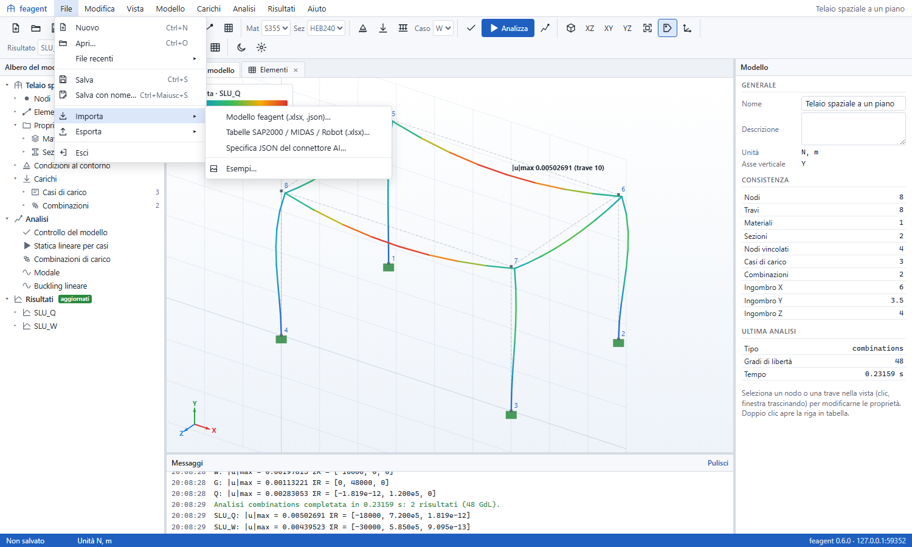

| Menu | Contenuto |
|---|---|
| File | nuovo, apri, file recenti, salva, salva con nome, importa, esporta, esci |
| Modifica | annulla e ripeti (60 passi), selezione, elimina, copia e trasla |
| Vista | 3D, pianta, prospetto, laterale, adatta; numeri, assi locali, vincoli, carichi, griglia |
| Modello | strumenti di disegno, nodi per coordinate, griglia strutturale, dividi, unisci nodi, proprietà, materiali e sezioni |
| Carichi | casi di carico, carichi nodali, distribuiti, concentrati, termici, peso proprio, combinazioni |
| Analisi | controllo del modello (codici E01-E63 di `feagent check`), statica per casi, combinazione libera, combinazioni, modale, buckling |
| Risultati | deformata, N, Vy, Vz, T, My, Mz, reazioni, modi, tabelle |
| Strumenti | collega un'IA (indirizzo, token, configurazioni pronte), opzioni |

**Esporta** scrive il modello per OpenSees (Tcl e Python), SAP2000, MIDAS,
Robot e Straus7, i risultati in Excel, il tabulato di calcolo e la relazione
Word. Se i dialoghi file nativi non sono disponibili, apertura e salvataggio
passano per il caricamento e lo scaricamento del browser.

## Albero del modello

Raggruppa nodi, elementi, materiali, sezioni, vincoli, cedimenti, casi di
carico (con i carichi per tipo) e combinazioni, poi le analisi e i risultati.

* **clic**: seleziona nella vista (un materiale o una sezione selezionano le
  travi che li usano; un caso di carico diventa il caso mostrato);
* **doppio clic**: apre la tabella corrispondente, lancia un'analisi o mostra
  un risultato;
* **tasto destro**: azioni del nodo (nuovo caso, nuova combinazione, rinomina,
  assegna alla selezione, sezione parametrica, nuovo materiale).

## Vista 3D

| Azione | Comando |
|---|---|
| ruota | tasto destro trascinato |
| sposta | tasto centrale, oppure Maiusc + tasto destro |
| zoom | rotella (centrata sul cursore) |
| seleziona | clic; Ctrl+clic aggiunge o toglie |
| selezione a finestra | trascina verso destra (elementi interamente dentro) |
| selezione per intersezione | trascina verso sinistra (elementi toccati) |
| viste | tasti 1 (3D), 2 (pianta), 3 (prospetto), 4 (laterale), F (adatta) |

L'asse verticale (Y o Z) si deduce dalla direzione dei carichi e si può
fissare in **Vista > Opzioni**. I carichi disegnati sono quelli del **caso
attivo**, scelto nella barra strumenti o nell'albero.

### Disegnare

* **N** (Disegna nodi): un clic inserisce un nodo sul piano di lavoro, sul
  passo della griglia.
* **B** (Disegna travi): clic sul primo punto e sui successivi, come una
  polilinea; il tasto destro o Esc chiudono la catena. I punti si agganciano
  ai nodi esistenti; le nuove travi usano il materiale e la sezione scelti
  nella barra strumenti.
* Il piano di lavoro segue la vista (pianta, prospetto) oppure si fissa in
  **Vista > Opzioni**, con quota e passo della griglia.

Per le geometrie regolari **Modello > Genera griglia strutturale** crea travi
continue, telai piani e telai 3D da elenchi di luci (`3*6 4.5` significa tre
luci da 6 e una da 4,5), con incastri o cerniere alla base.

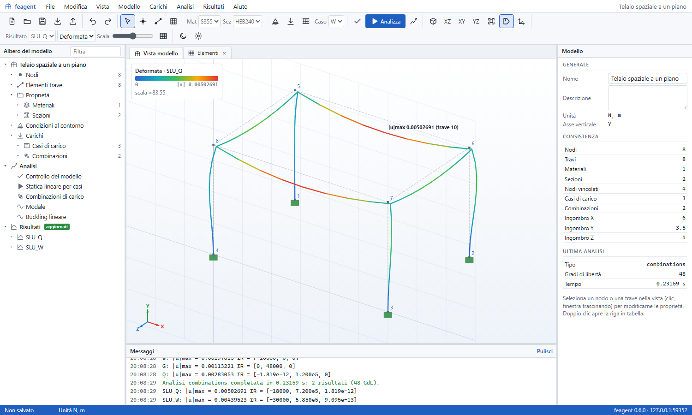

## Tabelle

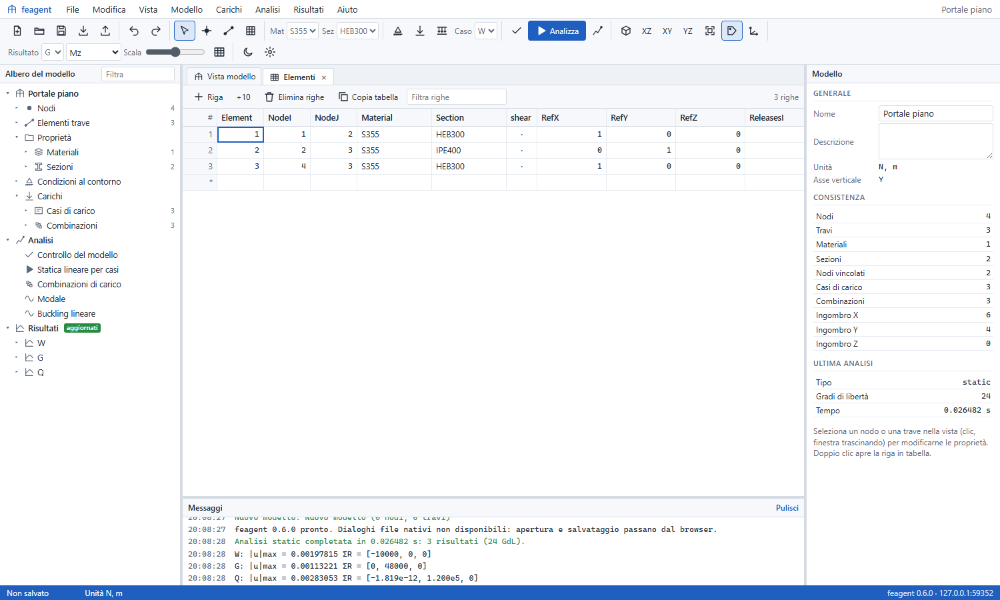

Ogni foglio si apre in una scheda (doppio clic nell'albero, oppure
**Modello > Tabelle** e **Carichi > Tabelle dei carichi**). La griglia regge
modelli grandi perché disegna solo le righe visibili.

| Tasto | Effetto |
|---|---|
| frecce, Tab, PagSu/PagGiù | spostamento |
| digitare, Invio, F2 | modifica della cella |
| Maiusc + frecce, trascinamento | selezione di un blocco |
| Ctrl+C / Ctrl+V | copia e incolla, anche da e verso Excel |
| Canc | svuota le celle selezionate |
| Ctrl+Canc | elimina le righe selezionate |

Se il blocco incollato ha una riga di intestazione con i nomi delle colonne,
i valori vanno nelle colonne giuste anche se l'ordine è diverso; le righe in
più vengono aggiunte. Selezionare le righe di Nodi o Elementi seleziona gli
oggetti nella vista, e viceversa.

## Proprietà

Il pannello di destra cambia con la selezione: per un nodo coordinate,
vincolo, carichi, spostamenti e reazioni; per una trave nodi, materiale,
sezione, formulazione di Timoshenko, svincoli, assi locali, carichi ed
estremi delle azioni interne; per una selezione multipla le azioni
disponibili. Senza selezione mostra il riepilogo del modello.

## Risultati

Dopo l'analisi la barra strumenti propone il risultato (caso, combinazione o
modo), la grandezza e la scala.

* **Deformata**: linea elastica calcolata con le funzioni di forma degli
  elementi (svincoli compresi), colorata con lo spostamento.
* **Azioni interne**: diagrammi di N, Vy, Vz, T, My e Mz nel piano locale
  dell'elemento, con massimo e minimo. I **momenti si disegnano dalla parte
  delle fibre tese**: per travi orizzontali con y locale verso l'alto i momenti
  negativi stanno sopra la trave, i positivi sotto.
* **Reazioni**: frecce con i valori e somma delle reazioni.
* **Modi**: forme modali animate, frequenze e masse partecipanti, oppure
  moltiplicatori critici del buckling.
* **Tabelle**: spostamenti, reazioni (con la somma) e azioni interne lungo gli
  elementi, copiabili in Excel.

Se il modello cambia dopo l'analisi, l'albero e la vista segnalano che i
risultati vanno aggiornati (F5).

## Gusci, piastre, bielle, molle e cavi

Oltre alle travi il modello accetta tutti gli elementi del solutore, ciascuno
con il proprio foglio (vedi [Excel I/O](it-11-excel-io.html)) e il proprio
gruppo nell'albero:

| Elemento | Foglio | Come si crea |
|---|---|---|
| Guscio o piastra (Q4, triangolo) | Shell, ShellSection | strumento **P** (3 o 4 vertici in ordine), **Modello > Genera piastra a maglia**, tabella |
| Biella | Truss | strumento Bielle (area e comportamento chiesti all'inizio), tabella |
| Molla assiale | Spring | strumento Molle, tabella |
| Cavo (asta o catenaria) | Cable | strumento Cavi, tabella |
| Vincolo elastico a terra | ElasticSupport | nodi selezionati, **Modello > Vincoli elastici** |
| Collegamento rigido, equalDOF, diaframma | Constraint | due o più nodi selezionati, **Modello > Vincolo cinematico** (il primo è il master) |
| Pressione, carico di superficie, termico sui gusci | ShellPressure, ShellLoad, ShellThermal | gusci selezionati, **Carichi > Carico sui gusci** |
| Peso proprio automatico | SelfWeight | **Carichi > Peso proprio** |

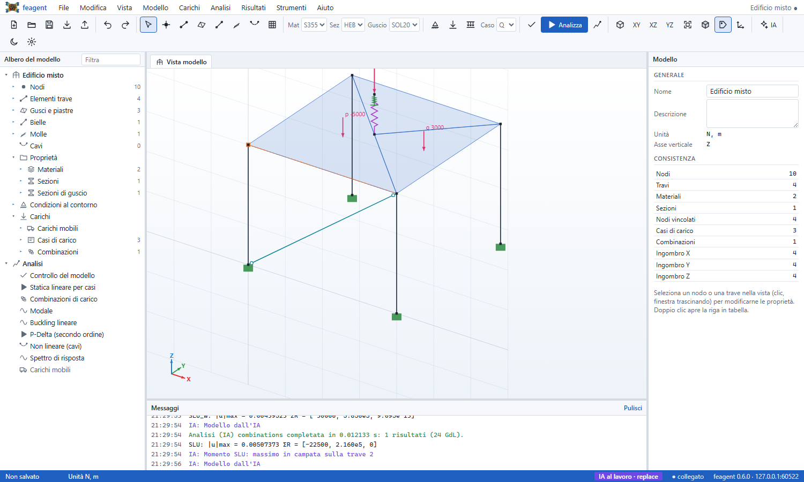

Il **peso proprio** non è più un elenco di carichi generati: è una
definizione che il solutore ricalcola a ogni analisi da peso specifico (γ, o
ρ·g) per area di travi e bielle e per spessore dei gusci, quindi resta giusto
anche se cambiano sezioni e spessori. Con i **cavi** l'analisi statica diventa
automaticamente non lineare (Newton-Raphson) e il messaggio lo segnala.

## Vista estrusa

**Vista > Vista estrusa** (tasto **E**, o il cubo della barra) disegna le
travi con la sezione reale e i gusci con il loro spessore, colorati per
materiale (acciaio, calcestruzzo, legno). La forma si prende dalle colonne
`Shape`, `h`, `b`, `tw`, `tf`, `t`, `d` del foglio Section, che le sezioni
parametriche compilano da sole; in mancanza si usa il rettangolo equivalente
ad `A`, `Iy`, `Iz`.

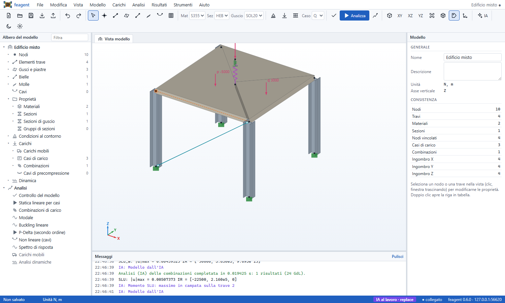

## Analisi e risultati degli elementi speciali

| Analisi | Note |
|---|---|
| Statica per casi, combinazione, combinazioni | lineare; non lineare in automatico se ci sono cavi |
| P-Delta | secondo ordine con la rigidezza geometrica aggiornata |
| Non lineare | Newton-Raphson, con passi di carico; cavi ed elementi solo trazione o solo compressione |
| Modale, buckling | come prima, con gusci, bielle e cavi (precarico dei cavi incluso) |
| Carichi mobili | convogli di assi sulle corsie: inviluppi, convoglio che scorre, linee d'influenza (vedi sotto) |
| Spettro di risposta | spettro EC8 / NTC 2018 di tipo 1 (a<sub>g</sub>, suolo, q, ξ), CQC o SRSS, un risultato per direzione (inviluppi senza segno) e tagli alla base |

Ai risultati si aggiungono le **mappe a colori dei gusci** (Mx, My, Mxy, Nx,
Ny, Nxy, Qx, Qy al centro dell'elemento, assi locali), lo **sforzo assiale di
bielle, molle e cavi** (blu trazione, rosso compressione, spessore
proporzionale), le reazioni dei vincoli elastici e le relative tabelle.

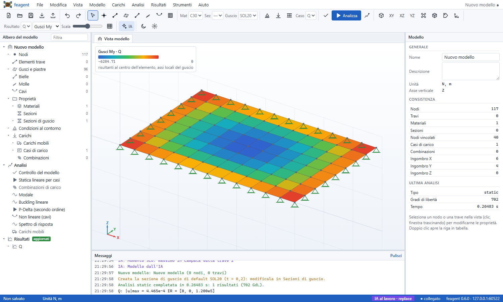

## Relazione di calcolo

**File > Esporta > Relazione di calcolo Word** esegue le analisi scelte (casi,
combinazioni, modale) e scrive una relazione nello stile aziendale: Calibri
11, titoli neri, tabelle native con intestazione su fondo azzurro chiaro,
figure centrate con didascalia «Figura N — …», nessun nome di software nel
testo. Le figure sono quelle della vista, quindi con gusci, cavi, vista estrusa
per il modello e momenti dalla parte delle fibre tese.

Contenuto: premessa, normativa, unità e convenzioni, materiali, sezioni di
travi e gusci, modello con figura e tabelle di input, carichi per caso con
figure e combinazioni, risultati per caso e combinazione (deformata, diagrammi,
mappe dei gusci, sforzi assiali, reazioni, estremi per trave) con il
**controllo dell'equilibrio globale** fra carichi applicati e reazioni, analisi
modale. Gli stessi dati, senza figure, si ottengono dall'IA con
`live/export` in formato `report`.

## Travi a sezione variabile

Una trave diventa a sezione variabile indicando la **sezione al nodo J**
(colonna `SectionJ`) ed eventuali **stazioni intermedie** (`Stations`, per
esempio `0.3:SEZ2; 0.7:SEZ3`), dal pannello delle proprietà o da **Proprietà
degli elementi**. La rigidezza è esatta (integrazione della flessibilità di
sezione lungo l'asse), quindi basta una sola trave per campata.

Se le sezioni alle stazioni hanno la stessa forma con le dimensioni (quelle
create con **Nuova sezione parametrica** le hanno), si interpolano le
**dimensioni**: per una trave ad altezza lineare l'inerzia varia allora con il
cubo dell'altezza, come deve. Altrimenti si interpolano le proprietà A, I, J.
La vista estrusa segue la rastremazione.

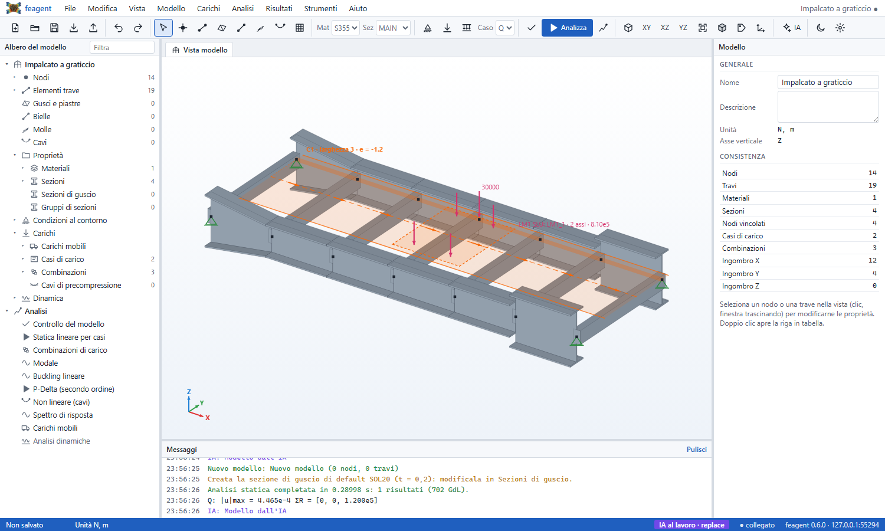

## Carichi mobili

Tre fogli descrivono i carichi mobili (**Carichi > Carichi mobili**):

| Foglio | Contenuto |
|---|---|
| Vehicle | un veicolo per nome, una riga per asse: posizione, peso, carreggiata (preset LM1 per le corsie 1, 2, 3, LM2, asse singolo, convoglio di assi uguali) |
| Lane | corsia su una catena di travi (dalle travi selezionate), nodo di partenza, eccentricità, inclinazione degli assali, traversi di ripartizione |
| MovingLoad | caso mobile: corsia, veicolo, numero di posizioni, direzione del carico, coefficiente, combinazione statica sovrapposta |

Il convoglio percorre tutta la corsia; per ogni posizione si risolve la statica
(una sola fattorizzazione della rigidezza per tutte le posizioni). Con
eccentricità, carreggiata o assali inclinati le ruote si ripartiscono sui
traversi del graticcio; l'eccentricità è positiva a sinistra nel verso di
percorrenza guardando dall'alto (normale = verticale × tangente).

La vista disegna ogni corsia dove viaggiano davvero i carichi: la
**carreggiata** alla sua eccentricità, larga quanto indicato nel caso mobile
(`Width`, altrimenti la carreggiata dei veicoli più un franco, almeno 3 m),
con la linea d'asse tratteggiata, le frecce del verso di marcia e il tracciato
di riferimento sulle travi. Si vede anche nella vista estrusa e, attenuata,
negli inviluppi e nel convoglio che scorre: una corsia che esce
dall'impalcato salta subito all'occhio (**Vista > Corsie dei carichi mobili**
la nasconde).

Con i carichi visibili, la vista del modello mette anche il **veicolo di ogni
caso mobile sulla sua corsia**: una freccia per ruota nella posizione in cui
il solutore la applica (eccentricità più o meno metà carreggiata, assali
inclinati compresi), la sagoma tratteggiata, l'etichetta con veicolo, numero
di assi e carico totale (con il coefficiente) e, se c'è, il carico
distribuito di corsia come frecce sulla carreggiata. I casi che usano la
stessa corsia sono distribuiti lungo il tracciato.

**Analisi > Carichi mobili** restituisce per ogni caso:

* **inviluppi** di N, V, T e M (massimo in blu, minimo in rosso), con la
  combinazione statica sovrapposta e il coefficiente applicato al carico
  mobile, e l'inviluppo delle reazioni;
* il **convoglio che scorre**: cursore della posizione e pulsante di
  riproduzione nella barra, con la deformata a ogni posizione e le ruote
  disegnate dove le applica il solutore;
* le tabelle degli inviluppi per trave, degli spostamenti e delle reazioni
  minimi e massimi e delle **linee d'influenza delle reazioni**.

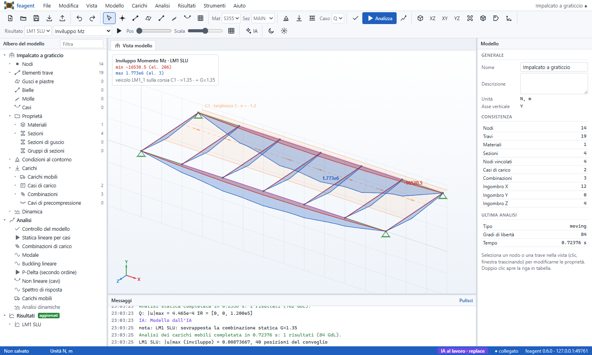

La relazione di calcolo riporta veicoli, corsie, casi mobili, figure degli
inviluppi, il convoglio in mezzeria e le tabelle degli inviluppi.

Il **carico distribuito di corsia** (colonne `UDL` e `Width` del caso mobile,
per esempio 9 kN/m² su 3 m per la corsia 1 dello schema LM1) si applica **a
scacchiera**: per ogni grandezza, in ogni stazione, si caricano solo i tratti
in cui la linea di influenza ha segno sfavorevole, e il contributo si somma a
quello del veicolo (per due campate uguali, il massimo momento positivo vale
0,0957 qL², quello sull'appoggio qL²/8). Se una ruota cade oltre gli estremi
dei traversi di ripartizione, il messaggio lo segnala con il numero di casi e
la distanza massima: di solito eccentricità o carreggiata sono sbagliate.

## Travi ruotate ed eccentriche, appoggi ruotati, gruppi di sezioni

* **Rotazione della sezione** attorno all'asse locale x (colonna `Roll`, in
  gradi, con il vettore di riferimento vuoto) ed **eccentricità dell'asse**
  rispetto ai nodi (`OffsetYI`, `OffsetZI`, `OffsetYJ`, `OffsetZJ`, assi
  locali), come l'offset di sezione dei programmi commerciali: dal pannello
  delle proprietà o da **Proprietà degli elementi**. Nella vista l'asse
  eccentrico si disegna con i bracci rigidi tratteggiati, e la vista estrusa
  sposta la sezione.
* **Assi d'appoggio ruotati** (**Modello > Assi d'appoggio ruotati**, foglio
  `SupportAxis`): per esempio un carrello su un piano inclinato; i vincoli e i
  cedimenti del nodo diventano locali, la vista disegna gli assi x′ e y′ e i
  risultati riportano anche le reazioni negli assi locali.
* **Gruppi di sezioni** (**Modello > Gruppo di sezioni**, foglio
  `SectionGroup`): sezioni alternative (fessurata, lungo termine) per alcune
  travi o per tutte. Se tutti i casi di un'analisi sono legati allo stesso
  gruppo, il gruppo si applica da solo; altrimenti si sceglie nella finestra
  delle analisi statica, modale e di buckling.

## Profili termici e cavi di precompressione

* **Profilo termico non lineare** (**Carichi > Profilo termico**): punti
  quota:temperatura sull'altezza della sezione, con un modello di partenza del
  riscaldamento dell'estradosso; nell'analisi entrano la parte uniforme e
  quella lineare del profilo, pesate sulla larghezza della sezione.
* **Cavo di precompressione a tracciato** (**Carichi > Cavo di
  precompressione**): vertici X Y Z del cavo (anche dai nodi selezionati,
  spostati dell'eccentricità), tiro e travi candidate. Le forze di ancoraggio
  e di deviazione vanno sulle travi più vicine con il momento
  dell'eccentricità; la vista disegna il tracciato tratteggiato.
* La precompressione per trave accetta anche un **profilo** `xi:e` al posto di
  eccentricità e freccia: il cavo è la poligonale per quei punti.

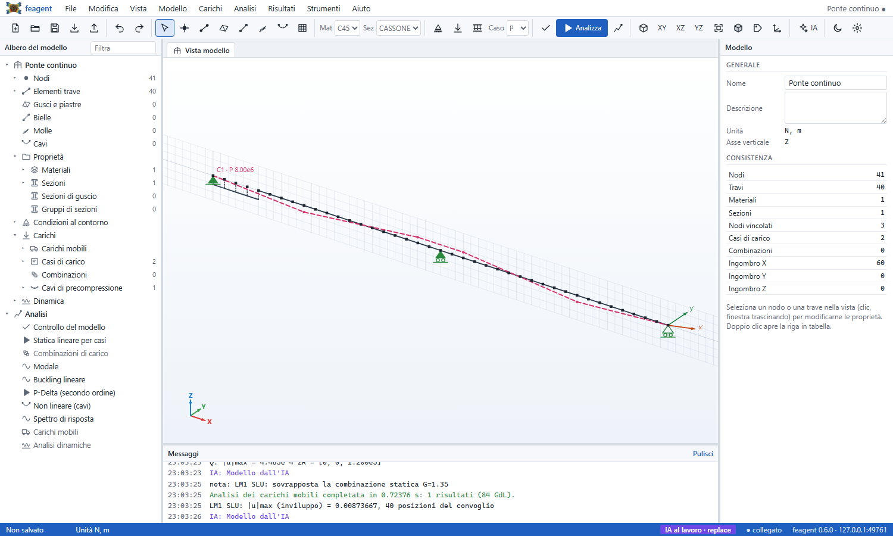

## Analisi dinamiche

Il gruppo **Dinamica** dell'albero e **Analisi > Dinamica** raccolgono:

| Oggetto | Contenuto |
|---|---|
| Accelerogrammi | da file di testo (una o due colonne, fattore di scala), artificiali compatibili con lo spettro EC8 / NTC 2018 (Gasparini e Vanmarcke), sinusoidi, impulsi; il grafico mostra la storia e lo spettro di risposta elastico |
| Dispositivi | isolatori a pendolo (FPS), elastomerici o bilineari, dissipatori viscosi, ritegni con gioco; fra due nodi o fra un nodo e il suolo |
| Analisi dinamiche | time history lineare (Newmark) o modale, time history non lineare con i dispositivi, risposta armonica, convoglio in movimento |
| Forze dinamiche | forze nodali per una funzione del tempo o armoniche con fase |

Ogni analisi ha la sua sorgente di massa, lo smorzamento (Rayleigh tarato su
due frequenze, modale, nessuno) e l'eventuale gruppo di sezioni.

I **dispositivi** seguono la loro legge non lineare nella time history non
lineare; in tutte le altre analisi (statica, combinazioni, modale, buckling,
carichi mobili, time history lineare, armonica) entrano con la **rigidezza
iniziale**: per il pendolo μ·W/u_y + W/R, per l'isolatore bilineare k1, per il
ritegno con gioco chiuso k, nulla per il dissipatore viscoso. Cosi' un
impalcato appoggiato solo sugli isolatori si risolve anche in statica, e le
tabelle dei risultati riportano le forze nei dispositivi.

Nel **convoglio in movimento** le ruote viaggiano come nella scansione
statica: eccentricita' della corsia, carreggiata e assali inclinati, con la
ripartizione sui traversi. Il carico distribuito di corsia non e' un carico
che viaggia: si somma staticamente, a scacchiera, agli inviluppi dinamici.
**Analisi > Analisi dinamiche** le esegue e per ciascuna restituisce:

* la **deformata nel tempo** (o per frequenza nell'armonica): cursore e
  pulsante di riproduzione nella barra;
* gli **inviluppi** di N, V, T e M e delle reazioni (per l'armonica le
  ampiezze);
* la **storia temporale di un nodo qualsiasi** (spostamento, velocità,
  accelerazione relativa o assoluta, reazione) o la **curva di risposta**
  armonica, calcolate a richiesta, esportabili in CSV e PNG;
* il **taglio alla base** nel tempo (vincoli più dispositivi verso il suolo);
* il **ciclo forza-spostamento** e l'energia dissipata di ogni dispositivo;
* per il convoglio in movimento, il **coefficiente di amplificazione
  dinamica** rispetto alla scansione quasi statica dello stesso convoglio.

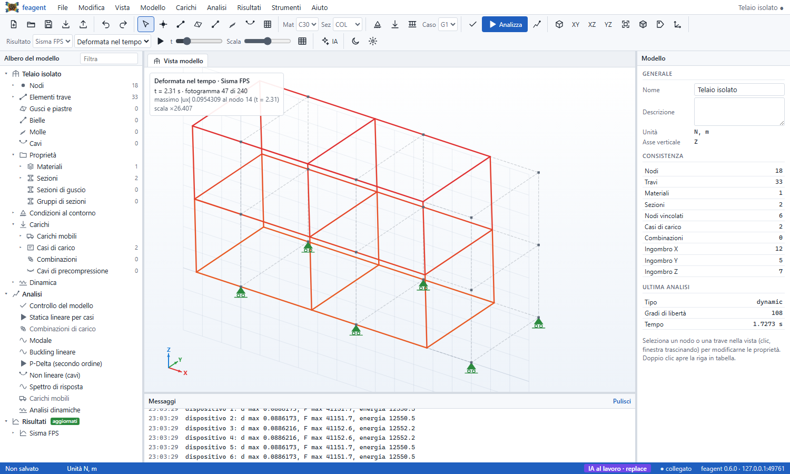

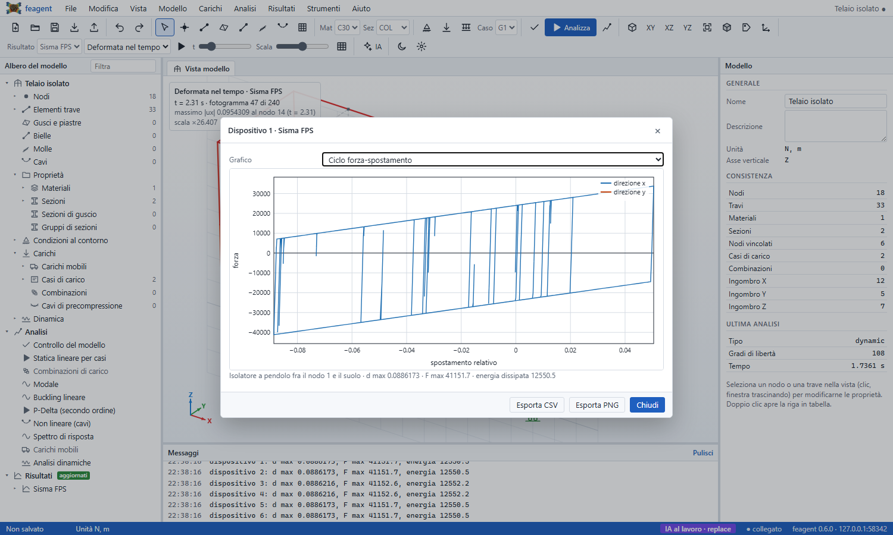

La relazione di calcolo aggiunge il capitolo delle analisi dinamiche:
equazione del moto, smorzamento, accelerogrammi, dispositivi, sintesi dei
picchi, storie, taglio alla base, cicli dei dispositivi e inviluppi.

## Pilotare l'interfaccia con un'IA

Il modello di ogni sessione vive sul server: la finestra, gli assistenti IA
e le altre finestre aperte sulla stessa sessione lo leggono e lo modificano,
e un canale di eventi avvisa subito tutti. Mentre un'IA lavora, la schermata
si aggiorna da sola: albero, vista, tabelle e risultati. Nella barra di stato
compare **IA al lavoro** e i suoi messaggi escono in viola; ogni modifica
dell'IA e' un passo di annulla (Ctrl+Z la toglie, e l'IA vede lo stato
annullato).

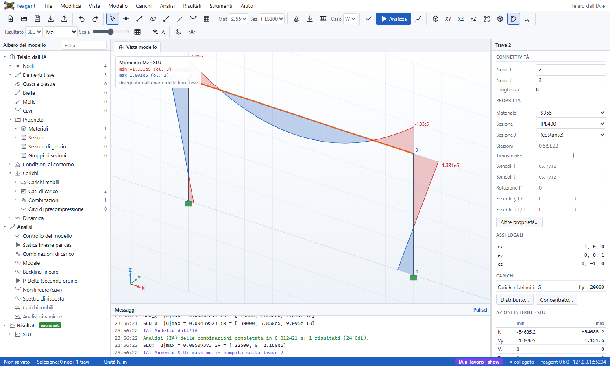

L'IA dispone di tre canali, tutti sulla stessa API:

* **MCP** (Claude Desktop, Claude Code, Codex, Cursor, ...): i tool `gui_*`
  del connettore ([pagina 38](it-38-mcp-server.html)). In locale basta avere il
  connettore configurato (`feagent connect claude-desktop --write`): `feagent
  gui` scrive indirizzo e token in `~/.feagent/gui_session.json` e i tool li
  trovano da soli.
* **REST/OpenAPI**: `POST /api/live/<azione>` con `Authorization: Bearer
  <token>`; la specifica e' in `/api/live/openapi.json` (Custom GPT Actions,
  n8n, script).
* **Python**: `agent_api.call("gui_state")` e gli altri tool.

| Azione | Effetto |
|---|---|
| `live/state` | riepilogo del modello, selezione e vista dell'utente, risultati |
| `live/model` | fogli del modello |
| `live/edit` | operazioni sui fogli (upsert, delete, replace_sheet, rename, set_meta) |
| `live/replace` | nuovo modello da specifica JSON |
| `live/run` | analisi; i risultati compaiono nella finestra |
| `live/results` | spostamenti, reazioni, diagrammi |
| `live/show` | risultato, vista, selezione, tabella o messaggio da mostrare |
| `live/screenshot` | immagine della vista |
| `live/history` | storia temporale di un nodo o curva armonica di un'analisi dinamica |
| `live/check`, `live/export` | validazione, file esportato |

**Strumenti > Collega un'IA** (o il pulsante **IA** della barra) mostra
indirizzo e token della sessione con la configurazione MCP, un esempio
`curl` e le righe Python pronte da copiare. Il token apre **solo quella
sessione**.

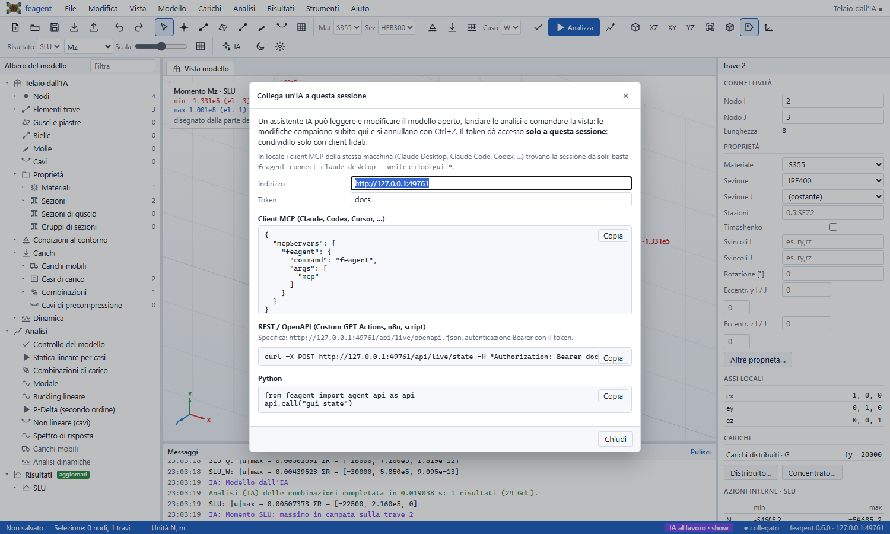

Esempio di operazioni `gui_edit`:

```json
[{"op": "upsert", "sheet": "nodes", "rows": [{"id": 5, "x": 12, "y": 4, "z": 0}]},
 {"op": "upsert", "sheet": "elements", "rows": [{"id": 4, "i": 3, "j": 5, "material": "S355", "section": "IPE400"}]},
 {"op": "delete", "sheet": "NodalLoad", "where": {"Case": "W"}}]
```

## Uso online

Lo stesso programma funziona come servizio web multiutente:

```bash
export FEAGENT_GUI_KEY="una-chiave-lunga"
feagent gui --online --port 8777 --public-url https://fem.esempio.it
```

* all'apertura della pagina si chiede la **chiave di accesso**; ogni accesso
  apre una **sessione separata** (modello, risultati, token propri), che resta
  attiva 12 ore senza uso;
* il server **non tocca il proprio file system**: i modelli si caricano e si
  scaricano dal browser (File > Apri, Salva, Esporta);
* senza chiave il server non parte, salvo `--no-auth` esplicito per reti
  fidate; `--max-sessions` limita le sessioni contemporanee e al massimo due
  analisi girano insieme;
* va esposto **solo dietro HTTPS** (proxy inverso come Caddy o nginx, oppure
  un tunnel); `--public-url` e' l'indirizzo pubblico mostrato nel dialogo
  dell'IA. Con nginx va lasciato passare il canale di eventi senza buffer
  (il server invia gia' `X-Accel-Buffering: no`).

Esempio con Caddy, che ottiene da solo il certificato:

```text
fem.esempio.it {
    reverse_proxy 127.0.0.1:8777
}
```

In container, dalla radice del repository:

```bash
docker build -f deploy/Dockerfile -t feagent-gui .
docker run -d -p 127.0.0.1:8777:8777 -e FEAGENT_GUI_KEY=una-chiave-lunga feagent-gui
python deploy/smoke_test.py http://127.0.0.1:8777 una-chiave-lunga
```

L'immagine gira con un utente non privilegiato e senza chiave rifiuta di
partire. Il workflow `Docker` del repository la costruisce e la collauda a
ogni modifica con `deploy/smoke_test.py`: pagina e script, chiave sbagliata
rifiutata, sessioni isolate, analisi statica e dinamica, export Excel e Word,
nessun accesso al file system del server.

## Scorciatoie

| Tasti | Comando |
|---|---|
| Ctrl+N, Ctrl+O, Ctrl+S, Ctrl+Maiusc+S | nuovo, apri, salva, salva con nome |
| Ctrl+Z, Ctrl+Y | annulla, ripeti |
| F5 | statica per casi |
| F6 | combinazioni |
| S, N, B, P | seleziona, disegna nodi, travi, gusci |
| E | vista estrusa |
| Invio | chiude il guscio in disegno come triangolo |
| Canc | elimina la selezione |
| Esc | chiude la catena di travi, torna alla selezione, deseleziona |

## Rapporto con l'interfaccia Streamlit

L'app Streamlit ([pagina 28](it-28-web-ui.html)) resta disponibile, ma
l'interfaccia desktop la sostituisce per il lavoro quotidiano: disegno nella
vista, tabelle con copia e incolla, annulla e ripeti, dialoghi file nativi,
nessuna dipendenza oltre a pandas e openpyxl.
