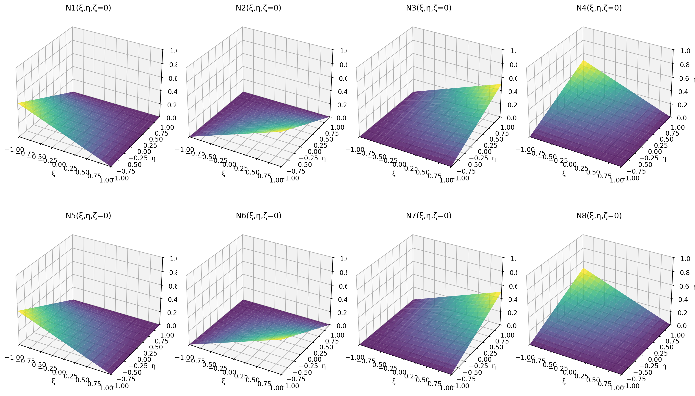
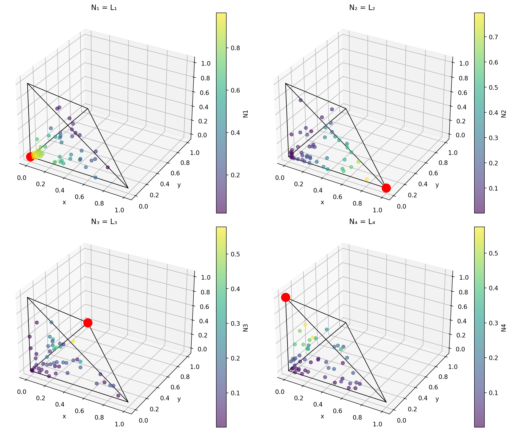

# 44 - Elementi solidi: formulazione

Questa pagina riprende la documentazione di **volumfeapy** (funzioni di forma e
tipi di elemento), ora che il solutore solido fa parte di feagent, e descrive
come sono costruiti gli elementi di `feagent.solid`. Per l'uso si veda il
[capitolo 43](it-43-solid-elements.html), per i casi studio il
[capitolo 45](it-45-solid-case-studies.html).

## Schema isoparametrico comune

Tutti gli elementi interpolano geometria e spostamenti con le stesse funzioni
di forma *N*ᵢ(ξ) nelle coordinate naturali dell'elemento di riferimento
(Zienkiewicz, Taylor & Zhu 2013, cap. 6; Bathe 2014, par. 5.3):

```
x(ξ) = Σ Nᵢ(ξ) xᵢ          u(ξ) = Σ Nᵢ(ξ) uᵢ
J = ∂x/∂ξ = (∂N/∂ξ) X       ∂N/∂x = J⁻¹ ∂N/∂ξ
ε = B u   (Voigt: εxx, εyy, εzz, γxy, γyz, γxz)
K = ∫ Bᵀ D B dV = Σg wg Bgᵀ D Bg det Jg
```

`D` è la matrice elastica isotropa 6x6 con scorrimenti ingegneristici
(γ = 2ε). Ogni elemento dichiara le funzioni di forma, le loro derivate e due
regole di quadratura: una per la rigidezza e una di ordine più alto per masse
e forze di volume. Gli elementi a numerazione speculare (Jacobiano negativo in
tutti i punti) sono accettati e integrati con |det J|; quelli con Jacobiano di
segno variabile, cioè distorti o degeneri, sono rifiutati.

## Hex8

Esaedro trilineare, coordinate (ξ, η, ζ) ∈ [−1, 1]³:

```
Nᵢ = ⅛ (1 + ξᵢ ξ)(1 + ηᵢ η)(1 + ζᵢ ζ)
```

| Nodo | ξᵢ | ηᵢ | ζᵢ |
|---|---|---|---|
| 1 | −1 | −1 | −1 |
| 2 | +1 | −1 | −1 |
| 3 | +1 | +1 | −1 |
| 4 | −1 | +1 | −1 |
| 5 | −1 | −1 | +1 |
| 6 | +1 | −1 | +1 |
| 7 | +1 | +1 | +1 |
| 8 | −1 | +1 | +1 |


*Figura 1 — Le otto funzioni di forma trilineari sul piano medio ζ = 0.*

Rigidezza con Gauss 2x2x2. L'Hex8 standard non rappresenta la flessione pura
(gli spostamenti quadratici mancano) e si irrigidisce: in una mensola con 2
elementi nello spessore la freccia è l'86 % di quella esatta.

### Hex8 a modi incompatibili

Con `incompatible=True` si aggiungono per ogni direzione i tre modi di Wilson
(1 − ξ²), (1 − η²), (1 − ζ²), cioè 9 parametri interni α:

```
ε = B u + G α          G calcolata con J₀ (baricentro) e il fattore det J₀ / det J
[Kuu Kuα; Kαu Kαα] → K = Kuu − Kuα Kαα⁻¹ Kαu
```

La correzione di Taylor (Taylor, Beresford & Wilson 1976) rende l'elemento
conforme al patch test anche su mesh distorte; i parametri α sono condensati a
livello d'elemento e ricostruiti nel recupero delle tensioni, anche con i
carichi termici. È l'equivalente del C3D8I: la flessione pura su elementi
regolari è esatta.

## Tet4

Tetraedro lineare in coordinate di volume (L₁, L₂, L₃, L₄), con
L₁ = 1 − r − s − t:

```
N₁ = L₁   N₂ = L₂   N₃ = L₃   N₄ = L₄
```

Deformazione costante, rigidezza esatta con un punto. È rigido a flessione:
serve una mesh fitta o, meglio, il Tet10.


*Figura 2 — Le quattro funzioni di forma lineari del tetraedro.*

## Tet10

Tetraedro quadratico: vertici Nᵢ = Lᵢ(2Lᵢ − 1), nodi di spigolo
N = 4 Lⱼ Lₖ, nell'ordine (1-2), (2-3), (3-1), (1-4), (2-4), (3-4).
Rigidezza con 4 punti (esatta a lati rettilinei), masse con il prodotto conico
di Stroud. È isoparametrico: i nodi di spigolo possono stare fuori dal
segmento (lati curvi da Gmsh). L'importazione da Gmsh riordina i nodi di
spigolo per posizione, perché Gmsh scambia gli ultimi due.

## Wedge6

Cuneo: triangolo lineare (r, s) per estrusione lineare in ζ:

```
N = [L₁, L₂, L₃] (1 − ζ)/2   (base 1-2-3)
N = [L₁, L₂, L₃] (1 + ζ)/2   (cima 4-5-6)
```

Rigidezza con 3 x 2 punti. Il volume e lo Jacobiano valgono per qualsiasi
orientamento (nel ramo d'origine lo Jacobiano era trasposto e il volume valido
solo per un'estrusione verticale).

## Pyramid5

Esaedro degenere con le quattro facce superiori collassate nell'apice
(Zienkiewicz par. 6.6; Bedrosian 1992):

```
N₁…₄ = ⅛ (1 + ξᵢ ξ)(1 + ηᵢ η)(1 − ζ)     N₅ = (1 + ζ)/2
```

Rispetta la partizione dell'unità (nel ramo d'origine no: la somma valeva
1,5 − ζ/2), è conforme con l'Hex8 sulla base quadrata e con il Tet4 sulle
facce triangolari e supera il patch test. Le tensioni all'apice, dove lo
Jacobiano si annulla, sono valutate come limite lungo l'asse.

## Carichi equivalenti e masse

| Grandezza | Formula | Note |
|---|---|---|
| Forza di volume | f = ∫ Nᵀ b dV | consistente; per il Tet10 i vertici ricevono forze negative, come previsto |
| Carico su faccia | f = ∫ Nᵀ (q − p n) dA | normale uscente dalla geometria; tri3, tri6, quad4 |
| Termica | f = ∫ Bᵀ D ε_th dV, ε_th = α T(ξ) (1,1,1,0,0,0) | T uniforme o interpolata dai nodi |
| Massa consistente | M = ∫ ρ Nᵀ N dV | |
| Massa concentrata | diagonale HRZ | diagonale della consistente scalata alla massa totale: nessuna massa negativa |

## Tensioni

Le tensioni si valutano nel punto naturale richiesto (baricentro, punti di
Gauss, nodi) sottraendo la parte termica: σ = D (B u + G α − ε_th). La mappa
nodale (`solid_nodal_stresses`) media sui volumi degli elementi adiacenti i
valori calcolati al nodo; von Mises e tensioni principali vengono dal tensore
mediato.

## Difetti del ramo volumfeapy corretti nell'integrazione

* Pyramid5 senza partizione dell'unità (risultati errati).
* Wedge6 con Jacobiano trasposto e volume valido solo per estrusione verticale.
* Pressione sulle facce dichiarata ma mai assemblata.
* Tet10 da Gmsh con due nodi di spigolo scambiati.
* Masse concentrate a parti uguali sui nodi (per il Tet10 sbagliate): ora HRZ.
