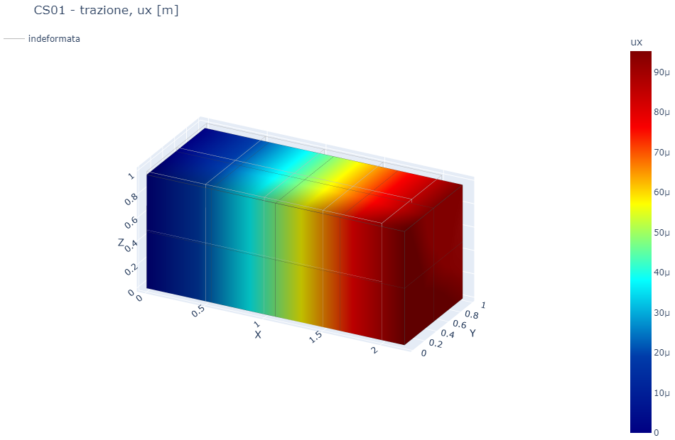
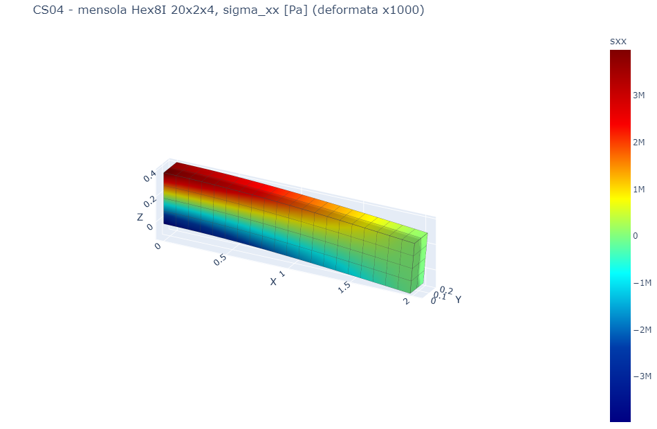
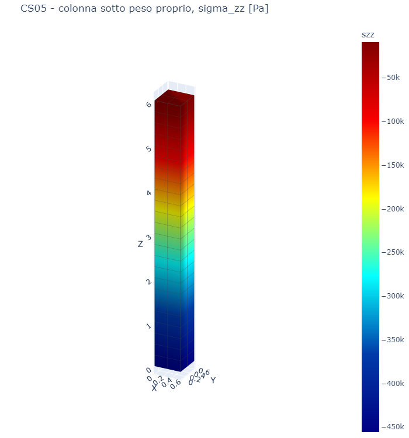
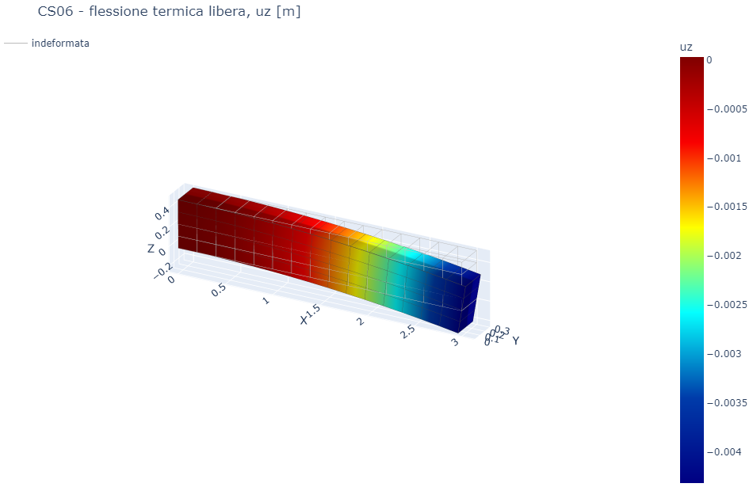
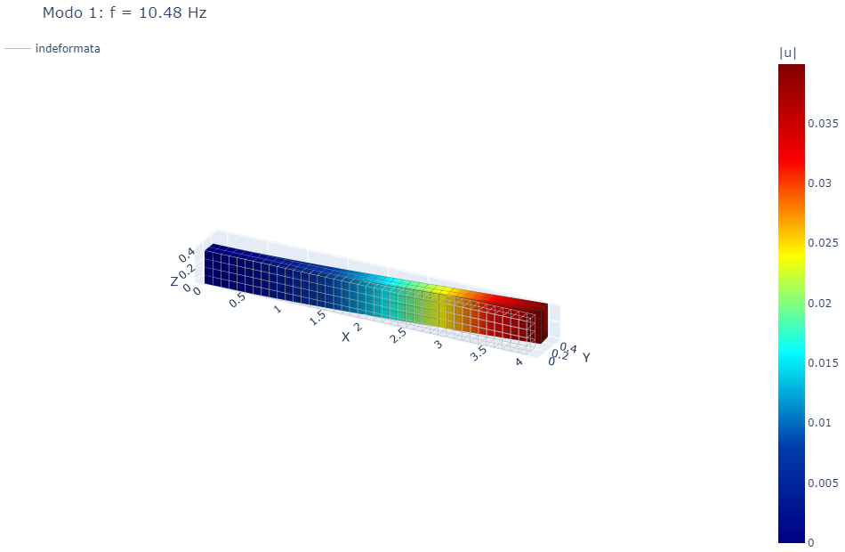
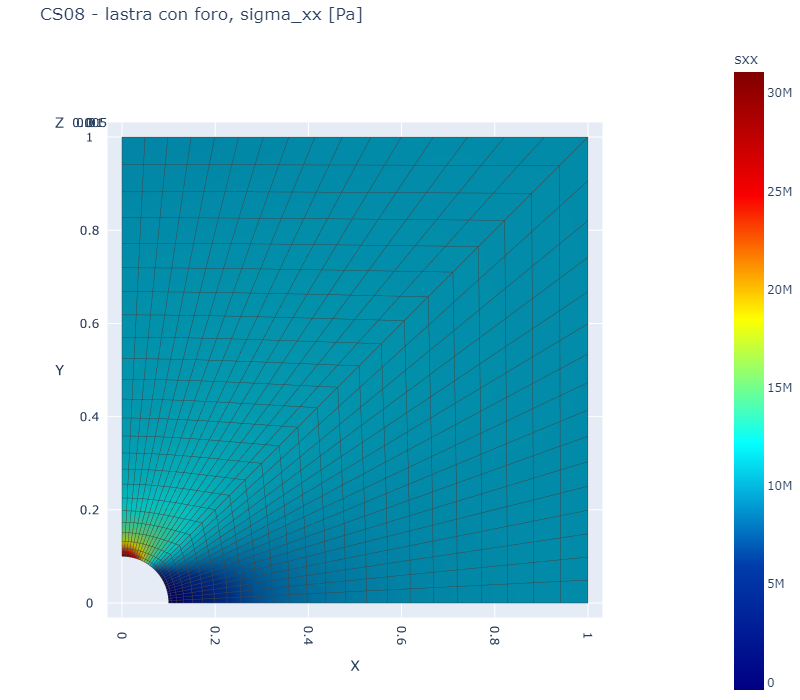
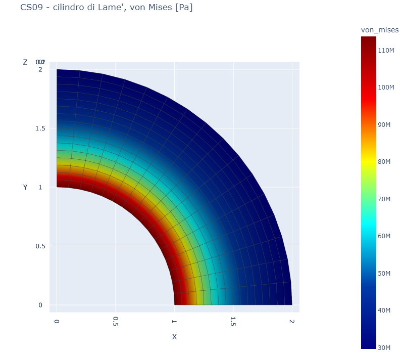
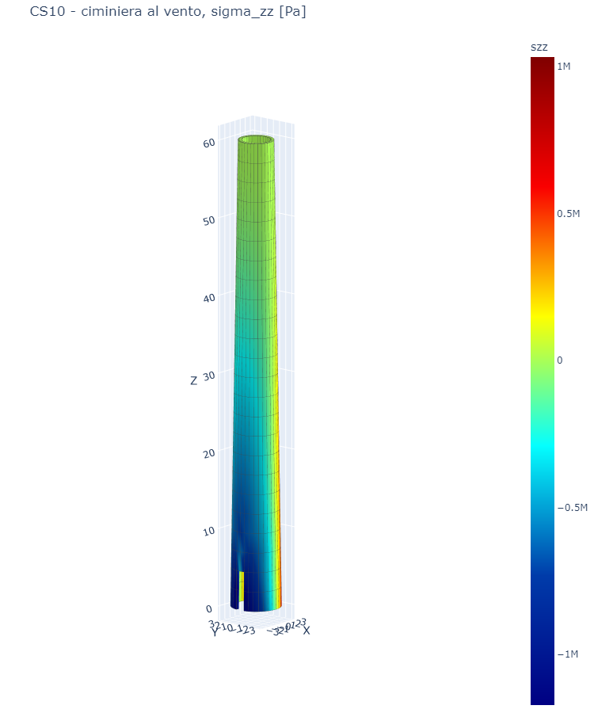
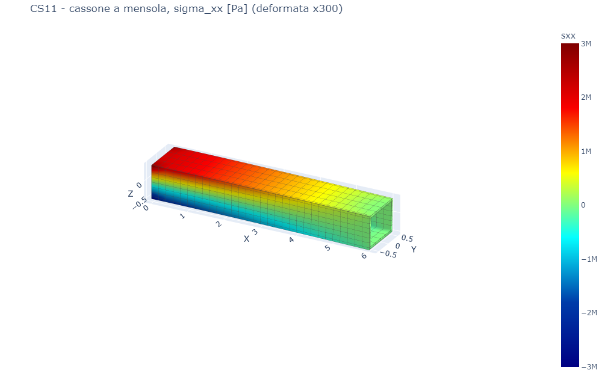

# 45 - Elementi solidi: casi studio

I casi studio di **volumfeapy**, rifatti con gli elementi di feagent. Ogni caso
ha un confronto in forma chiusa o un controllo d'equilibrio; i numeri e le
figure vengono dallo script `validation/solidi/casi_studio.py`, che riscrive
anche la tabella completa in `validation/solidi/README.md`. Esito: **32
confronti su 32 entro tolleranza**. I numeri pubblicati con volumfeapy non sono
stati ripresi: venivano da elementi con difetti (vedi il
[capitolo 44](it-44-solid-formulation.html)).

Acciaio E = 210 GPa, ν = 0,3, ρ = 7850 kg/m³ dove non indicato.

## CS01 Trazione uniassiale

Blocco 2 x 1 x 1 m in Hex8, trazione di 10 MPa sulla faccia x = 2 m. Allungamento
e contrazione laterale coincidono con σL/E e −νσb/E a meno dell'arrotondamento.

*Figura 1 — Spostamento ux sotto trazione uniforme.*

## CS02 Pressione idrostatica

Cubo con pressione di 5 MPa su tutte le facce: σxx = σyy = σzz = −5 MPa, von
Mises nulla (2·10⁻¹⁴ MPa), variazione di volume −p/K esatta.

## CS03 Patch test

Cubo di 2 x 2 x 2 celle con il nodo centrale spostato (patch di MacNeal-Harder),
spostamenti lineari imposti al bordo: il nodo interno torna sul campo lineare e
le tensioni sono costanti in ogni elemento.

| Elemento | Elementi nel patch | Errore massimo sulle tensioni |
|---|---|---|
| Hex8 | 8 | 4·10⁻¹⁴ % |
| Hex8 a modi incompatibili | 8 | 4·10⁻¹⁴ % |
| Tet4 | 48 | 1·10⁻¹³ % |
| Wedge6 | 16 | 6·10⁻¹⁴ % |
| Pyramid5 | 48 | 2·10⁻¹³ % |

## CS04 Mensola: i sei elementi a confronto

Mensola 2,0 x 0,2 x 0,4 m incastrata, 10 kN in punta come trazione sulla
faccia d'estremità. Riferimento: trave di Timoshenko (flessione più taglio).
Tet4, Wedge6 e Pyramid5 sono ottenuti suddividendo gli stessi esaedri.

| Elemento | Mesh 10 x 1 x 2 | Mesh 20 x 2 x 4 |
|---|---|---|
| Hex8 | 0,859 | 0,951 |
| **Hex8 a modi incompatibili** | **0,974** | **0,984** |
| Tet4 | 0,517 | 0,790 |
| Wedge6 | 0,859 | 0,949 |
| Pyramid5 | 0,791 | 0,928 |
| **Tet10 (Gmsh, passo 0,1 / 0,05 m)** | **0,989** | **0,990** |

*Rapporto fra la freccia media in punta e la soluzione di Timoshenko.* Gli
elementi lineari si irrigidiscono a flessione; Hex8 a modi incompatibili e
Tet10 sono quelli da usare quando il solido lavora a flessione. Il residuo
dell'1 % viene dall'incastro, che nel solido blocca anche la contrazione
laterale.

*Figura 2 — σxx nella mensola Hex8 a modi incompatibili 20 x 2 x 4, deformata amplificata.*

## CS05 Colonna sotto peso proprio

Colonna 0,6 x 0,6 x 6 m appoggiata al piede, peso proprio automatico
(`add_self_weight`). Peso e reazione 166,34 kN esatti; accorciamento in
sommità 6,597 μm contro γH²/(2E) = 6,601 μm (0,06 %); σzz nel primo elemento
esatta.

*Figura 3 — σzz lineare con la quota.*

## CS06 Azioni termiche

* Cubo con tutti i nodi bloccati e ΔT = 25 K: σ = −Eα ΔT / (1 − 2ν) =
  −157,5 MPa esatta.
* Trave libera 3,0 x 0,3 x 0,5 m con 40 K di differenza fra le facce
  (`add_solid_temperature_field`): freccia in punta −4,32 mm esatta e tensioni
  nulle (5·10⁻¹⁰ MPa) con l'Hex8 a modi incompatibili.

*Figura 4 — Flessione termica libera: la trave si incurva senza tensioni.*

## CS07 Modale di una mensola

Mensola 4,0 x 0,2 x 0,4 m, 40 x 2 x 4 Hex8 a modi incompatibili, massa propria
HRZ. Confronto con Eulero-Bernoulli: primo modo debole 10,48 Hz contro 10,44
(0,4 %), primo forte 20,82 contro 20,89 (0,3 %), secondo debole 64,9 contro
65,5 (0,8 %, il solido include taglio e inerzia rotazionale).

*Figura 5 — Primo modo flessionale.*

## CS08 Lastra con foro (Kirsch)

Quarto di lastra 2 x 2 m spessa 1 cm con foro di raggio 0,1 m, trazione di
10 MPa; mesh radiale di Hex8 a modi incompatibili addensata verso il foro.
Fattore di concentrazione Kt = 3,10 contro 3,03 per una lastra di larghezza
finita con d/W = 0,1 (3,0 per lastra infinita): 2,2 %.

*Figura 6 — σxx attorno al foro.*

## CS09 Cilindro spesso in pressione (Lamé)

Cilindro con raggi 1 e 2 m, pressione interna 50 MPa, deformazione piana,
quarto di sezione. Spostamento radiale al foro 0,4537 mm contro 0,4540
(0,05 %); tensione circonferenziale al foro 84,7 MPa contro 83,3 (1,6 %, valore
nodale sul bordo curvo approssimato da corde).

*Figura 7 — von Mises nel cilindro di Lamé.*

## CS10 Ciminiera al vento

Ciminiera in c.a. alta 60 m, raggio medio da 3,0 a 2,05 m, spessore 0,40 m,
apertura di servizio sottovento alla base; pressione del vento variabile con
quota e angolo applicata sulle facce esterne. La reazione alla base equilibra
esattamente la spinta del vento; a 30 m di quota σzz sulla fibra al vento vale
0,310 MPa contro 0,306 MPa della formula di Navier per il tubo sottile (1,2 %).

*Figura 8 — σzz nella ciminiera; l'apertura alla base disturba solo la zona vicina.*

## CS11 Cassone in parete sottile

Cassone a mensola lungo 6 m, 1,20 x 0,90 m, pareti di 6 cm modellate con un
solo Hex8 a modi incompatibili nello spessore; 25 kN in punta portati dalle
anime. Freccia media in punta 0,999 della trave di Timoshenko con area a taglio
delle anime; σxx nella soletta superiore a metà luce uguale a quella di Navier.
Nel ramo d'origine anime e solette non condividevano i nodi: il modello è stato
rifatto saldando le pareti sui nodi comuni.

*Figura 9 — σxx nel cassone, deformata amplificata.*

## Altri confronti

* **NAFEMS LE10** (piastra spessa in pressione): Tet10 −5,36 MPa contro −5,38
  in D; report in `validation/nafems/LE10`.
* **NAFEMS LE11** (cilindro, cono e sfera con campo termico): −104,5 MPa contro
  −105 in A; `validation/nafems/LE11`.
* **NAFEMS FV42** (sfera cava spessa, vibrazione radiale): cinque modi entro lo
  0,35 %; `validation/nafems/FV42`.
* **NAFEMS FV52** con il modello solido: `validation/nafems/FV52`.
* **Pulvino su fusto a trave** (`examples/ex19_solid_pier_cap.py`): modello
  misto, emette l'avviso `SOLIDI_MISTI` (vedi il capitolo 43).
